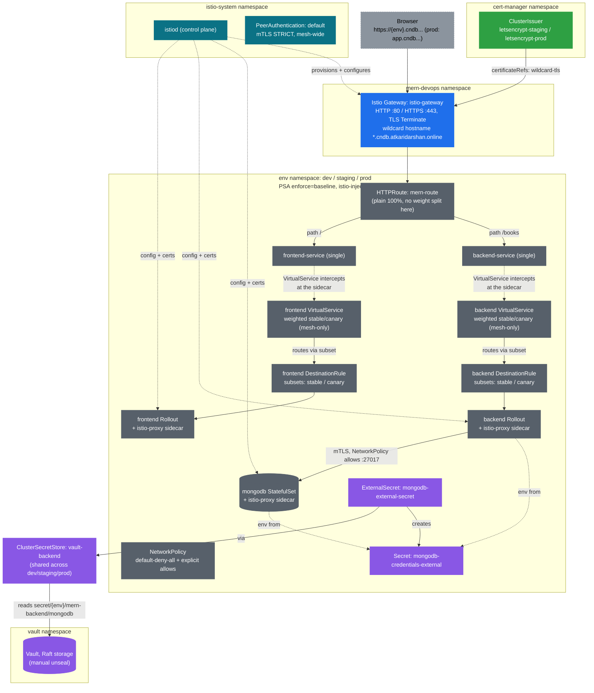
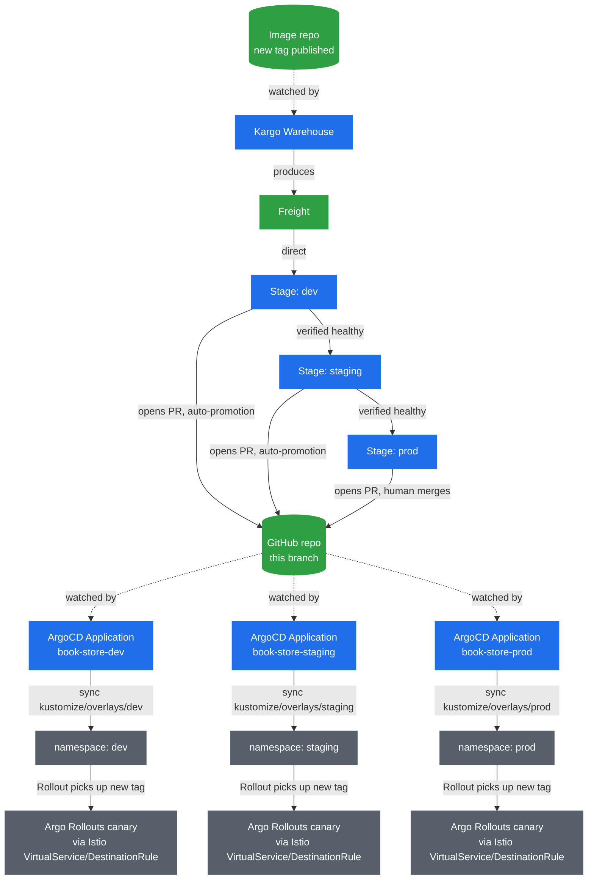
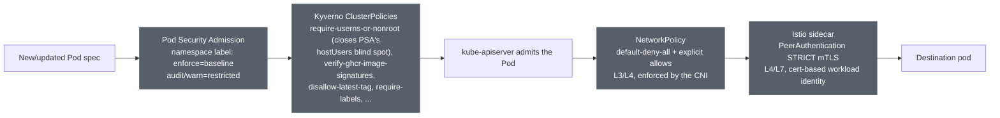

# Cloudnative DevOps Blueprint — Production GitOps Pipeline

One coherent path from a git push to a running, promoted, secured deployment — not a
collection of isolated demos. `git push` → **Kargo** watches the image registry and drives
promotion **dev → staging → prod** via PR → **ArgoCD** syncs each environment's
**Kustomize** overlay → **Argo Rollouts** runs the change through a canary, shifting traffic
via **Istio**'s native `VirtualService`/`DestinationRule` traffic management → mongodb credentials never touch git, synced
live from **Vault** via **ExternalSecrets** → every admission is checked by **Pod Security
Admission** and **Kyverno**, every namespace defaults to **zero-trust NetworkPolicies**, and
every mesh connection is **mTLS** by default. TLS, domain routing, and SSO across the
platform UIs (from this branch's `domain-and-tls` origin) sit underneath all of it.

Concept explanations — the "why" behind each piece — live on `main` and the single-feature
branches this one draws from (`domain-and-tls`, `kargo-promotion`). This branch is the
integration: only what's needed to stand the whole pipeline up.

Terraform/EKS provisioning is intentionally out of scope here — this targets an
already-existing cluster. Moving this onto real EKS, and layering Velero backup/DR on top,
are deliberate later steps once this is proven out.

## Architecture

### End-to-end (one environment; dev/staging/prod are structurally identical)


```mermaid
flowchart TD
    Browser["Browser<br/>https://{env}.cndb... (prod: app.cndb...)"] --> GW

    subgraph MD["mern-devops namespace"]
        GW["Istio Gateway: istio-gateway<br/>HTTP :80 / HTTPS :443, TLS Terminate<br/>wildcard hostname *.cndb.atkaridarshan.online"]
    end

    subgraph IS["istio-system namespace"]
        Istiod["istiod (control plane)"]
        PA["PeerAuthentication: default<br/>mTLS STRICT, mesh-wide"]
    end

    subgraph CM["cert-manager namespace"]
        CI["ClusterIssuer<br/>letsencrypt-staging / letsencrypt-prod"]
    end

    subgraph ENV["env namespace: dev / staging / prod<br/>PSA enforce=baseline, istio-injection=enabled"]
        Route["HTTPRoute: mern-route<br/>(plain 100%, no weight split here)"]
        FESvc["frontend-service (single)"]
        BESvc["backend-service (single)"]
        FEDR["frontend DestinationRule<br/>subsets: stable / canary"]
        BEDR["backend DestinationRule<br/>subsets: stable / canary"]
        FEVS["frontend VirtualService<br/>weighted stable/canary (mesh-only)"]
        BEVS["backend VirtualService<br/>weighted stable/canary (mesh-only)"]
        FE["frontend Rollout<br/>+ istio-proxy sidecar"]
        BE["backend Rollout<br/>+ istio-proxy sidecar"]
        DB[("mongodb StatefulSet<br/>+ istio-proxy sidecar")]
        NP["NetworkPolicy<br/>default-deny-all + explicit allows"]
        ES["ExternalSecret: mongodb-external-secret"]
        Sec["Secret: mongodb-credentials-external"]
    end

    subgraph VNS["vault namespace"]
        Vault[("Vault, Raft storage<br/>(manual unseal)")]
    end

    CSS["ClusterSecretStore: vault-backend<br/>(shared across dev/staging/prod)"]

    Istiod -.->|"config + certs"| FE
    Istiod -.->|"config + certs"| BE
    Istiod -.->|"config + certs"| DB
    Istiod -.->|"provisions + configures"| GW
    CI -->|"certificateRefs: wildcard-tls"| GW

    GW --> Route
    Route -->|"path /"| FESvc
    Route -->|"path /books"| BESvc
    FESvc -.->|"VirtualService intercepts<br/>at the sidecar"| FEVS -->|"routes via subset"| FEDR --> FE
    BESvc -.->|"VirtualService intercepts<br/>at the sidecar"| BEVS -->|"routes via subset"| BEDR --> BE
    BE -->|"mTLS, NetworkPolicy allows :27017"| DB
    BE -.->|"env from"| Sec
    DB -.->|"env from"| Sec
    ES -->|"via"| CSS -->|"reads secret/{env}/mern-backend/mongodb"| Vault
    ES -->|"creates"| Sec

    classDef gateway fill:#1f6feb,color:#fff,stroke:#1f6feb
    classDef mesh fill:#0b7285,color:#fff,stroke:#0b7285
    classDef certmgr fill:#2ea043,color:#fff,stroke:#2ea043
    classDef app fill:#57606a,color:#fff,stroke:#57606a
    classDef secret fill:#8957e5,color:#fff,stroke:#8957e5
    classDef external fill:#8b949e,color:#000,stroke:#8b949e,stroke-dasharray: 3 3

    class Browser external
    class GW gateway
    class Istiod,PA mesh
    class CI certmgr
    class Route,FESvc,BESvc,FEDR,BEDR,FEVS,BEVS,FE,BE,DB,NP app
    class ES,Sec,CSS,Vault secret
```

Rollouts shifts canary traffic entirely at the mesh layer, using its native Istio
integration: the `VirtualService`'s weighted `stable`/`canary` subsets, patched by the
`DestinationRule`'s `rollouts-pod-template-hash` labels as a rollout progresses.
`HTTPRoute` only handles the external Gateway attachment, at a constant 100% to the single
Service — Istio's own guidance is against attaching `VirtualService` directly to a Gateway
API `Gateway` (relies on internal implementation details, not a stable API contract).

Since Rollouts patches the live `VirtualService`/`DestinationRule` directly rather than
through git, each `book-store-*` Application's `ignoreDifferences` excludes those specific
fields (the weight, the subset labels) — otherwise `selfHeal` would revert a canary's
weight back to git's static value mid-rollout. A canary in progress showing those two
resources as unrelated to sync status is expected, not a stuck sync.

**Currently disabled on this environment**: the diagram's PSA `enforce=baseline` label and
the `NetworkPolicy` node are the intended design, but both are commented out right now
(`kustomize/overlays/*/namespace.yml`, `kustomize/base/kustomization.yml`) — Istio's sidecar
`istio-init` container needs `NET_ADMIN`/`NET_RAW`, which baseline PSA blocks outright, and
this cluster doesn't have istio-cni installed (the usual way around that). Re-enable both
once istio-cni is added; until then, Kyverno + mesh mTLS below are the two layers actually
enforcing anything on pods in `dev`/`staging`/`prod`.

### GitOps promotion pipeline


```mermaid
flowchart TD
    GHCR[("Image repo<br/>new tag published")] -.->|watched by| WH[Kargo Warehouse]
    WH -->|produces| Freight[Freight]

    Freight -->|direct| Dev[Stage: dev]
    Dev -->|verified healthy| Staging[Stage: staging]
    Staging -->|verified healthy| Prod[Stage: prod]

    Dev -->|opens PR, auto-promotion| Git[("GitHub repo<br/>this branch")]
    Staging -->|opens PR, auto-promotion| Git
    Prod -->|opens PR, human merges| Git

    Git -.->|watched by| AppDev[ArgoCD Application<br/>book-store-dev]
    Git -.->|watched by| AppStaging[ArgoCD Application<br/>book-store-staging]
    Git -.->|watched by| AppProd[ArgoCD Application<br/>book-store-prod]

    AppDev -->|sync kustomize/overlays/dev| NsDev[namespace: dev]
    AppStaging -->|sync kustomize/overlays/staging| NsStaging[namespace: staging]
    AppProd -->|sync kustomize/overlays/prod| NsProd[namespace: prod]

    NsDev -->|Rollout picks up new tag| CanaryDev[Argo Rollouts canary<br/>via Istio VirtualService/DestinationRule]
    NsStaging -->|Rollout picks up new tag| CanaryStaging[Argo Rollouts canary<br/>via Istio VirtualService/DestinationRule]
    NsProd -->|Rollout picks up new tag| CanaryProd[Argo Rollouts canary<br/>via Istio VirtualService/DestinationRule]

    classDef store fill:#2ea043,color:#fff,stroke:#2ea043
    classDef controller fill:#1f6feb,color:#fff,stroke:#1f6feb
    classDef workload fill:#57606a,color:#fff,stroke:#57606a

    class GHCR,Freight,Git store
    class WH,Dev,Staging,Prod,AppDev,AppStaging,AppProd controller
    class NsDev,NsStaging,NsProd,CanaryDev,CanaryStaging,CanaryProd workload
```

`dev`/`staging` auto-promote (`kargo/project-config.yml`); `prod` requires a human to merge
the PR Kargo opens. Every promotion is a real commit — `kustomize-set-image` bumps the tag
in that environment's overlay, not a live `kubectl set image` that git would immediately
drift from.

### Defense in depth

Four independent layers, each catching what the others structurally can't:


```mermaid
flowchart LR
    Req["New/updated Pod spec"] --> PSA["Pod Security Admission<br/>namespace label: enforce=baseline<br/>audit/warn=restricted"]
    PSA --> Kyverno["Kyverno ClusterPolicies<br/>require-userns-or-nonroot (closes PSA's<br/>hostUsers blind spot), verify-ghcr-image-signatures,<br/>disallow-latest-tag, require-labels, ..."]
    Kyverno --> API["kube-apiserver admits the Pod"]
    API --> NetPol["NetworkPolicy<br/>default-deny-all + explicit allows<br/>L3/L4, enforced by the CNI"]
    NetPol --> Mesh["Istio sidecar<br/>PeerAuthentication STRICT mTLS<br/>L4/L7, cert-based workload identity"]
    Mesh --> Dest["Destination pod"]

    classDef layer fill:#57606a,color:#fff,stroke:#57606a
    class PSA,Kyverno,NetPol,Mesh layer
```

PSA alone can't block a pod running real root via `hostUsers` left at its default — it has
no concept of Linux user namespaces at all. That's the specific gap
`kyverno/policies/require-userns-or-nonroot.yaml` exists to close.

PSA and `NetworkPolicy` (the 1st and 3rd layers above) are currently disabled on this
environment — see the callout above the first diagram. `require-userns-or-nonroot` is doing
double duty for now: it's Enforce regardless of PSA's own state, so it's currently the only
thing blocking real-root pods.

## Layout

```
.
├── gateway/            # GatewayClass (implicit via Istio), Gateway, ClusterIssuers, Certificate
├── istio/              # mesh-wide policy — PeerAuthentication (STRICT mTLS)
├── kiali/              # mesh observability dashboard, port-forward only, no public route
├── kustomize/
│   ├── base/           # frontend/backend Rollouts, VirtualService/DestinationRule subsets,
│   │                   # mongodb, HTTPRoute, NetworkPolicies
│   └── overlays/       # dev/staging/prod — namespace, image tags, per-env patches
├── kargo/              # promotion pipeline: Project, Warehouse, Stages, PromotionTask,
│                       # git credential ExternalSecret, dashboard route + SSO
├── argocd/
│   ├── project.yml, platform-project.yml   # AppProjects — manual bootstrap, not GitOps-synced
│   ├── root-application.yml                # the one Application applied by hand
│   └── applications/                       # everything else — platform tools + book-store, all app-of-apps children
├── argorollouts/       # dashboard route + SSO
├── external-secrets/   # Vault (Raft storage), ClusterSecretStore, SSO credential ExternalSecrets
├── kyverno/policies/    # admission policies (pod security, supply chain, best practices)
├── monitoring/         # kube-prometheus-stack + blackbox-exporter, Istio/cert-manager metrics
└── kind-config.yml     # local kind cluster config
```

## Setup

A fresh cluster needs almost no manual `kubectl apply`/`helm install` — ArgoCD reconstructs
the platform *and* the app from git. What ArgoCD **installs** (cert-manager, Istio, External
Secrets, Kyverno, Argo Rollouts, monitoring, Kargo — each as an Application combining its
Helm chart with this repo's extra manifests for it) is separate from what it **manages after
installing** (the same Applications, continuously reconciled). See
`argocd/applications/*.yml` for the actual definitions; what follows is the bootstrap.

### What stays manual, and why

Five things, all genuinely irreducible — everything else self-assembles from one
`kubectl apply`:

1. **The cluster itself** — ArgoCD needs somewhere to run.
2. **ArgoCD itself** — install and every future upgrade (`argocd/values.yaml` changes, e.g.
   enabling SSO) via `helm upgrade` by hand. Deliberately kept as a manual exception rather
   than a self-referential Application — everything else here is GitOps-managed, ArgoCD's
   own lifecycle isn't, for now.
3. **The two `AppProject`s** (`argocd/project.yml`, `argocd/platform-project.yml`) —
   deliberately kept outside GitOps. An Application creating/modifying its own `AppProject`
   would let a compromised git repo grant itself broader RBAC; see
   `argocd/platform-project.yml`'s comment.
4. **Vault's own init/unseal** — `external-secrets/vault-statefulset.yml` deploys Vault
   sealed and uninitialized (Raft storage, no auto-unseal). `vault operator init`/`unseal`
   and mounting the kv-v2 secrets engine are one-time manual steps; every pod restart after
   that needs another manual unseal. See "Vault initialization" below.
5. **Real secret material** — the Cloudflare DNS token, Vault's per-env mongodb credentials,
   GitHub OAuth secrets, Kargo's admin credentials, and Kargo's git credential. None of this
   can live in git by definition; each corresponding Application will sit
   `Progressing`/`Degraded` until its secret exists — expected, not a sync failure to chase.

### Bootstrap

```bash
# Cluster — pick one:
kind create cluster --config kind-config.yml     # local
# or: point kubeconfig at an existing cluster

helm repo add argo https://argoproj.github.io/argo-helm
helm repo update

helm install argocd argo/argo-cd -n argocd --create-namespace -f argocd/values.yaml

# HTTPRoute is a Gateway API CRD — must exist before ArgoCD's own route below can be
# created. Normally installed as the gateway-api-crds Application (wave 0), but that only
# starts existing once root-application.yml is applied further down — a fresh cluster has
# no HTTPRoute kind yet, so install it once by hand here. --server-side because the bundle's
# embedded OpenAPI schemas are too large for client-side apply's annotation limit.
kubectl apply --server-side -f gateway/gateway-api-crds.yaml
kubectl apply -f argocd/httproute.yml   # ArgoCD's own route — manual, since ArgoCD isn't self-managed

kubectl apply -f argocd/project.yml
kubectl apply -f argocd/platform-project.yml
kubectl apply -f argocd/root-application.yml

kubectl get application -n argocd
# watch the waves land: gateway-api-crds (0) → cert-manager/istio/external-secrets/
# kyverno/argo-rollouts (1) → gateway-platform (2) → book-store-{dev,staging,prod}/monitoring/
# kiali (3) → kargo (4) → sso-oauth2-proxy (5, optional)
```

Sync-waves here are Application-level, gating on each child Application's own `Healthy`
status before the next wave starts — same app-of-apps + sync-wave pattern as any other
dependency graph in ArgoCD, just applied to platform tools instead of app resources.

### Secrets: still-manual steps, once the corresponding wave is up

**Cloudflare DNS token** (unblocks `gateway-platform`'s `ClusterIssuer`s):

```bash
kubectl create secret generic cloudflare-api-token-secret \
  -n cert-manager --from-literal=api-token='<your-cloudflare-dns-edit-token>'
```

Prove the cert on staging before touching Let's Encrypt's production rate limit — edit
`gateway/certificate.yml`'s `issuerRef.name` to `letsencrypt-staging` first, confirm
`READY=True` (`kubectl describe certificate wildcard-tls -n mern-devops`), then switch to
`letsencrypt-prod` and let selfHeal pick up the change.

**Vault initialization** (one-time, before anything else in this section — Vault comes up
sealed and uninitialized with Raft storage and no auto-unseal):

```bash
kubectl exec -n vault vault-0 -- vault operator init -key-shares=1 -key-threshold=1
# save the unseal key and initial root token printed above — neither is recoverable

kubectl exec -n vault vault-0 -- vault operator unseal <unseal-key>

# production Vault doesn't auto-mount kv-v2 at secret/ the way dev mode does
kubectl exec -n vault vault-0 -- \
  env VAULT_ADDR=http://127.0.0.1:8200 VAULT_TOKEN=<root-token> \
  vault secrets enable -path=secret -version=2 kv

# scope ESO's own access instead of handing it the root token
kubectl exec -n vault vault-0 -- \
  env VAULT_ADDR=http://127.0.0.1:8200 VAULT_TOKEN=<root-token> \
  vault policy write eso-read - <<'EOF'
path "secret/data/*" { capabilities = ["read"] }
path "secret/metadata/*" { capabilities = ["list"] }
EOF

eso_token=$(kubectl exec -n vault vault-0 -- \
  env VAULT_ADDR=http://127.0.0.1:8200 VAULT_TOKEN=<root-token> \
  vault token create -policy=eso-read -period=768h -field=token)

kubectl create secret generic vault-token -n vault --from-literal=token="$eso_token"
```

Every pod restart after this needs `vault operator unseal <unseal-key>` again before the
`vault-0` pod reports Ready — there's no auto-unseal configured (see the pending KMS work).

**mongodb credentials** (unblocks the `ExternalSecret` in each `book-store-*` Application):

```bash
kubectl port-forward -n vault vault-0 8200:8200 &
sleep 2

for env in dev staging prod; do
  kubectl exec -n vault vault-0 -- \
    env VAULT_ADDR=http://127.0.0.1:8200 VAULT_TOKEN=<root-token> \
    vault kv put secret/${env}/mern-backend/mongodb username=admin password=<pick-a-real-password-per-env>
done
```

**Grafana admin credentials** (break-glass fallback, unblocks `monitoring/grafana-admin-secret.yml`'s `ExternalSecret` — Grafana otherwise stays `CreateContainerConfigError` until this exists):

```bash
kubectl exec -n vault vault-0 -- \
  env VAULT_ADDR=http://127.0.0.1:8200 VAULT_TOKEN=<root-token> \
  vault kv put secret/monitoring/grafana-admin username=admin password=<pick-a-real-password>
```

**Kargo admin credentials** — needed before the `kargo` Application's chart source will
produce a working login; see `argocd/applications/kargo.yml`'s comment on why this isn't
inlined as a Helm value:

```bash
pass=$(openssl rand -base64 48 | tr -d "=+/" | head -c 32)
hashed_pass=$(htpasswd -bnBC 10 "" "$pass" | tr -d ':\n')
signing_key=$(openssl rand -base64 48 | tr -d "=+/" | head -c 32)
echo "Kargo admin password: $pass"   # save this — hashed_pass can't be reversed back to it

kubectl exec -n vault vault-0 -- \
  env VAULT_ADDR=http://127.0.0.1:8200 VAULT_TOKEN=<root-token> \
  vault kv put secret/kargo/admin \
    passwordHash="$hashed_pass" \
    tokenSigningKey="$signing_key"
```

Routed through `kargo/external-secret.yml`'s `kargo-admin` ExternalSecret, same pattern as
everything else here. `kargo/values.yaml`'s `api.secret.name: kargo-admin` points the chart
at it instead of letting the chart create its own `kargo-api` Secret — confirmed against the
chart's own `templates/api/secret.yaml`: setting `api.secret.name` skips that Secret's
creation (and its `passwordHash`/`tokenSigningKey` `fail` guards) entirely, so nothing here
ever needs to be a plain Helm value in git.

**Kargo's git credential** — needed before `kargo/promotion-task.yml`'s `git-clone`/
`git-push`/`git-open-pr` steps can do anything. Routed through Vault like mongodb's creds,
not a raw `kubectl create secret` — `kargo/external-secret.yml` labels the Secret it
creates with `kargo.akuity.io/cred-type: git` (how Kargo recognizes a repo credential at
all) via its `target.template`, same mechanism as any other ExternalSecret here. A GitHub
PAT with repo write access works as both the git password and the GitHub API token
`git-open-pr`/`git-wait-for-pr` need:

```bash
kubectl exec -n vault vault-0 -- \
  env VAULT_ADDR=http://127.0.0.1:8200 VAULT_TOKEN=<root-token> \
  vault kv put secret/kargo/git-creds \
    repoURL='https://github.com/atkaridarshan04/CloudNative-DevOps-Blueprint.git' \
    username='<your-github-username>' \
    password='<a-github-pat-with-repo-write-access>'
```

Note there's no separate ArgoCD API credential to create — the `argocd-update` step
authenticates via Kargo's own ServiceAccount RBAC (Kubernetes-native, not a token), gated
per-Stage by the `kargo.akuity.io/authorized-stage` annotation already on each
`book-store-*` Application.

**GitHub OAuth (SSO, optional)** — four separate OAuth Apps (ArgoCD, Grafana, Rollouts
dashboard, Kargo; classic OAuth Apps only support one callback URL each). Kargo bundles its
own Dex broker (`kargo/values.yaml`'s `api.oidc.dex`) — same pattern as ArgoCD, real auth,
unlike the Rollouts dashboard's bolted-on oauth2-proxy.

**Creating each OAuth App** — github.com → Settings → Developer settings → OAuth Apps →
New OAuth App, once per row below:

| App | Homepage URL | Authorization callback URL |
|---|---|---|
| ArgoCD | `https://argocd.cndb.atkaridarshan.online` | `https://argocd.cndb.atkaridarshan.online/api/dex/callback` |
| Grafana | `https://grafana.cndb.atkaridarshan.online` | `https://grafana.cndb.atkaridarshan.online/login/github` |
| Rollouts dashboard | `https://argorollouts.cndb.atkaridarshan.online` | `https://argorollouts.cndb.atkaridarshan.online/oauth2/callback` |
| Kargo | `https://kargo.cndb.atkaridarshan.online` | `https://kargo.cndb.atkaridarshan.online/dex/callback` |

The callback URL must match protocol, host, and path *exactly* (`https`, not `http`; no
trailing slash; Kargo's is `/dex/callback`, not ArgoCD's `/api/dex/callback` — easy to mix
up). A mismatch surfaces as GitHub's own "Invalid redirect URL" page, not an ArgoCD/Kargo
error. After creating each App, note its **Client ID** (shown immediately, not secret) and
click **Generate a new client secret** (shown once — copy it now).

All four OAuth secrets are sourced from Vault (`external-secrets/sso-secrets.yml` for
ArgoCD/Grafana/Rollouts, `kargo/external-secret.yml` for Kargo) — seed them once:

```bash
kubectl exec -n vault vault-0 -- \
  env VAULT_ADDR=http://127.0.0.1:8200 VAULT_TOKEN=<root-token> \
  vault kv put secret/argocd/dex \
    clientId='<argocd-oauth-app-client-id>' \
    clientSecret='<argocd-oauth-app-client-secret>'

kubectl exec -n vault vault-0 -- \
  env VAULT_ADDR=http://127.0.0.1:8200 VAULT_TOKEN=<root-token> \
  vault kv put secret/monitoring/grafana-oauth \
    clientId='<grafana-oauth-app-client-id>' \
    clientSecret='<grafana-oauth-app-client-secret>'

COOKIE_SECRET=$(python3 -c 'import secrets,base64; print(base64.urlsafe_b64encode(secrets.token_bytes(32)).decode())')
kubectl exec -n vault vault-0 -- \
  env VAULT_ADDR=http://127.0.0.1:8200 VAULT_TOKEN=<root-token> \
  vault kv put secret/argo-rollouts/oauth2-proxy \
    clientId='<rollouts-oauth-app-client-id>' \
    clientSecret='<rollouts-oauth-app-client-secret>' \
    cookieSecret="$COOKIE_SECRET"

kubectl exec -n vault vault-0 -- \
  env VAULT_ADDR=http://127.0.0.1:8200 VAULT_TOKEN=<root-token> \
  vault kv put secret/kargo/github-oauth clientSecret='<kargo-oauth-app-client-secret>'
```

`argocd-dex-external-secret` merges its two keys into the `argocd-secret` ArgoCD's own
chart already created, rather than owning a separate Secret — `creationPolicy: Merge`.

Also fill in `kargo/values.yaml`'s `clientID` and `admins.claims.email` placeholders (same
`REPLACE_WITH_...` pattern as `argocd/values.yaml`'s RBAC line) — the Client ID isn't
secret, so it's a plain committed value, not something Vault needs to hold.

ArgoCD's own upgrade is manual (ArgoCD isn't self-managed — see "What stays manual, and
why") — re-apply the Dex connector config with:

```bash
helm upgrade argocd argo/argo-cd -n argocd -f argocd/values.yaml
```

Grafana and `sso-oauth2-proxy` pick up their secrets on their own next reconcile, no
re-apply needed.

### Verify + DNS

```bash
for env in dev staging prod; do kubectl get pods -n $env; done
kubectl argo rollouts get rollout dev-backend-rollout -n dev --watch
kubectl get stage -n book-store
```

On a cloud cluster, `kubectl get gateway istio-gateway -n mern-devops -o wide` populates an
`ADDRESS` once Istio's provisioned load balancer is up — point a wildcard `A`/`CNAME` record
at it (`CNAME` on EKS, since ALB/NLB DNS names can rotate the underlying IP; usually `A` on
AKS/GKE). On `kind`, there's no LB controller to hand out a real address, and the Gateway's
backing Service lands on random `NodePort`s — pin them to the exact ports `kind-config.yml`'s
`extraPortMappings` forwards from `localhost:80`/`443`:

```bash
kubectl patch svc istio-gateway-istio -n mern-devops --type=json -p '[
  {"op":"replace","path":"/spec/ports/1/nodePort","value":30080},
  {"op":"replace","path":"/spec/ports/2/nodePort","value":30443}
]'
```

Then point every hostname at your own machine (real DNS/Cloudflare only matters for the
Let's Encrypt DNS-01 challenge itself, not for reaching the Gateway locally):

```bash
echo "127.0.0.1 app.cndb.atkaridarshan.online
127.0.0.1 dev.cndb.atkaridarshan.online
127.0.0.1 staging.cndb.atkaridarshan.online
127.0.0.1 argocd.cndb.atkaridarshan.online
127.0.0.1 kargo.cndb.atkaridarshan.online
127.0.0.1 grafana.cndb.atkaridarshan.online
127.0.0.1 argorollouts.cndb.atkaridarshan.online
127.0.0.1 vault.cndb.atkaridarshan.online" | sudo tee -a /etc/hosts
```

**Browser access** — all on the same wildcard cert and Gateway, no separate NodePorts:

| URL | Login |
|---|---|
| `https://app.cndb.atkaridarshan.online/` | prod app |
| `https://staging.cndb.atkaridarshan.online/` | staging app |
| `https://dev.cndb.atkaridarshan.online/` | dev app |
| `https://argocd.cndb.atkaridarshan.online/` | GitHub SSO once seeded (see below), else `admin` + `argocd-initial-admin-secret` — only exists if `admin.enabled` was `"true"` at install/upgrade time |
| `https://kargo.cndb.atkaridarshan.online/` | GitHub SSO (Kargo's own bundled Dex), or the admin password saved during bootstrap |
| `https://grafana.cndb.atkaridarshan.online/` | GitHub SSO once `monitoring/grafana-oauth` is seeded |
| `https://argorollouts.cndb.atkaridarshan.online/` | GitHub SSO (oauth2-proxy) once `argo-rollouts/oauth2-proxy` is seeded |
| `https://vault.cndb.atkaridarshan.online/` | Token method, the `eso-read`-policy token from Vault initialization above (or the root token) — see the Vault UI section below |

See "GitHub OAuth (SSO, optional)" above for exact callback URLs — a mismatch there surfaces
as GitHub's own "Invalid redirect URL" page, not an ArgoCD/Kargo error.

**Prometheus and Kiali are `kubectl port-forward` only, no public route** — matches real
production practice for internal-only observability tooling: no login page to expose at
all, and access is already gated by whoever has valid cluster credentials:

```bash
kubectl port-forward -n monitoring svc/monitoring-kube-prometheus-prometheus 9090:9090
kubectl port-forward -n istio-system svc/kiali 20001:20001
```

Open `http://127.0.0.1:9090` / `http://127.0.0.1:20001` — no login for either.

```bash
curl -v https://app.cndb.atkaridarshan.online/
```

**Vault UI** — reach it directly at `https://vault.cndb.atkaridarshan.online/ui`
(Gateway-terminated TLS, same as every other UI here), method **Token**, any real Vault
token (the `eso-read` one from initialization, or the root token). Unlike dev mode's
throwaway fixed token, this is now a real credential guarding real secrets with no login
gate beyond it — worth revisiting whether `external-secrets/vault-httproute.yml` should stay
publicly reachable at all, vs. `kubectl port-forward`-only like Prometheus/Kiali.

For the `vault kv`/`vault exec` commands used throughout this doc, port-forward still works
the same as before:

```bash
kubectl port-forward -n vault vault-0 8200:8200
```

**Promoting a paused canary** — each Rollout's `pause: {}` step (no duration) waits for a
human:

```bash
kubectl argo rollouts promote dev-backend-rollout -n dev
kubectl argo rollouts promote dev-frontend-rollout -n dev
# same for staging-*/prod-* once verified
```

### Troubleshooting

**A rotated Vault secret isn't showing up yet** — every `ExternalSecret` here has
`refreshInterval: 1h`; it'll pick up a changed Vault value on its own, just not
immediately. Force it right away instead of waiting:

```bash
kubectl annotate externalsecret <name> -n <namespace> force-sync=$(date +%s) --overwrite
kubectl get externalsecret <name> -n <namespace>   # STATUS should flip to SecretSynced within seconds
```

Most consumers (Kargo's git credential, Dex/oauth2-proxy sidecars) read the resulting
Secret fresh per-operation — no pod restart needed. Ones that only read a Secret into an
env var at container startup (e.g. a Rollout's `mongoDBURL`) do need a restart:
`kubectl delete pod -n <ns> -l app=<name>` (the ReplicaSet/StatefulSet recreates it,
picking up the current Secret content).

**An Argo CD Application's `OutOfSync`/`Degraded` looks stuck after a push** — a plain
`git push` doesn't itself trigger anything; Argo CD polls on its own interval. Force it:

```bash
kubectl patch application <name> -n argocd --type merge \
  -p '{"metadata":{"annotations":{"argocd.argoproj.io/refresh":"hard"}}}'
```

If the Application spec's own drift needs re-syncing (not just re-diffing), and the CLI
isn't installed locally, it's already inside the `argocd-application-controller` pod —
useful for scripting or when RBAC/UI access is the very thing being debugged:

```bash
kubectl exec -n argocd argocd-application-controller-0 -- argocd app diff <name> --core
kubectl exec -n argocd argocd-application-controller-0 -- argocd app sync <name> --core
```

**A large Helm chart's CRDs fail with `metadata.annotations: Too long: may not be more
than 262144 bytes`** — client-side apply's `last-applied-configuration` annotation hit
Kubernetes' size limit (hit this three times here: kyverno, external-secrets,
kube-prometheus-stack). Add `ServerSideApply=true` to that Application's `syncOptions`.

**GitHub-SSO'd into Argo CD but every action 403s ("permission denied")** — `configs.rbac`
only examines the `groups`/`sub` claims by default; a `g, <email>, role:admin` policy line
silently never matches without also setting `scopes: "[groups, email]"` (see
`argocd/values.yaml`'s `rbac.scopes`). After fixing it and re-running the `helm upgrade`,
log out and back in — your existing session token was minted before the fix and won't
carry `email` retroactively.
