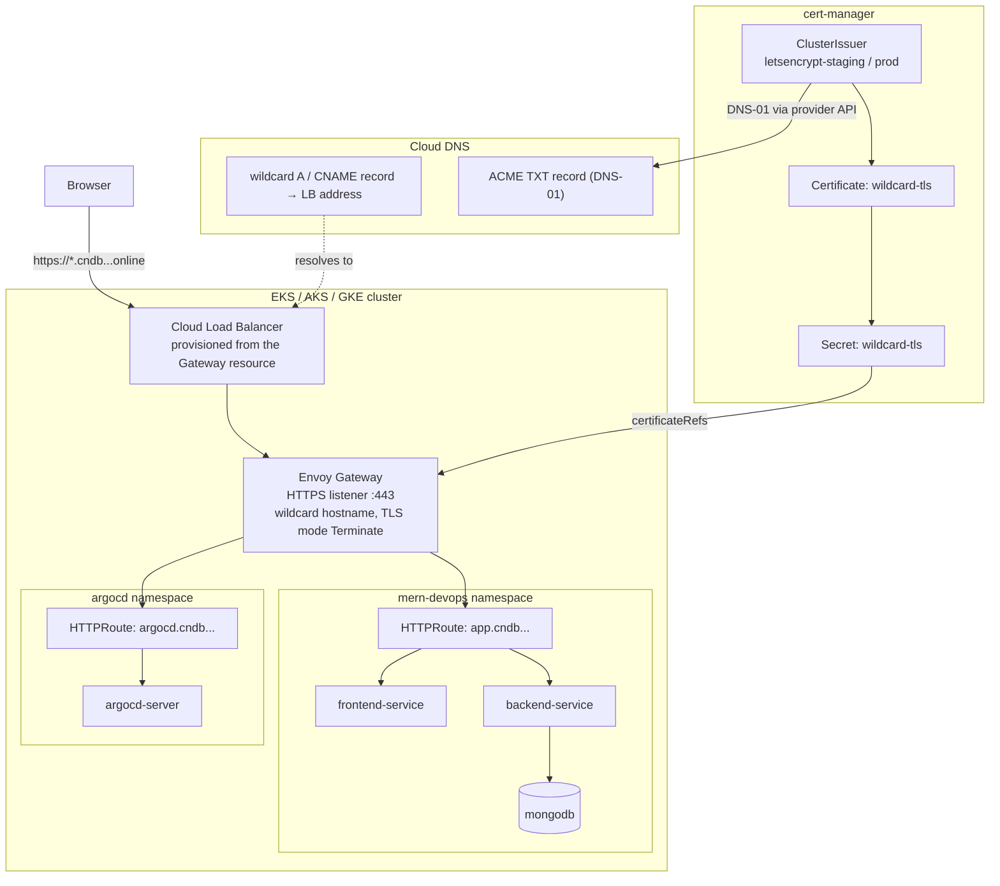
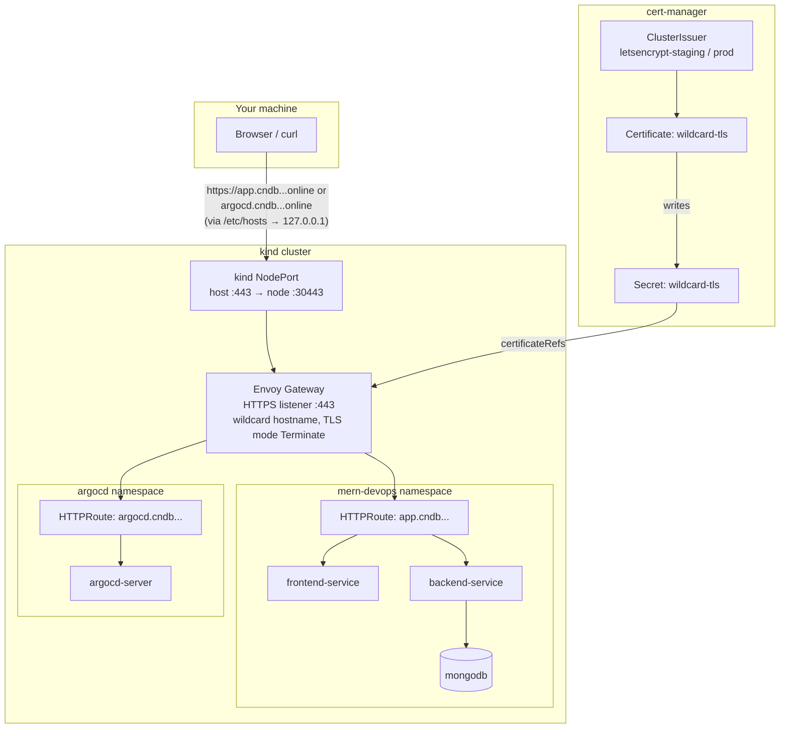

# Cloudnative DevOps Blueprint

This project is a staged learning blueprint for deploying a MERN (MongoDB, Express, React,
Node.js) application using cloud-native DevOps practices. It's organized as a set of
branches, each focused on a specific stage of the journey — from a beginner-friendly setup
to a full production-grade pipeline — so the repo itself can double as a learning resource,
for us and for anyone following along.

**This branch (`domain-and-tls`)** covers one such stage: configuring a custom domain and
TLS for the app — Kubernetes via `kind`, Gateway API (Envoy Gateway) instead of Ingress,
Helm for app packaging, and cert-manager + Let's Encrypt for browser-trusted HTTPS via the
DNS-01 challenge. Public access via Cloudflare Tunnel is on hold for now (see below) —
current focus is local NodePort/browser testing.

## Layout

```
gateway/            GatewayClass, Gateway, ClusterIssuers, Certificate — platform-level, not per-app
helm-chart/          Helm chart for the app itself: frontend, backend, mongodb, HTTPRoute
argocd/              AppProject, Application, HTTPRoute — GitOps deployment of the app via ArgoCD
kind-config.yml      local kind cluster config (NodePort → host port mappings)
docs/                setup guides and concept notes
```

## Domain & TLS

`*.cndb.atkaridarshan.online` is served over HTTPS terminated at the Envoy Gateway, using a
single wildcard Let's Encrypt certificate obtained via cert-manager's DNS-01 challenge
(Cloudflare DNS) — covering `app.cndb...` (the bookstore app) and `argocd.cndb...` (the
ArgoCD UI, for the GitOps deployment option) under one `Certificate`/`Secret`. Both
`letsencrypt-staging` and `letsencrypt-prod` `ClusterIssuer`s exist so new cert configs get
proven on staging before touching the production rate limit. DNS-01 (rather than HTTP-01)
is what makes the cert issuance independent of whether the cluster is publicly reachable
yet, and it's the only challenge type that supports wildcard certs at all.

See [`docs/tls-concepts.md`](docs/tls-concepts.md) for the full HTTP-01 vs DNS-01
reasoning and TLS trust-chain explanation, and
[`docs/tls-setup-guide.md`](docs/tls-setup-guide.md) for the runnable steps.

### Architecture — production (EKS / AKS / GKE)

The industry-standard path: applying the `Gateway` makes the cloud's Gateway/LB controller
provision a real, internet-facing load balancer. `kubectl get gateway` shows the result in
its `ADDRESS` column — a hostname on EKS (ALB/NLB DNS names, since AWS can rotate the
underlying IP, hence a `CNAME`), or often a static IP on AKS/GKE (hence an `A` record).
Either way, once that address exists, you point DNS at it directly — no tunnel needed,
because the load balancer is already public. See `docs/tls-setup-guide.md`'s "`kind` vs
production" table for the full point-by-point mapping of what's local-only scaffolding
versus what's identical in both places.


```mermaid
flowchart TD
    Browser[Browser] -->|"https://*.cndb...online"| LB

    subgraph "Cloud DNS"
        DNSRec["wildcard A / CNAME record → LB address"]
        TXT["ACME TXT record (DNS-01)"]
    end

    subgraph "EKS / AKS / GKE cluster"
        LB[Cloud Load Balancer<br/>provisioned from the Gateway resource]
        GW[Envoy Gateway<br/>HTTPS listener :443<br/>wildcard hostname, TLS mode Terminate]

        subgraph "mern-devops namespace"
            AppRoute[HTTPRoute: app.cndb...]
            FE[frontend-service]
            BE[backend-service]
            DB[(mongodb)]
        end

        subgraph "argocd namespace"
            ArgoRoute[HTTPRoute: argocd.cndb...]
            ArgoSvc[argocd-server]
        end
    end

    subgraph "cert-manager"
        CI[ClusterIssuer<br/>letsencrypt-staging / prod]
        Cert[Certificate: wildcard-tls]
        Secret[Secret: wildcard-tls]
    end

    LB --> GW
    GW --> AppRoute --> FE
    AppRoute --> BE --> DB
    GW --> ArgoRoute --> ArgoSvc

    DNSRec -.->|resolves to| LB
    CI -->|DNS-01 via provider API| TXT
    CI --> Cert --> Secret -->|certificateRefs| GW
```

### Architecture — local (this repo, `kind`, current focus)

`kind` has no public IP, so there's nothing to DNS-map publicly yet — the current focus is
local testing through `kind-config.yml`'s NodePort mapping (`host :443 → node :30443`),
from both `curl` and an actual browser (via an `/etc/hosts` override, since the domain's
public DNS already points elsewhere — see `docs/tls-setup-guide.md` Phase 6a).


```mermaid
flowchart TD
    subgraph "Your machine"
        Browser[Browser / curl]
    end

    subgraph "kind cluster"
        NP[kind NodePort<br/>host :443 → node :30443]
        GW[Envoy Gateway<br/>HTTPS listener :443<br/>wildcard hostname, TLS mode Terminate]

        subgraph "mern-devops namespace"
            AppRoute[HTTPRoute: app.cndb...]
            FE[frontend-service]
            BE[backend-service]
            DB[(mongodb)]
        end

        subgraph "argocd namespace"
            ArgoRoute[HTTPRoute: argocd.cndb...]
            ArgoSvc[argocd-server]
        end
    end

    subgraph "cert-manager"
        CI[ClusterIssuer<br/>letsencrypt-staging / prod]
        Cert[Certificate: wildcard-tls]
        Secret[Secret: wildcard-tls]
    end

    Browser -->|"https://app.cndb...online or<br/>argocd.cndb...online<br/>(via /etc/hosts → 127.0.0.1)"| NP
    NP --> GW
    GW --> AppRoute --> FE
    AppRoute --> BE --> DB
    GW --> ArgoRoute --> ArgoSvc

    CI --> Cert
    Cert -->|writes| Secret
    Secret -->|certificateRefs| GW
```

Public access (Cloudflare Tunnel) is a separate, currently-unused approach — see
[`docs/public-access-cloudflare-tunnel.md`](docs/public-access-cloudflare-tunnel.md) for
the architecture, the nested-hostname problem hit while testing it, and the fix.

## Docs

- [`docs/tls-concepts.md`](docs/tls-concepts.md) — learning notes: cert-manager, ACME,
  HTTP-01 vs DNS-01, Let's Encrypt staging vs prod.
- [`docs/tls-setup-guide.md`](docs/tls-setup-guide.md) — runnable step-by-step setup.
- [`docs/argocd-deploy.md`](docs/argocd-deploy.md) — deploying the app via ArgoCD (GitOps)
  instead of a one-off `helm install`.
- [`docs/public-access-cloudflare-tunnel.md`](docs/public-access-cloudflare-tunnel.md) —
  alternative approach (not currently used) for exposing the local cluster publicly.
