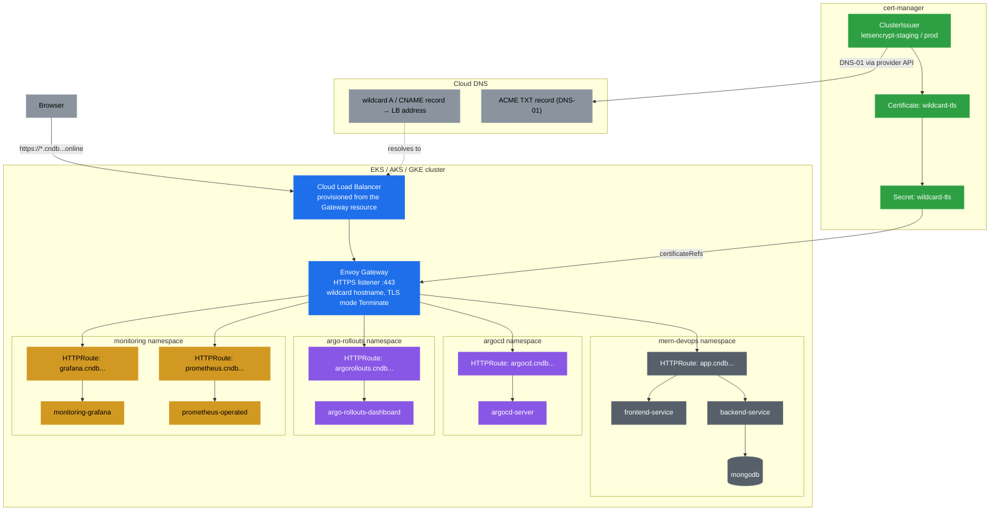
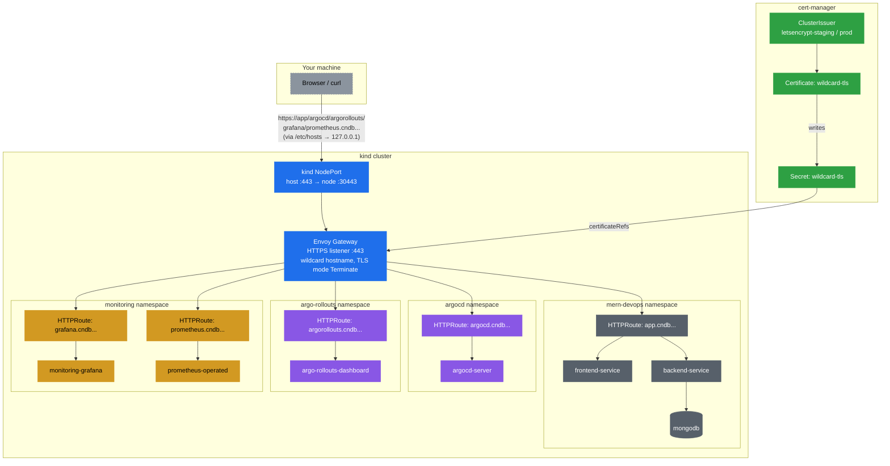
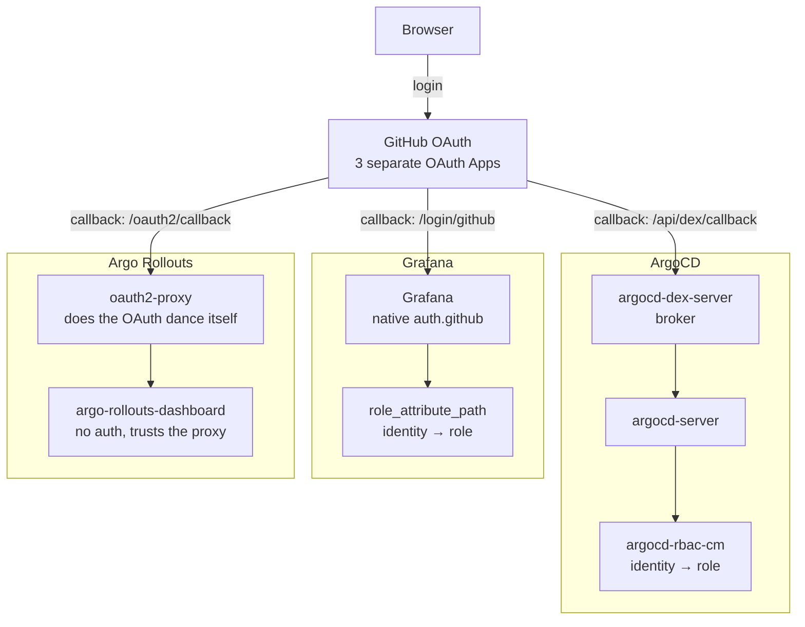

# Cloudnative DevOps Blueprint — Domain, TLS & Platform

A custom domain and TLS setup on Kubernetes, and everything that requires end-to-end:
`kind` cluster, Gateway API (Envoy Gateway) instead of Ingress, cert-manager + Let's
Encrypt over DNS-01, GitOps deployment via ArgoCD + Argo Rollouts, Prometheus/Grafana
monitoring with TLS cert-expiry alerting, and GitHub OAuth SSO across all three UIs.
Public access via Cloudflare Tunnel is on hold for now (see below) — current focus is
local NodePort/browser testing.

## Layout

```
.
├── gateway/            # platform-level: GatewayClass, Gateway, ClusterIssuers, Certificate
├── helm-chart/         # the app itself — frontend, backend, mongodb, Rollouts, HTTPRoute
├── argocd/             # GitOps deployment of the app (ArgoCD, incl. Dex GitHub SSO)
├── argorollouts/       # Argo Rollouts dashboard route + oauth2-proxy (no native auth)
├── monitoring/         # kube-prometheus-stack + blackbox-exporter (incl. Grafana SSO)
├── docs/
│   ├── concepts/       # learning notes — the "why" behind each piece
│   └── assets/         # screenshots referenced by the docs, one subfolder per doc
└── kind-config.yml     # local kind cluster config
```

## Domain & TLS

`*.cndb.atkaridarshan.online` is served over HTTPS terminated at the Envoy Gateway, using a
single wildcard Let's Encrypt certificate obtained via cert-manager's DNS-01 challenge
(Cloudflare DNS) — covering `app.cndb...` (the bookstore app), `argocd.cndb...` (the ArgoCD
UI), `argorollouts.cndb...` (the Argo Rollouts dashboard), `grafana.cndb...`, and
`prometheus.cndb...` under one `Certificate`/`Secret`. Both `letsencrypt-staging` and
`letsencrypt-prod` `ClusterIssuer`s exist so new cert configs get proven on staging before
touching the production rate limit. DNS-01 (rather than HTTP-01) is what makes the cert
issuance independent of whether the cluster is publicly reachable yet, and it's the only
challenge type that supports wildcard certs at all.

See [`docs/concepts/tls-concepts.md`](docs/concepts/tls-concepts.md) for the full HTTP-01 vs DNS-01
reasoning and TLS trust-chain explanation, and
[`docs/tls-setup-guide.md`](docs/tls-setup-guide.md) for the runnable steps.

### Architecture — production (EKS / AKS / GKE)

The industry-standard path: applying the `Gateway` makes the cloud's Gateway/LB controller
provision a real, internet-facing load balancer. `kubectl get gateway` shows the result in
its `ADDRESS` column — a hostname on EKS (ALB/NLB DNS names, since AWS can rotate the
underlying IP, hence a `CNAME`), or often a static IP on AKS/GKE (hence an `A` record).
Either way, once that address exists, you point DNS at it directly — no tunnel needed,
because the load balancer is already public. See `docs/tls-setup-guide.md`'s "`kind` vs
production" table for the full point-by-point mapping of what's local-only scaffolding
versus what's identical in both places.


```mermaid
flowchart TD
    Browser[Browser] -->|"https://*.cndb...online"| LB

    subgraph "Cloud DNS"
        DNSRec["wildcard A / CNAME record → LB address"]
        TXT["ACME TXT record (DNS-01)"]
    end

    subgraph "EKS / AKS / GKE cluster"
        LB[Cloud Load Balancer<br/>provisioned from the Gateway resource]
        GW[Envoy Gateway<br/>HTTPS listener :443<br/>wildcard hostname, TLS mode Terminate]

        subgraph "mern-devops namespace"
            AppRoute[HTTPRoute: app.cndb...]
            FE[frontend-service]
            BE[backend-service]
            DB[(mongodb)]
        end

        subgraph "argocd namespace"
            ArgoRoute[HTTPRoute: argocd.cndb...]
            ArgoSvc[argocd-server]
        end

        subgraph "argo-rollouts namespace"
            RolloutsRoute[HTTPRoute: argorollouts.cndb...]
            RolloutsSvc[argo-rollouts-dashboard]
        end

        subgraph "monitoring namespace"
            GrafanaRoute[HTTPRoute: grafana.cndb...]
            PromRoute[HTTPRoute: prometheus.cndb...]
            GrafanaSvc[monitoring-grafana]
            PromSvc[prometheus-operated]
        end
    end

    subgraph "cert-manager"
        CI[ClusterIssuer<br/>letsencrypt-staging / prod]
        Cert[Certificate: wildcard-tls]
        Secret[Secret: wildcard-tls]
    end

    LB --> GW
    GW --> AppRoute --> FE
    AppRoute --> BE --> DB
    GW --> ArgoRoute --> ArgoSvc
    GW --> RolloutsRoute --> RolloutsSvc
    GW --> GrafanaRoute --> GrafanaSvc
    GW --> PromRoute --> PromSvc

    DNSRec -.->|resolves to| LB
    CI -->|DNS-01 via provider API| TXT
    CI --> Cert --> Secret -->|certificateRefs| GW

    classDef gateway fill:#1f6feb,color:#fff,stroke:#1f6feb
    classDef certmgr fill:#2ea043,color:#fff,stroke:#2ea043
    classDef argocd fill:#8957e5,color:#fff,stroke:#8957e5
    classDef monitoring fill:#d29922,color:#000,stroke:#d29922
    classDef app fill:#57606a,color:#fff,stroke:#57606a
    classDef external fill:#8b949e,color:#000,stroke:#8b949e,stroke-dasharray: 3 3

    class Browser,DNSRec,TXT external
    class LB,GW gateway
    class AppRoute,FE,BE,DB app
    class ArgoRoute,ArgoSvc,RolloutsRoute,RolloutsSvc argocd
    class GrafanaRoute,PromRoute,GrafanaSvc,PromSvc monitoring
    class CI,Cert,Secret certmgr
```

### Architecture — local (this repo, `kind`, current focus)

`kind` has no public IP, so there's nothing to DNS-map publicly yet — the current focus is
local testing through `kind-config.yml`'s NodePort mapping (`host :443 → node :30443`),
from both `curl` and an actual browser (via an `/etc/hosts` override, since the domain's
public DNS already points elsewhere — see `docs/tls-setup-guide.md` Phase 6a).


```mermaid
flowchart TD
    subgraph "Your machine"
        Browser[Browser / curl]
    end

    subgraph "kind cluster"
        NP[kind NodePort<br/>host :443 → node :30443]
        GW[Envoy Gateway<br/>HTTPS listener :443<br/>wildcard hostname, TLS mode Terminate]

        subgraph "mern-devops namespace"
            AppRoute[HTTPRoute: app.cndb...]
            FE[frontend-service]
            BE[backend-service]
            DB[(mongodb)]
        end

        subgraph "argocd namespace"
            ArgoRoute[HTTPRoute: argocd.cndb...]
            ArgoSvc[argocd-server]
        end

        subgraph "argo-rollouts namespace"
            RolloutsRoute[HTTPRoute: argorollouts.cndb...]
            RolloutsSvc[argo-rollouts-dashboard]
        end

        subgraph "monitoring namespace"
            GrafanaRoute[HTTPRoute: grafana.cndb...]
            PromRoute[HTTPRoute: prometheus.cndb...]
            GrafanaSvc[monitoring-grafana]
            PromSvc[prometheus-operated]
        end
    end

    subgraph "cert-manager"
        CI[ClusterIssuer<br/>letsencrypt-staging / prod]
        Cert[Certificate: wildcard-tls]
        Secret[Secret: wildcard-tls]
    end

    Browser -->|"https://app/argocd/argorollouts/<br/>grafana/prometheus.cndb...<br/>(via /etc/hosts → 127.0.0.1)"| NP
    NP --> GW
    GW --> AppRoute --> FE
    AppRoute --> BE --> DB
    GW --> ArgoRoute --> ArgoSvc
    GW --> RolloutsRoute --> RolloutsSvc
    GW --> GrafanaRoute --> GrafanaSvc
    GW --> PromRoute --> PromSvc

    CI --> Cert
    Cert -->|writes| Secret
    Secret -->|certificateRefs| GW

    classDef gateway fill:#1f6feb,color:#fff,stroke:#1f6feb
    classDef certmgr fill:#2ea043,color:#fff,stroke:#2ea043
    classDef argocd fill:#8957e5,color:#fff,stroke:#8957e5
    classDef monitoring fill:#d29922,color:#000,stroke:#d29922
    classDef app fill:#57606a,color:#fff,stroke:#57606a
    classDef external fill:#8b949e,color:#000,stroke:#8b949e,stroke-dasharray: 3 3

    class Browser external
    class NP,GW gateway
    class AppRoute,FE,BE,DB app
    class ArgoRoute,ArgoSvc,RolloutsRoute,RolloutsSvc argocd
    class GrafanaRoute,PromRoute,GrafanaSvc,PromSvc monitoring
    class CI,Cert,Secret certmgr
```

Public access (Cloudflare Tunnel) is a separate, currently-unused approach — see
[`docs/public-access-cloudflare-tunnel.md`](docs/public-access-cloudflare-tunnel.md) for
the architecture, the nested-hostname problem hit while testing it, and the fix.

## Authentication (SSO)

All three UIs (ArgoCD, Grafana, Argo Rollouts dashboard) are gated by GitHub OAuth instead
of local admin/password logins, each via a different mechanism since none of the three
tools handle auth the same way — see
[`docs/concepts/sso-concepts.md`](docs/concepts/sso-concepts.md) for why. ArgoCD's local
admin and Grafana's local login form are disabled once SSO is confirmed working (see
[`docs/sso-deploy.md`](docs/sso-deploy.md)); the Rollouts dashboard has no local login to
disable in the first place, since it never had one.


```mermaid
flowchart TD
    Browser[Browser]
    GH[GitHub OAuth<br/>3 separate OAuth Apps]

    subgraph "ArgoCD"
        Dex[argocd-dex-server<br/>broker]
        ArgoSrv[argocd-server]
        RBAC[argocd-rbac-cm<br/>identity → role]
    end

    subgraph "Grafana"
        GrafSrv[Grafana<br/>native auth.github]
        GrafRole[role_attribute_path<br/>identity → role]
    end

    subgraph "Argo Rollouts"
        Proxy[oauth2-proxy<br/>does the OAuth dance itself]
        Dash[argo-rollouts-dashboard<br/>no auth, trusts the proxy]
    end

    Browser -->|login| GH
    GH -->|callback: /api/dex/callback| Dex --> ArgoSrv --> RBAC
    GH -->|callback: /login/github| GrafSrv --> GrafRole
    GH -->|callback: /oauth2/callback| Proxy --> Dash
```

## Docs

- [`docs/concepts/tls-concepts.md`](docs/concepts/tls-concepts.md) — learning notes: cert-manager, ACME,
  HTTP-01 vs DNS-01, Let's Encrypt staging vs prod.
- [`docs/tls-setup-guide.md`](docs/tls-setup-guide.md) — runnable step-by-step setup.
- [`docs/gitops-deploy.md`](docs/gitops-deploy.md) — deploying the app via Argo Rollouts +
  ArgoCD (GitOps), the only supported deployment path now, in the required install order.
- [`docs/concepts/monitoring-concepts.md`](docs/concepts/monitoring-concepts.md) — learning notes:
  ServiceMonitor vs PodMonitor, how the blackbox-exporter Probe mechanism works,
  PrometheusRule alert states, Grafana dashboard provisioning.
- [`docs/monitoring-deploy.md`](docs/monitoring-deploy.md) — Prometheus, Grafana, and TLS
  cert-expiry monitoring/alerting via blackbox-exporter and cert-manager metrics.
- [`docs/concepts/sso-concepts.md`](docs/concepts/sso-concepts.md) — learning notes: OAuth2/OIDC,
  Dex as a broker vs Grafana's native OAuth, why the Rollouts dashboard needs oauth2-proxy.
- [`docs/sso-deploy.md`](docs/sso-deploy.md) — GitHub OAuth SSO for ArgoCD, Grafana, and the
  Argo Rollouts dashboard.
- [`docs/public-access-cloudflare-tunnel.md`](docs/public-access-cloudflare-tunnel.md) —
  alternative approach (not currently used) for exposing the local cluster publicly.
