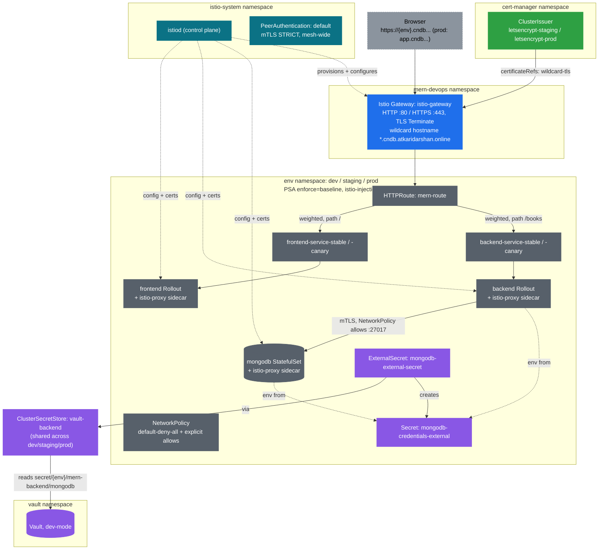
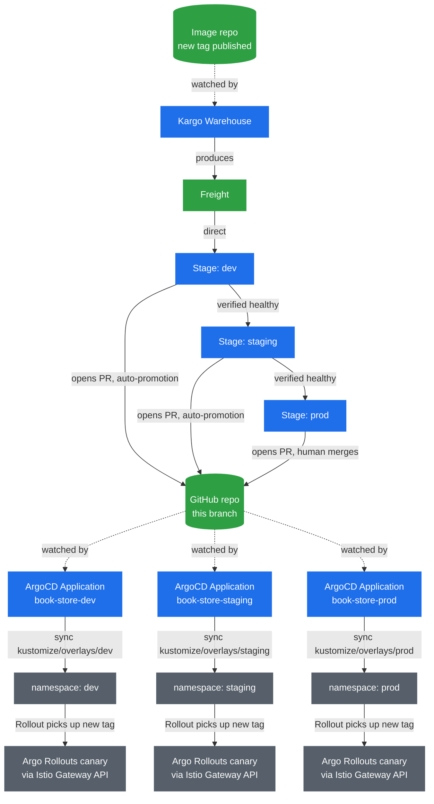
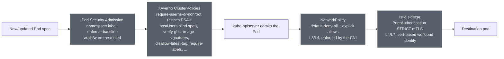

# Cloudnative DevOps Blueprint — Production GitOps Pipeline

One coherent path from a git push to a running, promoted, secured deployment — not a
collection of isolated demos. `git push` → **Kargo** watches the image registry and drives
promotion **dev → staging → prod** via PR → **ArgoCD** syncs each environment's
**Kustomize** overlay → **Argo Rollouts** runs the change through a canary, shifting traffic
via **Istio**'s Gateway API implementation → mongodb credentials never touch git, synced
live from **Vault** via **ExternalSecrets** → every admission is checked by **Pod Security
Admission** and **Kyverno**, every namespace defaults to **zero-trust NetworkPolicies**, and
every mesh connection is **mTLS** by default. TLS, domain routing, and SSO across the
platform UIs (from this branch's `domain-and-tls` origin) sit underneath all of it.

Concept explanations — the "why" behind each piece — live on `main` and the single-feature
branches this one draws from (`domain-and-tls`, `kargo-promotion`). This branch is the
integration: only what's needed to stand the whole pipeline up.

Terraform/EKS provisioning is intentionally out of scope here — this targets an
already-existing cluster. Moving this onto real EKS, and layering Velero backup/DR on top,
are deliberate later steps once this is proven out.

## Architecture

### End-to-end (one environment; dev/staging/prod are structurally identical)


```mermaid
flowchart TD
    Browser["Browser<br/>https://{env}.cndb... (prod: app.cndb...)"] --> GW

    subgraph MD["mern-devops namespace"]
        GW["Istio Gateway: istio-gateway<br/>HTTP :80 / HTTPS :443, TLS Terminate<br/>wildcard hostname *.cndb.atkaridarshan.online"]
    end

    subgraph IS["istio-system namespace"]
        Istiod["istiod (control plane)"]
        PA["PeerAuthentication: default<br/>mTLS STRICT, mesh-wide"]
    end

    subgraph CM["cert-manager namespace"]
        CI["ClusterIssuer<br/>letsencrypt-staging / letsencrypt-prod"]
    end

    subgraph ENV["env namespace: dev / staging / prod<br/>PSA enforce=baseline, istio-injection=enabled"]
        Route["HTTPRoute: mern-route"]
        FES["frontend-service-stable / -canary"]
        BES["backend-service-stable / -canary"]
        FE["frontend Rollout<br/>+ istio-proxy sidecar"]
        BE["backend Rollout<br/>+ istio-proxy sidecar"]
        DB[("mongodb StatefulSet<br/>+ istio-proxy sidecar")]
        NP["NetworkPolicy<br/>default-deny-all + explicit allows"]
        ES["ExternalSecret: mongodb-external-secret"]
        Sec["Secret: mongodb-credentials-external"]
    end

    subgraph VNS["vault namespace"]
        Vault[("Vault, dev-mode")]
    end

    CSS["ClusterSecretStore: vault-backend<br/>(shared across dev/staging/prod)"]

    Istiod -.->|"config + certs"| FE
    Istiod -.->|"config + certs"| BE
    Istiod -.->|"config + certs"| DB
    Istiod -.->|"provisions + configures"| GW
    CI -->|"certificateRefs: wildcard-tls"| GW

    GW --> Route
    Route -->|"weighted, path /"| FES --> FE
    Route -->|"weighted, path /books"| BES --> BE
    BE -->|"mTLS, NetworkPolicy allows :27017"| DB
    BE -.->|"env from"| Sec
    DB -.->|"env from"| Sec
    ES -->|"via"| CSS -->|"reads secret/{env}/mern-backend/mongodb"| Vault
    ES -->|"creates"| Sec

    classDef gateway fill:#1f6feb,color:#fff,stroke:#1f6feb
    classDef mesh fill:#0b7285,color:#fff,stroke:#0b7285
    classDef certmgr fill:#2ea043,color:#fff,stroke:#2ea043
    classDef app fill:#57606a,color:#fff,stroke:#57606a
    classDef secret fill:#8957e5,color:#fff,stroke:#8957e5
    classDef external fill:#8b949e,color:#000,stroke:#8b949e,stroke-dasharray: 3 3

    class Browser external
    class GW gateway
    class Istiod,PA mesh
    class CI certmgr
    class Route,FES,BES,FE,BE,DB,NP app
    class ES,Sec,CSS,Vault secret
```

### GitOps promotion pipeline


```mermaid
flowchart TD
    GHCR[("Image repo<br/>new tag published")] -.->|watched by| WH[Kargo Warehouse]
    WH -->|produces| Freight[Freight]

    Freight -->|direct| Dev[Stage: dev]
    Dev -->|verified healthy| Staging[Stage: staging]
    Staging -->|verified healthy| Prod[Stage: prod]

    Dev -->|opens PR, auto-promotion| Git[("GitHub repo<br/>this branch")]
    Staging -->|opens PR, auto-promotion| Git
    Prod -->|opens PR, human merges| Git

    Git -.->|watched by| AppDev[ArgoCD Application<br/>book-store-dev]
    Git -.->|watched by| AppStaging[ArgoCD Application<br/>book-store-staging]
    Git -.->|watched by| AppProd[ArgoCD Application<br/>book-store-prod]

    AppDev -->|sync kustomize/overlays/dev| NsDev[namespace: dev]
    AppStaging -->|sync kustomize/overlays/staging| NsStaging[namespace: staging]
    AppProd -->|sync kustomize/overlays/prod| NsProd[namespace: prod]

    NsDev -->|Rollout picks up new tag| CanaryDev[Argo Rollouts canary<br/>via Istio Gateway API]
    NsStaging -->|Rollout picks up new tag| CanaryStaging[Argo Rollouts canary<br/>via Istio Gateway API]
    NsProd -->|Rollout picks up new tag| CanaryProd[Argo Rollouts canary<br/>via Istio Gateway API]

    classDef store fill:#2ea043,color:#fff,stroke:#2ea043
    classDef controller fill:#1f6feb,color:#fff,stroke:#1f6feb
    classDef workload fill:#57606a,color:#fff,stroke:#57606a

    class GHCR,Freight,Git store
    class WH,Dev,Staging,Prod,AppDev,AppStaging,AppProd controller
    class NsDev,NsStaging,NsProd,CanaryDev,CanaryStaging,CanaryProd workload
```

`dev`/`staging` auto-promote (`kargo/project-config.yml`); `prod` requires a human to merge
the PR Kargo opens. Every promotion is a real commit — `kustomize-set-image` bumps the tag
in that environment's overlay, not a live `kubectl set image` that git would immediately
drift from.

### Defense in depth

Four independent layers, each catching what the others structurally can't:


```mermaid
flowchart LR
    Req["New/updated Pod spec"] --> PSA["Pod Security Admission<br/>namespace label: enforce=baseline<br/>audit/warn=restricted"]
    PSA --> Kyverno["Kyverno ClusterPolicies<br/>require-userns-or-nonroot (closes PSA's<br/>hostUsers blind spot), verify-ghcr-image-signatures,<br/>disallow-latest-tag, require-labels, ..."]
    Kyverno --> API["kube-apiserver admits the Pod"]
    API --> NetPol["NetworkPolicy<br/>default-deny-all + explicit allows<br/>L3/L4, enforced by the CNI"]
    NetPol --> Mesh["Istio sidecar<br/>PeerAuthentication STRICT mTLS<br/>L4/L7, cert-based workload identity"]
    Mesh --> Dest["Destination pod"]

    classDef layer fill:#57606a,color:#fff,stroke:#57606a
    class PSA,Kyverno,NetPol,Mesh layer
```

PSA alone can't block a pod running real root via `hostUsers` left at its default — it has
no concept of Linux user namespaces at all. That's the specific gap
`kyverno/policies/require-userns-or-nonroot.yaml` exists to close.

## Layout

```
.
├── gateway/            # GatewayClass (implicit via Istio), Gateway, ClusterIssuers, Certificate
├── istio/              # mesh-wide policy — PeerAuthentication (STRICT mTLS)
├── kustomize/
│   ├── base/           # frontend/backend Rollouts, mongodb, HTTPRoute, NetworkPolicies
│   └── overlays/       # dev/staging/prod — namespace, image tags, per-env patches
├── kargo/              # promotion pipeline: Project, Warehouse, Stages, PromotionTask
├── argocd/             # per-env Applications + AppProject, Dex GitHub SSO
├── argorollouts/       # Gateway API traffic-router plugin config, dashboard route + SSO
├── external-secrets/   # dev-mode Vault, ClusterSecretStore
├── kyverno/policies/    # admission policies (pod security, supply chain, best practices)
├── monitoring/         # kube-prometheus-stack + blackbox-exporter, Istio/cert-manager metrics
└── kind-config.yml     # local kind cluster config
```

## Setup

Real dependency order — install phases strictly top to bottom; several later phases fail
outright ("resource not found") if an earlier one is skipped.

### Prerequisites

```bash
# Cluster — pick one:
kind create cluster --config kind-config.yml     # local
# or: point kubeconfig at an existing cluster

kubectl create namespace mern-devops
helm repo add jetstack https://charts.jetstack.io
helm repo add istio https://istio-release.storage.googleapis.com/charts
helm repo add argo https://argoproj.github.io/argo-helm
helm repo add external-secrets https://charts.external-secrets.io
helm repo add kyverno https://kyverno.github.io/kyverno/
helm repo add prometheus-community https://prometheus-community.github.io/helm-charts
helm repo add oauth2-proxy https://oauth2-proxy.github.io/manifests
helm repo update
```

### Phase 1 — Gateway API CRDs + cert-manager

Istio needs the Gateway API CRDs present at startup to auto-enable Gateway API support;
cert-manager backs both the TLS `ClusterIssuer`s below and Kargo's own webhook certs later.

```bash
kubectl apply -f https://github.com/kubernetes-sigs/gateway-api/releases/download/v1.1.0/standard-install.yaml

helm install cert-manager jetstack/cert-manager \
  -n cert-manager --create-namespace --set crds.enabled=true

kubectl get pods -n cert-manager
```

### Phase 2 — Istio

Just the base + control plane — **not** a separately Helm-installed `istio-ingress`. Istio
implements Gateway API natively: applying `gateway/gateway-api.yml`'s `Gateway` (next phase)
is what makes istiod provision the actual proxy deployment, with no separate gateway chart.

```bash
kubectl create namespace istio-system
helm install istio-base istio/base -n istio-system
helm install istiod istio/istiod -n istio-system --wait

kubectl get pods -n istio-system
```

Mesh-wide mTLS:

```bash
kubectl apply -f istio/peer-authentication.yml
```

### Phase 3 — TLS: Cloudflare token, ClusterIssuers, wildcard Gateway

```bash
kubectl create secret generic cloudflare-api-token-secret \
  -n cert-manager --from-literal=api-token='<your-cloudflare-dns-edit-token>'

kubectl apply -f gateway/cluster-issuer.yml
kubectl get clusterissuer   # both should show READY=True once the Secret above exists

kubectl apply -f gateway/gateway-api.yml
kubectl get gateway -n mern-devops
# Programmed: Unknown/False until the wildcard-tls Secret exists below — expected
```

Prove the cert on staging before touching Let's Encrypt's production rate limit — edit
`gateway/certificate.yml`'s `issuerRef.name` to `letsencrypt-staging` first, apply, confirm
`READY=True`, then switch it to `letsencrypt-prod` and re-apply (cert-manager detects the
`issuerRef` change and re-requests automatically):

```bash
kubectl apply -f gateway/certificate.yml
kubectl describe certificate wildcard-tls -n mern-devops
```

### Phase 4 — Argo Rollouts

Must exist before ArgoCD's first sync — the Kustomize overlays define `Rollout` resources,
and ArgoCD's sync fails outright ("resource not found") for `argoproj.io/Rollout` if the CRD
isn't registered yet.

```bash
helm install argo-rollouts argo/argo-rollouts \
  -n argo-rollouts --create-namespace --set dashboard.enabled=true

kubectl apply -f argorollouts/rollouts-plugin-config.yml
kubectl rollout restart deployment argo-rollouts -n argo-rollouts

kubectl apply -f argorollouts/httproute.yml   # dashboard route — SSO (oauth2-proxy) is Phase 10
```

### Phase 5 — External Secrets Operator + Vault

Also must precede ArgoCD's first sync — the overlays define `ExternalSecret` resources.

```bash
helm install external-secrets external-secrets/external-secrets \
  -n external-secrets --create-namespace

kubectl apply -f external-secrets/vault-deployment.yml    # creates the vault namespace too
kubectl apply -f external-secrets/vault-token-secret.yml
kubectl apply -f external-secrets/cluster-secret-store.yml

kubectl get pods -n vault
kubectl get clustersecretstore vault-backend
```

Seed each environment's mongodb credentials into Vault — this is the one step that
genuinely can't live in git:

```bash
kubectl port-forward -n vault deploy/vault 8200:8200 &
sleep 2   # let the port-forward establish before the first request

for env in dev staging prod; do
  kubectl exec -n vault deploy/vault -- \
    env VAULT_ADDR=http://127.0.0.1:8200 VAULT_TOKEN=root \
    vault kv put secret/${env}/mern-backend/mongodb username=admin password=<pick-a-real-password-per-env>
done
```

### Phase 6 — Kyverno

```bash
helm install kyverno kyverno/kyverno -n kyverno --create-namespace
kubectl get pods -n kyverno

kubectl apply -f kyverno/policies/
```

### Phase 7 — ArgoCD

`server.insecure: true` (already in `argocd/values.yaml`) is required — the Gateway
terminates TLS and forwards plain HTTP downstream, so `argocd-server`'s default HTTPS-only
listener would otherwise mismatch:

```bash
helm install argocd argo/argo-cd -n argocd --create-namespace -f argocd/values.yaml

kubectl apply -f argocd/httproute.yml
kubectl apply -f argocd/project.yml
kubectl apply -f argocd/application-dev.yml
kubectl apply -f argocd/application-staging.yml
kubectl apply -f argocd/application-prod.yml

kubectl get application -n argocd
# all three: SYNC STATUS Synced, HEALTH STATUS Healthy
```

This is the phase where the bulk of the pipeline actually comes up: `dev`/`staging`/`prod`
namespaces (with their PSA + `istio-injection` labels), NetworkPolicies, ExternalSecrets,
mongodb, and the frontend/backend Rollouts all get created from the Kustomize overlays in
one sync per environment.

```bash
for env in dev staging prod; do kubectl get pods -n $env; done
kubectl argo rollouts get rollout dev-backend-rollout -n dev --watch
```

### Phase 8 — Kargo

Depends on Phase 7's three Applications already being `Synced`/`Healthy` — Kargo's
`argocd-update` promotion step targets them by name.

```bash
pass=$(openssl rand -base64 48 | tr -d "=+/" | head -c 32)
hashed_pass=$(htpasswd -bnBC 10 "" "$pass" | tr -d ':\n')
signing_key=$(openssl rand -base64 48 | tr -d "=+/" | head -c 32)
echo "Kargo admin password: $pass"   # save this

helm install kargo oci://ghcr.io/akuity/kargo-charts/kargo \
  -n kargo --create-namespace \
  --set api.adminAccount.passwordHash="$hashed_pass" \
  --set api.adminAccount.tokenSigningKey="$signing_key" \
  --wait

kubectl apply -f kargo/project.yml
kubectl apply -f kargo/project-config.yml
kubectl apply -f kargo/warehouse.yml
kubectl apply -f kargo/promotion-task.yml
kubectl apply -f kargo/stage-dev.yml
kubectl apply -f kargo/stage-staging.yml
kubectl apply -f kargo/stage-prod.yml

kubectl get stage -n book-store
```

Kargo also needs GitHub repo write access (for `git-push`/`git-open-pr`) and ArgoCD API
access (for `argocd-update`) — both via credentials Secrets created imperatively, never
committed.

### Phase 9 — Monitoring

```bash
helm install monitoring prometheus-community/kube-prometheus-stack \
  -n monitoring --create-namespace -f monitoring/values.yaml
helm install blackbox-exporter prometheus-community/prometheus-blackbox-exporter \
  -n monitoring -f monitoring/blackbox-exporter-values.yaml

kubectl apply -f monitoring/cert-manager-service-monitor.yml
kubectl apply -f monitoring/istio-monitors.yml
kubectl apply -f monitoring/blackbox-probe.yml
kubectl apply -f monitoring/cert-expiry-alerts.yml
kubectl apply -f monitoring/argocd-service-monitor.yml
kubectl apply -f monitoring/grafana-httproute.yml
kubectl apply -f monitoring/prometheus-httproute.yml
```

### Phase 10 — SSO (optional)

Gates ArgoCD, Grafana, and the Rollouts dashboard behind GitHub OAuth instead of local
logins — three separate GitHub OAuth Apps (one per tool, classic OAuth Apps only support a
single callback URL each), their secrets created imperatively, then `argocd/values.yaml`'s
Dex config and `argorollouts/oauth2-proxy-values.yaml` wire them in:

```bash
kubectl patch secret argocd-secret -n argocd --type merge -p '{
  "stringData": {
    "dex.github.clientId": "<argocd-oauth-app-client-id>",
    "dex.github.clientSecret": "<argocd-oauth-app-client-secret>"
  }
}'
helm upgrade argocd argo/argo-cd -n argocd -f argocd/values.yaml

kubectl create secret generic grafana-github-oauth -n monitoring \
  --from-literal=client-id='<grafana-oauth-app-client-id>' \
  --from-literal=client-secret='<grafana-oauth-app-client-secret>'

COOKIE_SECRET=$(python3 -c 'import secrets,base64; print(base64.urlsafe_b64encode(secrets.token_bytes(32)).decode())')
kubectl create secret generic argorollouts-oauth2-proxy -n argo-rollouts \
  --from-literal=client-id='<rollouts-oauth-app-client-id>' \
  --from-literal=client-secret='<rollouts-oauth-app-client-secret>' \
  --from-literal=cookie-secret="$COOKIE_SECRET"
helm install argorollouts-oauth2-proxy oauth2-proxy/oauth2-proxy \
  -n argo-rollouts -f argorollouts/oauth2-proxy-values.yaml
```

### DNS + verify

On a cloud cluster, `kubectl get gateway istio-gateway -n mern-devops -o wide` populates an
`ADDRESS` once Istio's provisioned load balancer is up — point a wildcard `A`/`CNAME` record
at it (`CNAME` on EKS, since ALB/NLB DNS names can rotate the underlying IP; usually `A` on
AKS/GKE). On `kind`, there's no LB controller to hand out a real address — inspect
`kubectl get svc -n mern-devops` for the Gateway's actual backing Service and either install
a LoadBalancer controller (e.g. MetalLB) or patch it to `NodePort` for local testing.

```bash
curl -v https://app.cndb.atkaridarshan.online/
```
