# 🚀 CloudNative DevOps Blueprint

*A comprehensive DevOps blueprint for deploying cloud-native applications with enterprise-grade tooling*

## 🎯 Overview

This project demonstrates a **production-ready DevOps pipeline** for deploying a MERN (MongoDB, Express, React, Node.js) application using modern cloud-native technologies and best practices. From local development to cloud deployment, this blueprint covers the entire application lifecycle.

**Quick navigation:** [Explore Other Branches](#-explore-other-branches) ·
[Application Versions](#-application-versions) ·
[Project Deployment Flow](#-project-deployment-flow) ·
[Technology Stack](#️-technology-stack) ·
[Documentation Hub](#-documentation-hub)

## 🌿 Explore Other Branches

This repository is organized as a set of branches. `main` (this one) is the broadest,
most comprehensive blueprint — the branches below are standalone, focused deep-dives
into a specific slice of the stack, each with its own complete setup and docs:

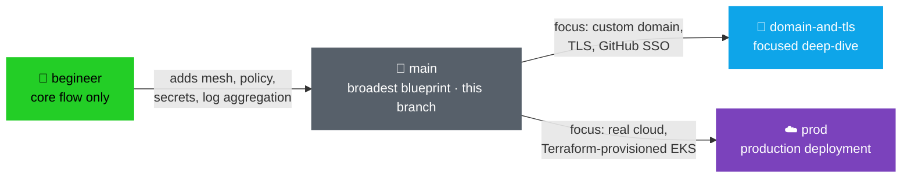
```mermaid
flowchart LR
    Begin["🌱 begineer<br/>core flow only"] -->|adds mesh, policy,<br/>secrets, log aggregation| Main["🚀 main<br/>broadest blueprint · this branch"]
    Main -->|focus: custom domain,<br/>TLS, GitHub SSO| TLS["🔐 domain-and-tls<br/>focused deep-dive"]
    Main -->|focus: real cloud,<br/>Terraform-provisioned EKS| Prod["☁️ prod<br/>production deployment"]

    classDef begin fill:#23ce26,color:#000,stroke:#23ce26
    classDef main fill:#57606a,color:#fff,stroke:#57606a
    classDef tls fill:#0ea5e9,color:#fff,stroke:#0ea5e9
    classDef prod fill:#7B42BC,color:#fff,stroke:#7B42BC

    class Begin begin
    class Main main
    class TLS tls
    class Prod prod
```

<table border="1" cellpadding="15" cellspacing="0" style="border-collapse: collapse; width: 100%; border: 2px solid #23ce26ff;">
<tr>
<td width="33%" style="border: 2px solid #23ce26ff; padding: 20px; vertical-align: top;">

### 🌱 **[`begineer`](https://github.com/atkaridarshan04/CloudNative-DevOps-Blueprint/tree/begineer)**
**Beginner-Friendly Core Flow**

The starting point, before `main`'s more advanced pieces (service mesh, policy engines, secrets management, log aggregation).

- Docker + Docker Compose
- Kubernetes on `kind` with Ingress
- Jenkins CI/CD
- Helm + ArgoCD GitOps
- Kustomize (dev/prod overlays)
- Prometheus/Grafana observability

</td>
<td width="33%" style="border: 2px solid #0ea5e9; padding: 20px; vertical-align: top;">

### 🔐 **[`domain-and-tls`](https://github.com/atkaridarshan04/CloudNative-DevOps-Blueprint/tree/domain-and-tls)**
**Domain, TLS & Platform**

A custom domain and TLS setup on Kubernetes, and everything that requires end-to-end.

- Gateway API + wildcard Let's Encrypt cert via DNS-01
- GitOps deployment (ArgoCD + Argo Rollouts canary)
- Prometheus/Grafana + blackbox-exporter TLS monitoring
- GitHub OAuth SSO (Dex, native Grafana OAuth, oauth2-proxy)

</td>
<td width="33%" style="border: 2px solid #7B42BC; padding: 20px; vertical-align: top;">

### ☁️ **[`prod`](https://github.com/atkaridarshan04/CloudNative-DevOps-Blueprint/tree/prod)**
**Real AWS EKS Production Deployment**

Actual cloud infrastructure, provisioned with Terraform, driven by a real CI/CD pipeline.

- Terraform-provisioned AWS EKS, VPC, ECR
- Envoy Gateway (Gateway API) + cert-manager
- Jenkins + Trivy + SonarQube CI/CD pipeline
- ArgoCD + Argo Rollouts canary, triggered by CI

</td>
</tr>
</table>

**At a glance — what each branch actually includes:**

| Capability | 🌱 begineer | 🚀 main (this branch) | 🔐 domain-and-tls | ☁️ prod |
|---|---|---|---|---|
| Containerization | ✅ Docker Compose | ✅ Docker | ✅ Docker | ✅ Docker |
| Kubernetes cluster | `kind` + Ingress | `kind` + Ingress/Gateway API | `kind` + Gateway API | Real AWS EKS |
| Infra as Code | — | ✅ Terraform (optional path) | — | ✅ Terraform (EKS, VPC, ECR) |
| CI/CD | ✅ Jenkins | ✅ Jenkins + Trivy + SonarQube + GitHub Actions (GHCR, cosign, Kyverno signature enforcement) | — | ✅ Jenkins + Trivy + SonarQube |
| GitOps | ✅ ArgoCD | ✅ ArgoCD + Kargo (promotion) | ✅ ArgoCD | ✅ ArgoCD |
| Progressive Delivery | — | ✅ Argo Rollouts (canary + blue-green) | ✅ Argo Rollouts (canary) | ✅ Argo Rollouts (canary) |
| Config management | Helm + Kustomize | Helm + Kustomize | Helm | Helm |
| Service Mesh | — | ✅ Istio | — | — |
| Policy Engine | — | ✅ Kyverno | — | — |
| Secrets Management | — | ✅ Vault + External Secrets Operator | — | — |
| Custom Domain + TLS | — | — | ✅ cert-manager, DNS-01 wildcard | ✅ cert-manager |
| SSO | — | — | ✅ GitHub OAuth (Dex, Grafana, oauth2-proxy) | — |
| Monitoring | ✅ Prometheus/Grafana | ✅ Prometheus/Grafana | ✅ + TLS cert-expiry alerts | ✅ Prometheus/Grafana |
| Log Aggregation | — | ✅ Fluent Bit + Loki | — | — |

## 📦 Application Versions

Three versions of the application are available, each with distinct visual and functional differences:

| Version | Frontend | Backend |
|---------|----------|---------|
| [`1.0.0`](./src/README.md) | 🔵 Blue theme | `v1.0.0` |
| [`2.0.0`](./src/README.md) | 🔴 Red theme | `v2.0.0` |
| [`3.0.0`](./src/README.md) | 🟣 Purple theme | `v3.0.0` |

> See **[src/README.md](./src/README.md)** for screenshots and build instructions.

## 🌟 Project Deployment Flow

*End-to-end deployment pipeline from code commit to production*

The gif above walks through one path end-to-end; it doesn't show every piece running at
once. Every box below is a real, working piece of this repo — but most of the per-tool
guides ([Kyverno.md](./docs/Kyverno.md), [Istio.md](./docs/Istio.md),
[ArgoRollouts.md](./docs/ArgoRollouts.md), etc.) demo their slice **standalone**, each with
its own `kind` cluster, not wired to the others. This is the *composite* architecture — how
they compose if you ran them together, not a claim that this exact end-to-end chain runs in
any single guide today. Note the two independent CI entry points feeding the same cluster:
Jenkins (Docker Hub, the primary GitOps path) and [GitHub Actions](./docs/GitHubActions.md)
(GHCR, signed images that Kyverno verifies at admission) — see
[concepts/SupplyChainSecurity.md](./docs/concepts/SupplyChainSecurity.md) for why that second
path exists:

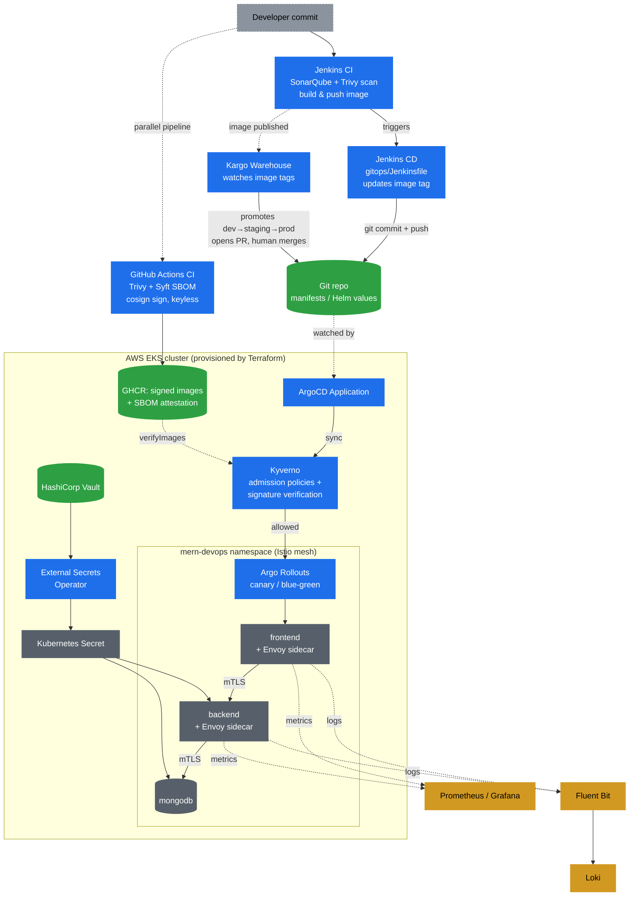
```mermaid
flowchart TD
    Dev[Developer commit] --> CI[Jenkins CI<br/>SonarQube + Trivy scan<br/>build & push image]
    CI -->|triggers| CD[Jenkins CD<br/>gitops/Jenkinsfile<br/>updates image tag]
    CD -->|git commit + push| Git[(Git repo<br/>manifests / Helm values)]
    Git -.->|watched by| ArgoApp[ArgoCD Application]

    CI -.->|image published| Kargo[Kargo Warehouse<br/>watches image tags]
    Kargo -->|promotes dev→staging→prod<br/>opens PR, human merges| Git

    Dev -.->|parallel pipeline| GHA[GitHub Actions CI<br/>Trivy + Syft SBOM<br/>cosign sign, keyless]
    GHA --> GHCR[(GHCR: signed images<br/>+ SBOM attestation)]

    subgraph "AWS EKS cluster (provisioned by Terraform)"
        ArgoApp -->|sync| Kyverno[Kyverno<br/>admission policies +<br/>signature verification]
        GHCR -.->|verifyImages| Kyverno
        Kyverno -->|allowed| Rollout[Argo Rollouts<br/>canary / blue-green]

        subgraph "mern-devops namespace (Istio mesh)"
            Rollout --> FE[frontend<br/>+ Envoy sidecar]
            FE -->|mTLS| BE[backend<br/>+ Envoy sidecar]
            BE -->|mTLS| DB[(mongodb)]
        end

        Vault[(HashiCorp Vault)] --> ESO[External Secrets<br/>Operator] --> Secret[Kubernetes Secret]
        Secret --> BE
        Secret --> DB
    end

    FE -.->|metrics| Prom[Prometheus / Grafana]
    BE -.->|metrics| Prom
    FE -.->|logs| Fluent[Fluent Bit] --> Loki[Loki]
    BE -.->|logs| Fluent

    classDef controller fill:#1f6feb,color:#fff,stroke:#1f6feb
    classDef store fill:#2ea043,color:#fff,stroke:#2ea043
    classDef workload fill:#57606a,color:#fff,stroke:#57606a
    classDef external fill:#8b949e,color:#000,stroke:#8b949e,stroke-dasharray: 3 3
    classDef observability fill:#d29922,color:#000,stroke:#d29922

    class Dev external
    class CI,CD,ArgoApp,Kyverno,Rollout,ESO,Kargo,GHA controller
    class Git,Vault,GHCR store
    class FE,BE,DB,Secret workload
    class Prom,Fluent,Loki observability
```

## 🛠️ Technology Stack

<table width="100%">
<tr>
<td align="center"><strong>🏗️ Infrastructure</strong></td>
<td align="center"><strong>🔄 CI/CD</strong></td>
<td align="center"><strong>☸️ Orchestration & Config</strong></td>
<td align="center"><strong>🔐 Security & Secrets</strong></td>
<td align="center"><strong>📊 Observability</strong></td>
</tr>
<tr>
<td valign="top">• Terraform • AWS EKS • Docker • Docker Bake • Ingress / Gateway API</td>
<td valign="top">• Jenkins • ArgoCD • Kargo • Argo Rollouts • SonarQube • Trivy • GitHub Actions • cosign • Syft</td>
<td valign="top">• Kubernetes • Helm • Kustomize • Istio • Kyverno • HPA / Locust</td>
<td valign="top">• HashiCorp Vault • External Secrets Operator</td>
<td valign="top">• Prometheus • Grafana • Fluent Bit • Loki</td>
</tr>
</table>

## 📚 Documentation Hub

> 📘 **[docs/concepts/](./docs/concepts/README.md)** — the guides below are how-to runbooks; the concepts folder covers the *why* (GitOps, service mesh, progressive delivery, policy-as-code, secrets management, Helm vs Kustomize, Ingress vs Gateway API).

<table border="1" cellpadding="15" cellspacing="0" style="border-collapse: collapse; width: 100%; border: 2px solid #2e6ccaff;">
<tr>
<td width="33%" style="border: 2px solid #2e6ccaff; padding: 20px; vertical-align: top;">

### 🐳 **Containerization**

**[Docker.md](./docs/Docker.md)**
*Build and run containers with Docker Compose for multi-service applications*
- Multi-stage Dockerfiles
- Production optimizations
- Container networking
- Volume management

</td>
<td width="33%" style="border: 2px solid #284cdfff; padding: 20px; vertical-align: top;">

### ☸️ **Kubernetes**

**[Kubernetes.md](./docs/Kubernetes.md)**
*Deploy on kind cluster with ingress*
- Persistent storage setup
- Deployments and Statefulsets
- Secrets and Configuration Management
- Ingress/Gateway API Deployment

</td>
<td width="33%" style="border: 2px solid #e05c00; padding: 20px; vertical-align: top;">

### 🔥 **Stress Testing & HPA**

**[StressTest.md](./docs/StressTest.md)**
*Load test the backend with Locust to trigger HPA autoscaling*
- Locust stress client (local & Kubernetes Job)
- HPA autoscaling demonstration
- Grafana metrics observation during load

</td>
</tr>
</table>

### 🔄 **CI/CD Pipeline**

<table border="1" cellpadding="15" cellspacing="0" style="border-collapse: collapse; width: 100%; border: 2px solid #b84c09ff;">
<tr>
<td width="30%" style="border: 2px solid #b84c09ff; padding: 20px ; vertical-align: top;">

**[Jenkins.md](./docs/Jenkins.md)**
*Automated build, test, and deployment*
- Multi-stage pipeline
- Sonar scanning
- Quality gates
- Trivy Scanning
- Docker Images Build and Push
- Notification system

</td>
<td width="60%" style="border: 2px solid #b84c09ff; margin-left:20px ; padding: 15px; vertical-align: middle; text-align: center;">

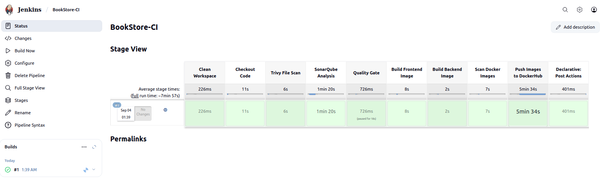
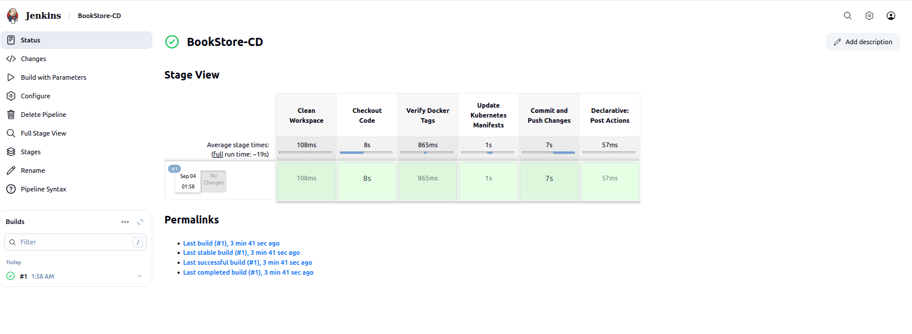

</td>
</tr>
<tr>
<td width="30%" style="border: 2px solid #b84c09ff; padding: 20px ; vertical-align: top;">

**[GitHubActions.md](./docs/GitHubActions.md)**  
*Signed CI/CD pipeline to GHCR*
- Multi-arch build via existing `docker-bake.hcl`
- Trivy scan + Syft SBOM
- cosign keyless signing (Sigstore)
- Kyverno signature enforcement at admission

</td>
<td width="60%" style="border: 2px solid #b84c09ff; margin-left:20px ; padding: 15px; vertical-align: middle; text-align: center;">

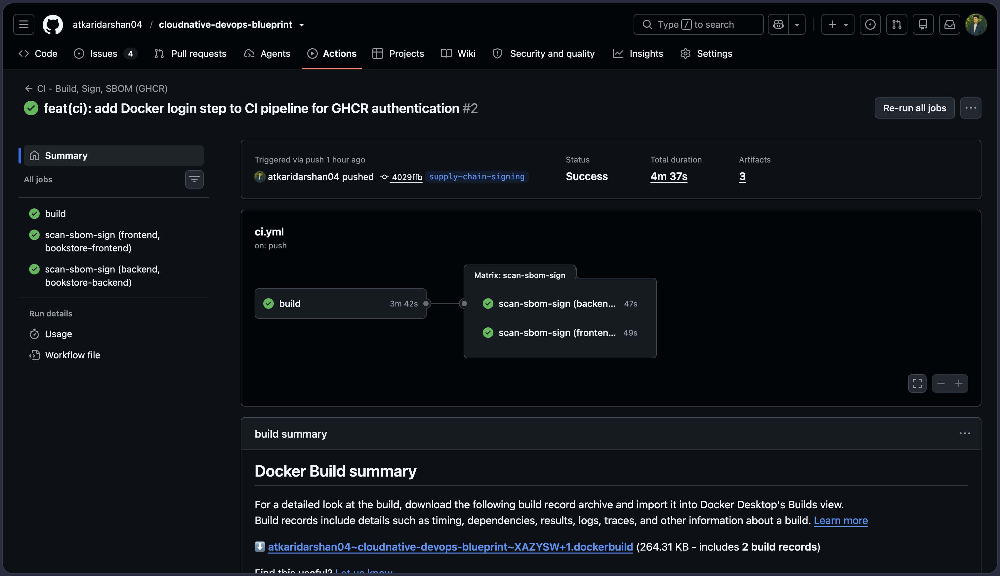

</td>
</tr>
</table>

### 📦 **Package, Configuration & Policy Management**

<table border="1" cellpadding="15" cellspacing="0" style="border-collapse: collapse; width: 100%; border: 2px solid #23ce26ff;">
<tr>
<td width="33%" style="border: 2px solid #23ce26ff; padding: 20px; vertical-align: top;">

#### 📦 **Helm Charts**
**[Helm.md](./docs/Helm.md)**
*Template-based Kubernetes deployments*
- Chart customization
- Values management
- Release lifecycle

</td>
<td width="33%" style="border: 2px solid #23ce26ff; padding: 20px; vertical-align: top;">

#### 🔧 **Kustomize**
**[Kustomize.md](./docs/Kustomize.md)**
*Environment-specific configurations*
- Base and overlay patterns
- Patch management
- Multi-environment deployment

</td>

<td width="33%" style="border: 2px solid #23ce26ff; padding: 20px; vertical-align: top;">

#### 🛡️**Kyverno**
**[Kyverno.md](./docs/Kyverno.md)**
*Policy management and governance*
- Security policy enforcement
- Resource validation rules
- Compliance automation
</tr>
</table>

### 🔐 **Secrets Management**

<table border="1" cellpadding="15" cellspacing="0" style="border-collapse: collapse; width: 100%; border: 2px solid #6f42c1;">
<tr>
<td width="30%" style="border: 2px solid #6f42c1; padding: 20px ; vertical-align: top;">

**[ExternalSecrets.md](./docs/ExternalSecrets.md)**
*Secure secrets management with HashiCorp Vault integration*
- External Secrets Operator
- Vault secret synchronization
- Kubernetes secret automation

</td>
<td width="60%" style="border: 2px solid #6f42c1; margin-left:20px ; padding: 15px; vertical-align: middle; text-align: center;">

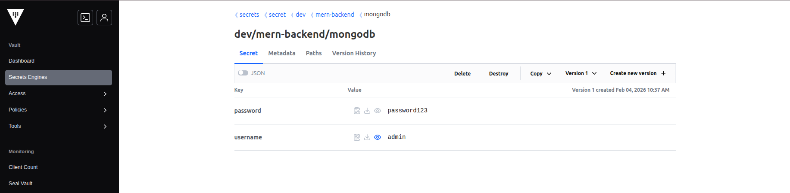

</td>
</tr>
</table>

### 📈 **Monitoring**

<table border="1" cellpadding="15" cellspacing="0" style="border-collapse: collapse; width: 100%; border: 2px solid #bc2323ff;">
<tr>
<td width="30%" style="border: 2px solid #bc2323ff; padding: 20px ; vertical-align: top;">

**[Monitoring.md](./docs/Monitoring.md)**
*Metrics observability with Prometheus & Grafana*
- Metrics collection & storage
- Kube Prometheus Stack Dashboards
- Real-time monitoring dashboards
- Performance & resource tracking
- Alert management & notifications

</td>
<td width="60%" style="border: 2px solid #bc2323ff; margin-left:20px ; padding: 15px; vertical-align: middle; text-align: center;">

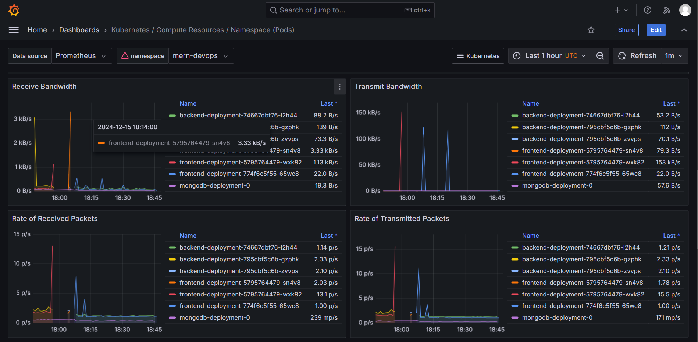

</td>
</tr>
</table>

### 🪵 **Logging**

<table border="1" cellpadding="15" cellspacing="0" style="border-collapse: collapse; width: 100%; border: 2px solid #49BDA5;">
<tr>
<td width="30%" style="border: 2px solid #49BDA5; padding: 20px ; vertical-align: top;">

**[Logging.md](./docs/Logging.md)**
*Centralized log collection with Fluent Bit, Loki & Grafana*
- Fluent Bit DaemonSet collection
- Kubernetes metadata enrichment
- JSON log parsing
- Loki log aggregation
- LogQL querying in Grafana

</td>
<td width="60%" style="border: 2px solid #49BDA5; margin-left:20px ; padding: 15px; vertical-align: middle; text-align: center;">

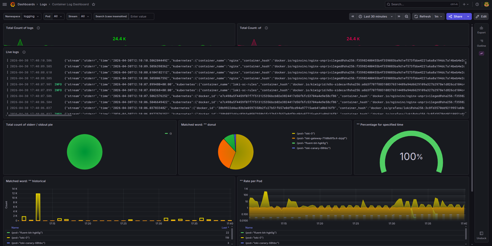

</td>
</tr>
</table>

### 🚀 **GitOps Deployment**

<table border="1" cellpadding="15" cellspacing="0" style="border-collapse: collapse; width: 100%; border: 2px solid #c9772bff;">
<tr>
<td width="30%" style="border: 2px solid #c9772bff; padding: 20px ; vertical-align: top;">

**[ArgoCD.md](./docs/ArgoCD.md)**
*Continuous deployment with Git sync and automated application lifecycle management*
- Repository connection
- Application management
- Sync policies
- Multi-cluster deployment
- RBAC integration

</td>
<td width="60%" style="border: 2px solid #c9772bff; margin-left:20px ; padding: 15px; vertical-align: middle; text-align: center;">

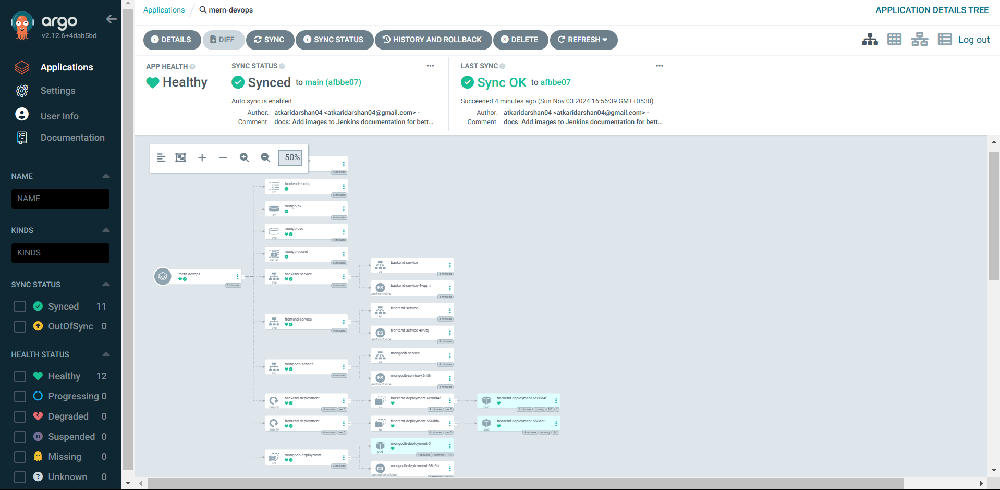

</td>
</tr>
</table>

### 🚚 **Continuous Promotion**

<table border="1" cellpadding="15" cellspacing="0" style="border-collapse: collapse; width: 100%; border: 2px solid #c9772bff;">
<tr>
<td width="30%" style="border: 2px solid #c9772bff; padding: 20px ; vertical-align: top;">

**[Kargo.md](./docs/Kargo.md)**
*Verified, PR-gated promotion of builds across dev → staging → prod*
- Warehouse-driven Freight from image tags
- Health-gated Stage chaining (dev → staging → prod)
- PR-gated promotions, reviewed on GitHub before ArgoCD syncs
- Multi-environment Kustomize overlays

</td>
<td width="60%" style="border: 2px solid #c9772bff; margin-left:20px ; padding: 15px; vertical-align: middle; text-align: center;">

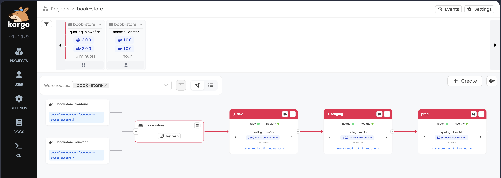

</td>
</tr>
</table>

### 🎯 **Progressive Delivery**

<table border="1" cellpadding="15" cellspacing="0" style="border-collapse: collapse; width: 100%; border: 2px solid #c9772bff;">
<tr>
<td width="30%" style="border: 2px solid #c9772bff; padding: 20px ; vertical-align: top;">

**[ArgoRollouts.md](./docs/ArgoRollouts.md)**
*Canary and blue-green deployments with automated rollbacks*
- Canary traffic splitting
- Blue-green instant promotion
- Rollback strategies

</td>
<td width="60%" style="border: 2px solid #c9772bff; margin-left:20px ; padding: 15px; vertical-align: middle; text-align: center;">

</td>
</tr>
</table>

### 🕸️ **Service Mesh**

<table border="1" cellpadding="15" cellspacing="0" style="border-collapse: collapse; width: 100%; border: 2px solid #4297ccff;">
<tr>
<td width="30%" style="border: 2px solid #42a4bcff; padding: 20px ; vertical-align: top;">

**[Istio.md](./docs/Istio.md)**
*Advanced traffic management and security with service mesh capabilities*
- mTLS encryption
- Traffic splitting & canary
- Observability & tracing
- Policy enforcement

</td>
<td width="60%" style="border: 2px solid #42a4bcff; margin-left:20px ; padding: 15px; vertical-align: middle; text-align: center;">

</td>
</tr>
</table>

### ☁︎ **Production Deployment**

<table border="1" cellpadding="15" cellspacing="0" style="border-collapse: collapse; width: 100%; border: 2px solid #7B42BC;">
<tr>
<td width="30%" style="border: 2px solid #7B42BC; padding: 20px ; vertical-align: top;">

#### 🏗️ **Cloud Infrastructure**
**[Terraform.md](./docs/Terraform.md)**
*Provision and Deploy on AWS EKS cluster with IaC*

- VPC and networking setup
- EKS cluster configuration
- Security groups and IAM
- Add-ons installation

</td>
<td width="60%" style="border: 2px solid #7B42BC; margin-left:20px ; padding: 15px; vertical-align: middle; text-align: center;">

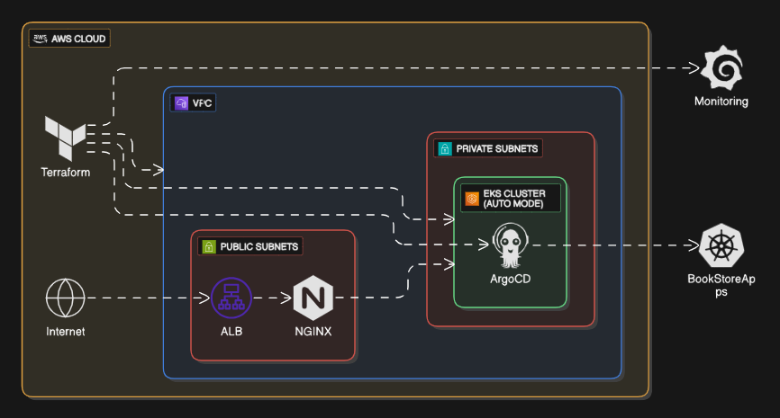

</td>
</tr>
</table>

<!-- ## 🤝 Contributing

We welcome contributions! Please see our [Contributing Guidelines](CONTRIBUTING.md) for details. -->

## 📄 License

This project is licensed under the MIT License - see the [LICENSE](LICENSE) file for details.

---

**⭐ Star this repository if you find it helpful!**

<!-- *Built with ❤️ for the DevOps community* -->

