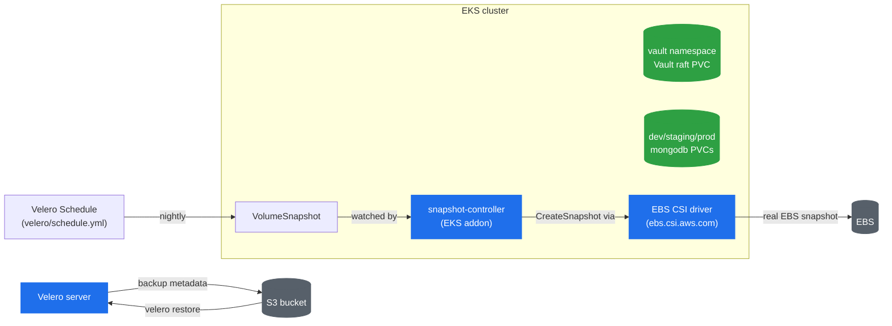
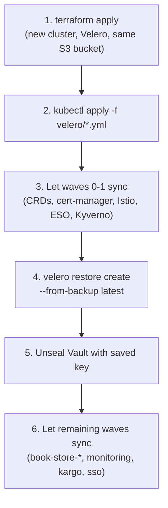

# Backup & Disaster Recovery with Velero

This covers backup and restore for the stateful data this platform actually holds: Vault's
raft data and each environment's mongodb data. Everything else — Kyverno policies, Istio
config, ArgoCD's own Applications, the app's Rollouts — is reconstructed from git by ArgoCD
and isn't backed up here; there's nothing stateful in it to lose.

This is EKS-specific — it relies on real EBS-backed PVCs and the EBS CSI driver's native
snapshot support. It isn't covered on `kind` (see [`KIND.md`](KIND.md)); `kind`'s
`local-path-provisioner` volumes aren't cloud disks, so there's nothing for a CSI snapshot
driver to snapshot.

## How ArgoCD and Velero divide the work

ArgoCD has no idea what's inside a PVC — it only knows the StatefulSet spec that claims one.
Velero is the other half: it doesn't know or care what a Kyverno policy is — it snapshots
whatever's mounted where a `Schedule` tells it to look.

| | Source of truth | Recreated by |
|---|---|---|
| Kyverno policies, Istio, cert-manager, ArgoCD's own Applications | Git | ArgoCD, from nothing |
| Vault/mongodb **manifests** (StatefulSet spec, Service, ClusterSecretStore, ExternalSecret) | Git | ArgoCD, from nothing |
| Vault's **raft data** (actual secret values, unseal keys) | Nowhere else | Velero restore only |
| Each env's mongodb **data directory** | Nowhere else | Velero restore only |

Losing the `vault`/`dev`/`staging`/`prod` namespaces' PVCs without a Velero backup means the
secret values and every environment's DB rows are gone for good — ArgoCD can redeploy every
manifest in this repo from git, but it can't recreate data that was never in git to begin
with.



## What's installed, and by what

**Terraform** (`terraform/modules/velero/`, plus one resource in
`terraform/modules/ebs-csi/`):

- An S3 bucket (`<cluster_name>-velero-backups`) for backup metadata — versioned,
  encrypted, public access blocked, no `force_destroy` (see "Tear down" below).
- An IRSA role for Velero's own ServiceAccount, scoped to that bucket plus a set of EC2
  `Describe*`/`CreateTags`/`CreateSnapshot`/`DeleteSnapshot` actions. The EBS CSI driver's
  own IRSA role (`AmazonEBSCSIDriverPolicy`) is what actually performs the snapshot — the
  EC2 grant on Velero's role is for its own bookkeeping (tagging, describing, backup-sync
  and expiry reconciliation), matching both `velero-plugin-for-aws`'s documented policy and
  AWS's own EKS+Velero backup guide, which grant it uniformly regardless of CSI vs. native
  snapshots.
- The `snapshot-controller` EKS-managed addon (`aws_eks_addon.snapshot_controller` in
  `terraform/modules/ebs-csi/main.tf`) — the CRDs (`VolumeSnapshotClass`/
  `VolumeSnapshotContent`/`VolumeSnapshot`) and the cluster-level controller that watches
  them. The `aws-ebs-csi-driver` addon only ships the CSI driver's own csi-snapshotter
  sidecar, not this — without it, a `VolumeSnapshot` object just sits with no
  `VolumeSnapshotContent` ever created.
- The Velero server itself, via `helm_release` (chart `vmware-tanzu/velero`), with static
  config in `velero/values.yaml` and the Terraform-computed values (IRSA role ARN, bucket
  name, region) layered on top via `set` — those three can't live in the values file since
  they're only known after Terraform creates the resources they come from. The server is
  Terraform-installed rather than an ArgoCD Application for the same reason the ALB
  controller is: its ServiceAccount needs that IRSA ARN baked in at install time.

**Manual, once** (`velero/volumesnapshotclass.yml`, `velero/schedule.yml`) — two small
manifests, applied by hand rather than through an ArgoCD Application:

```bash
kubectl apply -f velero/volumesnapshotclass.yml -f velero/schedule.yml
```

- `volumesnapshotclass.yml` — a cluster-scoped `VolumeSnapshotClass` for driver
  `ebs.csi.aws.com`, labeled `velero.io/csi-volumesnapshot-class: "true"`. That label, not
  the class's name, is what Velero's CSI support actually looks for when picking a class to
  snapshot a PVC through.
- `schedule.yml` — a `Schedule` (cron `0 2 * * *`, `ttl: 240h0m0s`) covering the
  `vault`, `dev`, `staging`, and `prod` namespaces.

They're plain, self-contained manifests with nothing dynamic in them — not worth the
overhead of a dedicated ArgoCD Application for two files.

## Why CSI, not fs-backup

Every PVC here is provisioned by `ebs.csi.aws.com` via the `aws-ebs-gp3` StorageClass
(`external-secrets/storageclass.yml`) — a real EBS volume, not a hostPath directory. That
means Velero can snapshot it natively through the CSI driver
(`configuration.features: EnableCSI` in `velero/values.yaml`) instead of falling back to
its Node Agent (file-level Kopia backup, `deployNodeAgent: false` here) — faster, block-level,
and it's what CSI-provisioned storage is actually for. A `volumeSnapshotLocation` is
configured alongside it (`snapshotsEnabled: true`) purely as a documented, harmless
fallback matching AWS's own guide — under `EnableCSI` with a matching `VolumeSnapshotClass`,
Velero's CSI path is what actually runs.

## Verifying it's working

```bash
kubectl get pods -n velero                    # velero server + no node-agent pods
velero backup-location get                    # Phase: Available
kubectl get volumesnapshotclass                # velero-ebs-vsc, driver ebs.csi.aws.com
kubectl get schedule -n velero                 # platform-daily

# trigger one on demand rather than waiting for 02:00
velero backup create manual-test --include-namespaces vault,dev,staging,prod
velero backup describe manual-test --details   # Phase: Completed, not PartiallyFailed
```

## Restoring onto the same cluster

E.g. after `kubectl delete namespace prod`, or any other loss of one of the backed-up
namespaces:

```bash
velero backup get                              # pick a backup to restore from

# Pause self-heal on anything that owns the namespace(s) being restored, first. Without
# this, ArgoCD recreates the StatefulSet/PVC empty again the moment it notices the
# namespace is gone - and Velero's restore can't attach a snapshot's data to a Pod it
# didn't create from the backup itself, only to one it's actively restoring.
kubectl patch application external-secrets -n argocd --type merge \
  -p '{"spec":{"syncPolicy":{"automated":null}}}'
kubectl patch application book-store-prod -n argocd --type merge \
  -p '{"spec":{"syncPolicy":{"automated":null}}}'

velero restore create --from-backup <name>
velero restore describe <name> --details       # confirm Phase: Completed

# Vault's raft data comes back, but sealed again - restoring a PVC doesn't restore seal
# state. Needs the same unseal key from the original `vault operator init`.
kubectl exec -n vault vault-0 -- env VAULT_ADDR=http://127.0.0.1:8200 \
  vault operator unseal <unseal-key>

# Re-enable once the restore's confirmed healthy - otherwise these two Applications sit
# with sync automation off indefinitely.
kubectl patch application external-secrets -n argocd --type merge \
  -p '{"spec":{"syncPolicy":{"automated":{"prune":true,"selfHeal":true}}}}'
kubectl patch application book-store-prod -n argocd --type merge \
  -p '{"spec":{"syncPolicy":{"automated":{"prune":true,"selfHeal":true}}}}'
```

## Rebuilding onto a brand-new cluster

Order matters — controllers and CRDs before data, data before app workloads:



1. `terraform apply` on the new cluster — provisions Velero (server, IRSA, S3 bucket)
   pointed at the **same bucket name** if you're reusing one; Velero's backup-sync
   auto-discovers the backups already sitting there.
2. `kubectl apply -f velero/volumesnapshotclass.yml -f velero/schedule.yml`.
3. Let ArgoCD's root Application sync waves 0-1 — this gets the CRDs and the Vault/mongodb
   *shape* in place (namespaces, StatefulSets, `ClusterSecretStore`, `ExternalSecret`), but
   with empty, freshly-provisioned PVCs. `book-store-*` (wave 3) hasn't synced yet — don't
   let it get ahead of the restore below.
4. `velero restore create --from-backup <latest>`, scoped to `vault`/`dev`/`staging`/`prod`.
5. Unseal Vault with the key saved out-of-band at the original `vault operator init`.
   Without it, the raft data is back but permanently unreadable.
6. Let the remaining waves sync, so `book-store-*` comes up against already-populated
   mongodb data instead of racing empty PVCs.

Doing step 4 before step 3 is the most common way this breaks — restoring Custom Resources
(the `ExternalSecret`, Vault's own config) before their CRDs exist just fails.

## Where this breaks

- **ArgoCD self-heal fights a same-cluster restore** — see the pause/re-enable steps above.
  This only matters when restoring into a namespace ArgoCD is actively reconciling; a
  brand-new cluster (Rebuilding, above) doesn't hit it because the relevant Applications
  haven't synced far enough to own those Pods yet.
- **A restored Vault is not unsealed** — the PVC data comes back, but Vault needs the
  original unseal key re-applied by hand every time. Losing that key means the raft data
  restores but is permanently unreadable.
- **CSI snapshots capture whatever's on disk at that instant, not a guaranteed-consistent
  DB state.** mongod could be mid-write when the snapshot is taken. For a single mongod
  without backup hooks this is usually fine (WiredTiger recovers from an unclean shutdown),
  but it isn't guaranteed application-consistent. Velero's backup hooks (a pre-hook running
  `mongodump`/`db.fsyncLock()`, a post-hook releasing it) are the documented way to close
  this gap — not configured here.
- **The StorageClass has to exist on the target cluster.** These manifests are all
  `aws-ebs-gp3`. Restoring onto a cluster without that exact StorageClass name is a hard
  failure unless remapped via Velero's `ChangeStorageClassAction` restore config.

## Tear down

The backup bucket has no `force_destroy` (see `terraform/modules/velero/main.tf`) —
`terraform destroy` fails on it once it holds any backups. Empty it first if that's
actually the intent:

```bash
aws s3 rm s3://<cluster_name>-velero-backups --recursive
```
