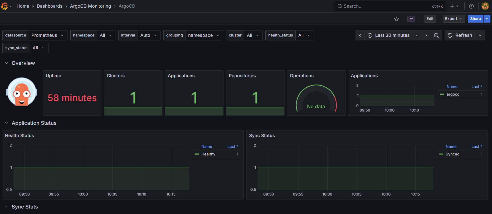

# ⚡ GitOps Continuous Delivery with ArgoCD

This guide demonstrates how to deploy and manage the MERN stack application using ArgoCD for GitOps continuous delivery, enabling automated synchronization between Git repository and Kubernetes cluster.

## Overview

ArgoCD provides declarative GitOps continuous delivery for Kubernetes applications. This setup enables:

- Automated deployment from Git repository
- Real-time synchronization with cluster state
- Easy rollback and application lifecycle management
- Multi-environment deployment capabilities

## Cluster Configuration

```yaml
# kind-config.yaml
kind: Cluster
apiVersion: kind.x-k8s.io/v1alpha4
nodes:
  - role: control-plane
    extraPortMappings:
      - containerPort: 80
        hostPort: 80
        protocol: TCP
      - containerPort: 30001
        hostPort: 30001
        protocol: TCP
```

## 1. Install and Configure ArgoCD

### Create ArgoCD Namespace

```bash
kubectl create namespace argocd
```

---

### Install ArgoCD

```bash
kubectl apply -n argocd \
  -f https://raw.githubusercontent.com/argoproj/argo-cd/stable/manifests/install.yaml
```

> Note: Installing using manifest because the metrics services of ArgoCD will be created by only official manifests, not with helm. Which is requried in monitoring ArgoCD Stuff...

### Verify Installation

```bash
watch kubectl get pods -n argocd
```

Ensure all pods are in **Running** state.

---

### Configure Service Access

```bash
# Check services
kubectl get svc -n argocd

# Change to NodePort
kubectl patch svc argocd-server -n argocd \
  -p '{"spec": {"type": "NodePort", "ports": [{"port": 80, "targetPort": 8080, "nodePort": 30001}]}}'

# Confirm change
kubectl get svc -n argocd
```

---

### Access ArgoCD UI

```bash
# Get NodePort
kubectl get svc argocd-server -n argocd
```

Access at: `http://localhost:30001`

---

### Get Admin Credentials

```bash
kubectl -n argocd get secret argocd-initial-admin-secret -o jsonpath="{.data.password}" | base64 -d; echo
```

- **Username:** `admin`
- **Password:** Use output from above command

> Change the default password after first login in **User Info**.

## 2. Intergration with Email (Optional)

### Step 1: Install Triggers and Templates from the catalog
```bash
kubectl apply -n argocd -f https://raw.githubusercontent.com/argoproj/argo-cd/stable/notifications_catalog/install.yaml
```

### Step 2: Configure SMTP Secret

Create a Kubernetes Secret with SMTP credentials:

Use: [notifications/secret-smtp.yml](../argocd/notifications/secret-smtp.yml)

> Replace `your-email@example.com` with your actual sender gmail address (In which you have created app password).

> Replace `your-smtp-password` with your actual app password created in gmail as it is (remove spaces between them).


Apply it:

```bash
kubectl apply -f notifications/secret-smtp.yml
```
---

### Step 3: Configure Notification ConfigMap

ArgoCD Notifications configuration lives in `notifications/configmap.yml` ConfigMap.

Apply it:
```bash
kubectl apply -f notifications/configmap.yml
```

### Step 4. Update ArgoCD Application Manifest
> Note: Add the annotations in your application manifest file for which you want to get notifications.


## 3. Deploy the Application

### Configure Ingress

Deploy the Ingress controller:

```bash
kubectl apply -f https://kind.sigs.k8s.io/examples/ingress/deploy-ingress-nginx.yaml
```

Verify the Ingress controller is running:
```bash
kubectl get pods --namespace ingress-nginx
```

### Method 1: Using Manifests

```bash
kubectl apply -f project.yml
kubectl apply -f application.yml
```


Access Application at `http://localhost/`


### Method 2: Using ArgoCD UI

#### Connect to Repository

1. Click **New App** in ArgoCD dashboard
2. Configure application:
   - **Application Name:** `mern-devops`
   - **Project:** `default`
   - **Sync Policy:** `Manual` or `Automatic`
   - Select `Auto-Create Namespace`


#### Configure Repository

- **Repository URL:** `https://github.com/atkaridarshan04/CloudNative-DevOps-Blueprint.git`
- **Revision:** `main`
- **Path:** `kubernetes`


#### Set Destination

- **Cluster:** Default cluster
- **Namespace:** `mern-devops`


#### Deploy Application

1. Click **Create**
2. Sync the application in ArgoCD dashboard


## 4. Monitor Application

1. Ensure Prometheus and Grafana are set up in the cluster. Steps: [Observability.md](./Observability.md)
2. Apply the ArgoCD service monitor configuration:
    ```bash
    kubectl apply -f argocd/monitoring/service-monitor.yml
    ```
    > Note: Ensure the `release` label matches your Prometheus installation. In this case, it's set to `monitoring`.



---
