# Argo Rollouts: Progressive Deployments in Kubernetes

> 📘 See [concepts/ProgressiveDelivery.md](./concepts/ProgressiveDelivery.md) for why canary/blue-green exist and when to pick which.

Argo Rollouts is a Kubernetes controller that enables advanced deployment strategies such as **canary** and **blue-green** deployments, allowing you to release application updates with greater safety and control.

| | Canary | Blue-Green |
|---|---|---|
| Traffic shift | Gradual (%) | Instant (all-or-nothing) |
| Resource usage | Lower | Double during rollout |
| Rollback speed | Slower | Instant |
| Risk exposure | Partial users | Zero until promotion |

---

## 1. Installation

> These steps are common to both canary and blue-green strategies.

### Step 1: Install Argo Rollouts Controller

```bash
kubectl create namespace argo-rollouts
kubectl apply -n argo-rollouts -f https://github.com/argoproj/argo-rollouts/releases/latest/download/install.yaml
```

### Step 2: Install CRDs

```bash
kubectl apply -k https://github.com/argoproj/argo-rollouts/manifests/crds\?ref\=stable
```

### Step 3: Install Argo Rollouts kubectl Plugin

```bash
# Download the binary
curl -LO https://github.com/argoproj/argo-rollouts/releases/latest/download/kubectl-argo-rollouts-linux-amd64

# Make it executable and move to PATH
chmod +x ./kubectl-argo-rollouts-linux-amd64
sudo mv ./kubectl-argo-rollouts-linux-amd64 /usr/local/bin/kubectl-argo-rollouts

# Verify installation
kubectl argo rollouts version
```

### Step 4: Install the Dashboard

```bash
kubectl apply -n argo-rollouts -f https://github.com/argoproj/argo-rollouts/releases/latest/download/dashboard-install.yaml
```

### Step 5: Verify Installation

```bash
kubectl get pods -n argo-rollouts
```

---

## 2. Common Prerequisites

### Step 1: Install NGINX Ingress Controller

```bash
kubectl apply -f https://kind.sigs.k8s.io/examples/ingress/deploy-ingress-nginx.yaml

# Wait for the controller to be ready
kubectl wait --namespace ingress-nginx \
  --for=condition=ready pod \
  --selector=app.kubernetes.io/component=controller \
  --timeout=90s

kubectl get pods --namespace ingress-nginx
```

### Step 2: Create Application Namespace

```bash
kubectl create namespace mern-devops
```

### Step 3: Deploy MongoDB

```bash
cd argo-rollouts/
kubectl apply -f mongodb.yml
kubectl get pods -n mern-devops -l app=mongodb
```

### Step 4: Open Argo Rollouts Dashboard

```bash
kubectl port-forward svc/argo-rollouts-dashboard 3100:3100 -n argo-rollouts --address 0.0.0.0
```

---

# Canary Deployments

Canary deployments allow you to gradually shift traffic from the stable version to a new version, minimizing risk by testing with a small percentage of users first.

## 3. Deploy Canary

### Step 1: Deploy Services

```bash
kubectl apply -f canary/backend-services.yml
kubectl apply -f canary/frontend-services.yml
kubectl get svc -n mern-devops
```

### Step 2: Configure Ingress

```bash
kubectl apply -f canary/ingress.yml
kubectl get ingress -n mern-devops
```

> **How Canary Ingress Works**: When a rollout begins, Argo Rollouts automatically creates a **companion canary ingress** (`rollout-nginx-stable-canary`) with NGINX annotations `nginx.ingress.kubernetes.io/canary: "true"` and `nginx.ingress.kubernetes.io/canary-weight: "<percentage>"` to split traffic at the network level. The original stable ingress is never modified.

### Step 3: Deploy Rollouts

```bash
kubectl apply -f canary/backend-rollout.yml
kubectl apply -f canary/frontend-rollout.yml
```


### Step 4: Verify

```bash
kubectl argo rollouts list rollouts -n mern-devops
kubectl argo rollouts get rollout backend-rollout -n mern-devops
kubectl argo rollouts get rollout frontend-rollout -n mern-devops
```

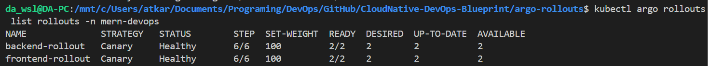
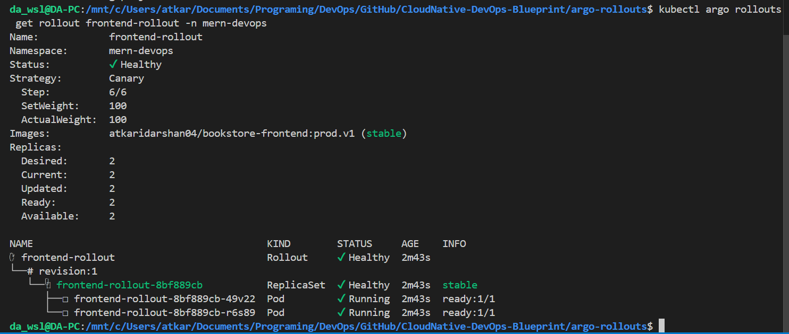
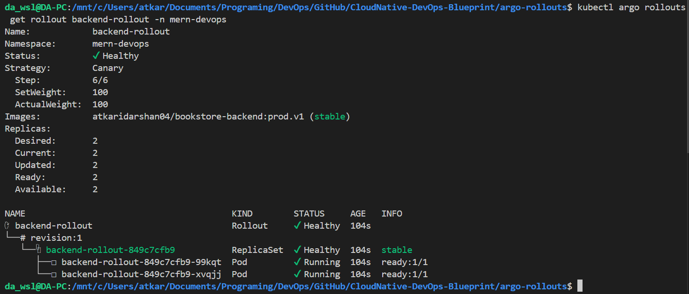

#### Move To Argo Rollouts Dashboard

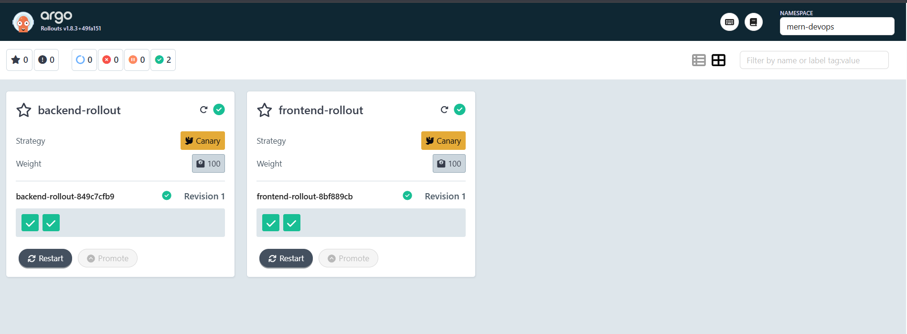
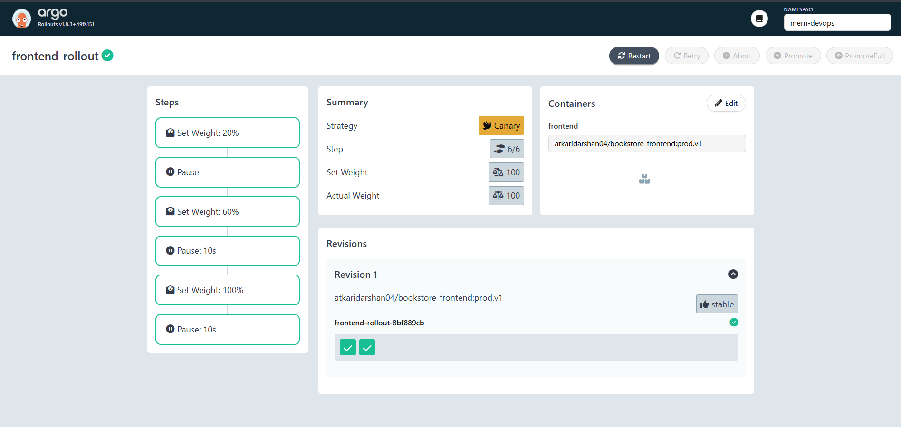

### Access Application

Port forward the stable ingress to access the application:

```bash
kubectl port-forward svc/ingress-nginx-controller 8080:80 -n ingress-nginx --address 0.0.0.0
```

Head to [localhost:8080](http://localhost:8080) in your browser.

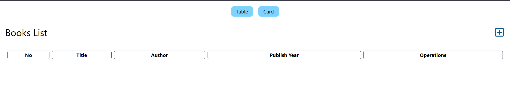

## 4. Understanding Canary Configuration

```yaml
strategy:
  canary:
    canaryService: frontend-service-canary    # Service for canary pods
    stableService: frontend-service-stable    # Service for stable pods
    trafficRouting:
      nginx:
        stableIngress: rollout-nginx-stable   # Ingress used for traffic splitting
    steps:
    - setWeight: 20                           # Route 20% traffic to canary
    - pause: {}                               # Manual approval gate
    - setWeight: 60                           # Route 60% traffic to canary
    - pause: { duration: 10s }                # Automated pause for metric collection
    - setWeight: 100                          # Route 100% traffic to canary
    - pause: { duration: 10s }                # Final pause before stable promotion
```

### Traffic Flow

1. **Initial State**: 100% traffic → Stable version
2. **Step 1**: 20% → Canary, 80% → Stable *(manual pause)*
3. **Step 2**: 60% → Canary, 40% → Stable *(10s pause)*
4. **Step 3**: 100% → Canary *(10s pause)*
5. **Completion**: Canary becomes the new stable version

## 5. Canary Commands

### Trigger a Deployment

```bash
kubectl argo rollouts set image frontend-rollout frontend=ghcr.io/atkaridarshan04/cloudnative-devops-blueprint/bookstore-frontend:2.0.0 -n mern-devops
kubectl argo rollouts set image backend-rollout backend=ghcr.io/atkaridarshan04/cloudnative-devops-blueprint/bookstore-backend:2.0.0 -n mern-devops
```

### Monitor Progress

```bash
kubectl argo rollouts get rollout frontend-rollout -n mern-devops --watch
```

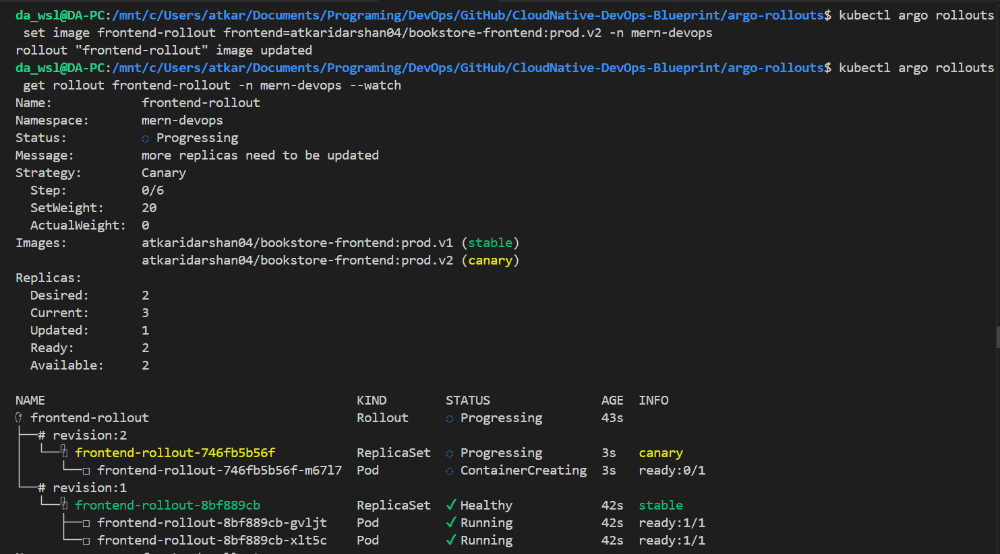
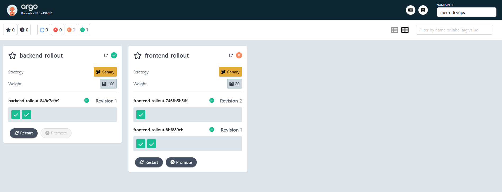
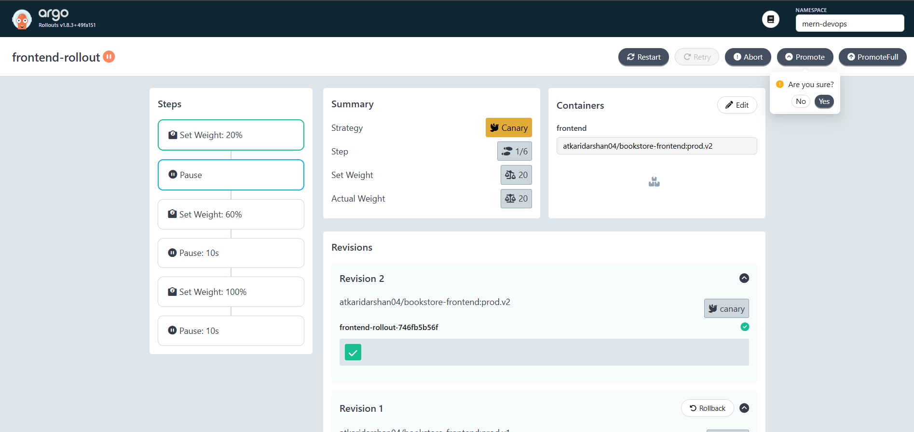
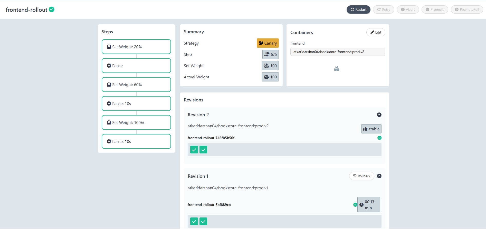
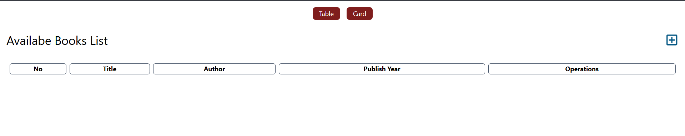

### Control the Rollout

```bash
# Promote to next step (when paused)
kubectl argo rollouts promote frontend-rollout -n mern-devops

# Abort and roll back to stable
kubectl argo rollouts abort frontend-rollout -n mern-devops

# Retry a failed rollout
kubectl argo rollouts retry frontend-rollout -n mern-devops

# Restart rollout
kubectl argo rollouts restart frontend-rollout -n mern-devops
```

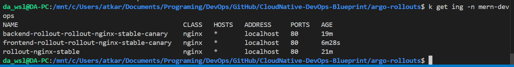

---

# Blue-Green Deployments

Blue-green deployments maintain two identical environments — **blue** (active production) and **green** (new version). Traffic switches all at once on promotion, with instant rollback capability.

## 6. Deploy Blue-Green

### Step 1: Deploy Services

```bash
kubectl apply -f blue-green/services.yml
kubectl get svc -n mern-devops
```

### Step 2: Configure Ingress

```bash
kubectl apply -f blue-green/ingress.yml
kubectl get ingress -n mern-devops
```

> **How Blue-Green Ingress Works**: The ingress always points to `frontend-service-active` and `backend-service-active` by name — it never changes. On promotion, Argo Rollouts patches the **pod selector** inside the active service (updating `rollouts-pod-template-hash`) to point at the green pods. No new ingress is created, no NGINX annotations are involved.

### Step 3: Deploy Rollouts

```bash
kubectl apply -f blue-green/backend-rollout.yml
kubectl apply -f blue-green/frontend-rollout.yml
```

### Step 4: Verify

```bash
kubectl argo rollouts list rollouts -n mern-devops
kubectl argo rollouts get rollout backend-rollout-bg -n mern-devops
kubectl argo rollouts get rollout frontend-rollout-bg -n mern-devops
```

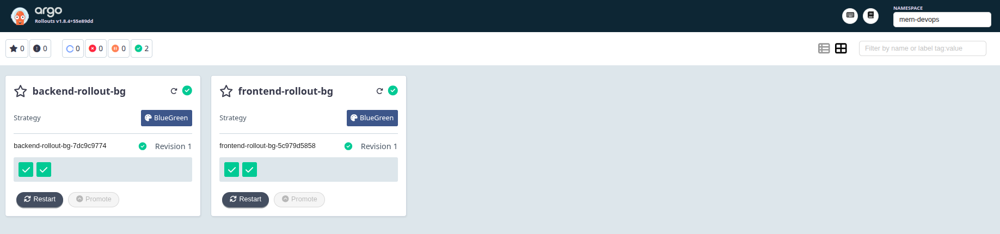
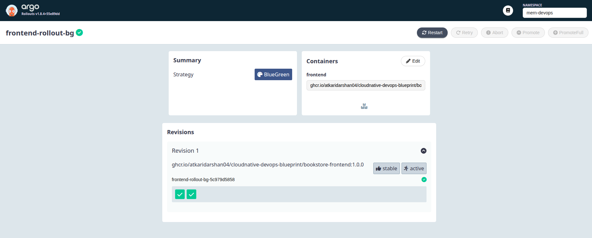

## 7. Understanding Blue-Green Configuration

```yaml
strategy:
  blueGreen:
    activeService: frontend-service-active    # Production traffic (blue)
    previewService: frontend-service-preview  # New version traffic (green)
    autoPromotionEnabled: false               # Pause for manual promotion gate
    scaleDownDelaySeconds: 30                 # Grace period before blue pods terminate
```

### Traffic Flow

```
DURING ROLLOUT (paused):
  Ingress ──► frontend-service-active  ──► Blue pods (v1)   ← production traffic
              frontend-service-preview ──► Green pods (v2)  ← port-forward only

AFTER PROMOTION:
  Ingress ──► frontend-service-active  ──► Green pods (v2)  ← active selector patched
              frontend-service-preview ──► Green pods (v2)
  (Blue pods kept for scaleDownDelaySeconds, then deleted)
```

1. **Update triggered**: Green pods (new version) created alongside blue
2. **Paused**: Preview service selector patched to green pods; active unchanged
3. **Test**: Validate green via port-forward before promoting
4. **Promote**: Active service selector patched to green — instant traffic switch
5. **Cleanup**: Blue pods terminated after `scaleDownDelaySeconds`

## 8. Blue-Green Commands

### Trigger a Deployment

```bash
kubectl argo rollouts set image frontend-rollout-bg frontend=ghcr.io/atkaridarshan04/cloudnative-devops-blueprint/bookstore-frontend:2.0.0 -n mern-devops
kubectl argo rollouts set image backend-rollout-bg backend=ghcr.io/atkaridarshan04/cloudnative-devops-blueprint/bookstore-backend:2.0.0 -n mern-devops
```

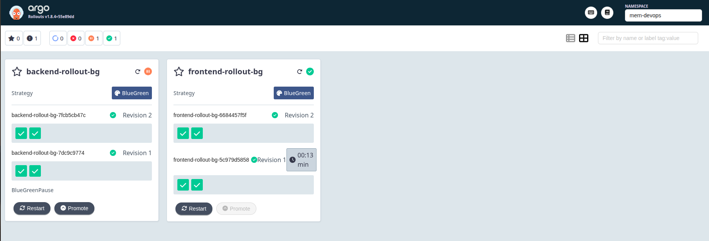

### Test Green Environment Before Promoting

Port forward the stable ingress to access the application:

```bash
kubectl port-forward svc/ingress-nginx-controller 8080:80 -n ingress-nginx --address 0.0.0.0
```

Navigate to [localhost:8080](http://localhost:8080) and verify the new version is working correctly before promoting.
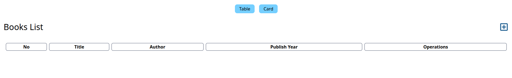

### Monitor Progress

```bash
kubectl argo rollouts get rollout frontend-rollout-bg -n mern-devops --watch
```

### Control the Rollout

```bash
# Promote green to active (instant traffic switch)
kubectl argo rollouts promote frontend-rollout-bg -n mern-devops
```

Now navigate back to [localhost:8080](http://localhost:8080) to see the new version live after promotion.

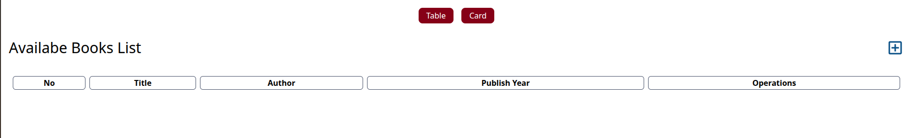


### More Commands

```bash
# Abort — terminates green pods, blue remains active
kubectl argo rollouts abort frontend-rollout-bg -n mern-devops

# Retry a failed rollout
kubectl argo rollouts retry frontend-rollout-bg -n mern-devops
```

---