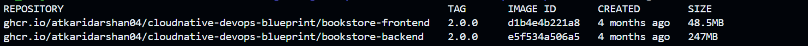

# 🐳 Containerizing MERN Stack with Docker

This guide explains how to containerize and run a MERN (MongoDB, Express, React, Node.js) stack application using **Docker** and **Docker Compose**. Additionally, it covers using **Docker Bake** for images builds and pushing images to **Docker Hub**.

## Prerequisites

Ensure you have the following installed:
- [Docker](https://docs.docker.com/get-docker/)
- [Docker Compose](https://docs.docker.com/compose/install/)

## Setting Up Docker Network

Create a Docker network to allow seamless communication between containers:

```sh
docker network create docker-network
```

## Building and Running Containers Individually

### 1. Running the MongoDB Container

```sh
docker run --network=docker-network --name mongodb -d -p 27017:27017 -v ~/opt/data:/data/mydb mongo:latest
```

This starts a MongoDB container and binds the database storage to `~/opt/data` on the host machine.

### 2. Building and Running the Frontend (React)

#### Build the Frontend Docker Image

```sh
docker build -t ./src/frontend/bookstore-frontend ./src/frontend
```

#### Run the Frontend Container

```sh
docker run --name=frontend --network=docker-network -d -p 5173:5173 bookstore-frontend
```

#### Verify Frontend

Visit `http://localhost:5173` in your browser to check if the frontend is running.

### 3. Building and Running the Backend (Express & Node.js)

#### Build the Backend Docker Image

```sh
docker build -t ./src/backend/bookstore-backend ./src/backend
```

#### Run the Backend Container

```sh
docker run --name=backend --network=docker-network -d -p 8000:8000 bookstore-backend
```

## Production Containers (dockerfile.prod)

For optimized production containers with smaller image sizes:

### 1. Building Production Images

```sh
# Frontend production build
docker build -f ./src/frontend/dockerfile.prod -t bookstore-frontend-prod ./src/frontend

# Backend production build
docker build -f ./src/backend/dockerfile.prod -t bookstore-backend-prod ./src/backend
```

> **📝 Note:** For Kubernetes deployments, check `.env.docker` files in each service directory. These contain different environment configurations for docker development and the one used for the kubernetes manifests.

### 2. Running Production Containers

```sh
# Run production frontend
docker run --name=frontend-prod --network=docker-network -d -p 80:80 bookstore-frontend-prod

# Run production backend
docker run --name=backend-prod --network=docker-network -d -p 8000:8000 bookstore-backend-prod
```

## Using Docker Compose

To simplify container management, use Docker Compose to build and run all services at once.

```sh
docker-compose up -d
```

This command will build and start the frontend, backend, and MongoDB containers as defined in `docker-compose.yml`.


## Using `docker buildx bake` for Multi-Platform Builds

To build images wecan also use the `docker buildx bake` command with a `docker-bake.hcl` or `docker-bake.yml` file.

```sh
docker buildx bake -f docker-bake.yml
```

## Pushing Docker Images to Docker Hub

To push the built images to Docker Hub, follow these steps:

1. Log in to Docker Hub:

   ```sh
   docker login
   ```

2. Tag the images:

   ```sh
   docker tag bookstore-frontend <dockerhub-username>/bookstore-frontend:<tag>
   docker tag bookstore-backend <dockerhub-username>/bookstore-backend:<tag>
   ```

3. Push the images:

   ```sh
   docker push <dockerhub-username>/bookstore-frontend:<tag>
   docker push <dockerhub-username>/bookstore-backend:<tag>
   ```

Go and have a look to your Docker Hub repository to see the pushed images!

## Production Images: GitHub Container Registry (GHCR)

For production-ready images with semantic versioning, we use GHCR with optimized Dockerfiles:

### Building Production Images

```bash
# Build production images using dockerfile.prod
docker build -f src/frontend/dockerfile.prod -t ghcr.io/username/repo/bookstore-frontend:1.0.0 src/frontend/
docker build -f src/backend/dockerfile.prod -t ghcr.io/username/repo/bookstore-backend:1.0.0 src/backend/
```

### Push to GHCR

```bash
# Login to GHCR
echo $GITHUB_TOKEN | docker login ghcr.io -u USERNAME --password-stdin

# Push production images
docker push ghcr.io/username/repo/bookstore-frontend:1.0.0
docker push ghcr.io/username/repo/bookstore-backend:1.0.0
```

### Pull Production Images

```bash
# Pull from GHCR for Kubernetes deployments
docker pull ghcr.io/username/repo/bookstore-frontend:1.0.0
docker pull ghcr.io/username/repo/bookstore-backend:1.0.0
```

### Image Strategy

- **Docker Hub**: Development images and CI/CD pipeline
- **GHCR**: Production-optimized images with semantic versioning
- **Kubernetes manifests**: Use GHCR production images


## 🐳 Docker Best Practices Applied
Added with Docker best practices for production-grade containers:

- **Non-root user**: Containers run as non-root users for improved security.
- **Multistage builds**: Separate build and runtime stages to reduce image size.
- Optimized builds for **smaller image sizes**, fewer vulnerabilities

- **Production-ready Dockerfiles**:
   - Dockerfile.prod added in both frontend/ and backend/ folders

### Happy Dockerizing! 🚀

