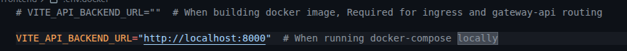

# 🐳 Containerizing a MERN Stack with Docker

This guide explains how to containerize and run a **MERN stack (MongoDB, Express, React, Node.js)** application using **Docker**, **Docker Compose**, and **Docker Buildx Bake**.
It also covers building images and pushing them to **Docker Hub** and **GitHub Container Registry (GHCR)**.


## 🌐 Docker Network Setup

Create a Docker network to enable container-to-container communication:

```bash
docker network create docker-network
```


## 🚀 Running Containers Individually

### 1️⃣ MongoDB

```bash
docker run \
  --name mongodb \
  --network=docker-network \
  -d \
  -p 27017:27017 \
  -v ~/opt/data:/data/mydb \
  mongo:latest
```

* Uses a Docker volume for persistent storage
* Accessible to other containers via `mongodb`

---

### 2️⃣ Frontend (React)

#### Build Image

```bash
docker build -t bookstore-frontend ./src/frontend
```


> **📝 Note:** For Kubernetes deployments, check [./frontend/.env.docker](../src/frontend/.env.docker) files. These contain different environment configurations for docker development and the one used for the kubernetes manifests.



#### Run Container

```bash
docker run \
  --name frontend \
  --network=docker-network \
  -d \
  -p 80:80 \
  bookstore-frontend
```

---

### 3️⃣ Backend (Node.js + Express)

#### Build Image

```bash
docker build -t bookstore-backend ./src/backend
```

#### Run Container

```bash
docker run \
  --name backend \
  --network=docker-network \
  -d \
  -p 8000:8000 \
  bookstore-backend
```


## 🔗 Access the Application

* Frontend: [http://localhost](http://localhost)
* Backend API: [http://localhost:8000](http://localhost:8000)


## 🧩 Running with Docker Compose

Docker Compose allows running all services together using a single command:

```bash
docker-compose up -d
```

This will:

* Build images
* Start MongoDB, backend, and frontend
* Attach all services to a shared network

To stop and remove containers:

```bash
docker-compose down
```


## 🏗️ Multi-Platform Builds with Docker Buildx Bake

For advanced and CI-friendly builds, use **Docker Buildx Bake**:

```bash
docker buildx bake -f docker-bake.yml
```

Benefits:

* Centralized build definitions
* Parallel image builds
* Multi-architecture support


## 📤 Publishing Images (Docker Hub & GHCR)

Images can be published to **Docker Hub** or **GitHub Container Registry (GHCR)** using the same workflow.

### Authenticate

```bash
# Docker Hub
docker login

# GHCR
echo $GITHUB_TOKEN | docker login ghcr.io -u <username> --password-stdin
```

---

### Tag Images

```bash
# Docker Hub
docker tag bookstore-frontend <username>/bookstore-frontend:<tag>
docker tag bookstore-backend <username>/bookstore-backend:<tag>

# GHCR
docker tag bookstore-frontend ghcr.io/<username>/<repo>/bookstore-frontend:<tag>
docker tag bookstore-backend ghcr.io/<username>/<repo>/bookstore-backend:<tag>
```

---

### Push Images

```bash
# Docker Hub
docker push <username>/bookstore-frontend:<tag>
docker push <username>/bookstore-backend:<tag>

# GHCR
docker push ghcr.io/<username>/<repo>/bookstore-frontend:<tag>
docker push ghcr.io/<username>/<repo>/bookstore-backend:<tag>
```

---

### Pull Images

```bash
# Docker Hub
docker pull <username>/bookstore-frontend:<tag>
docker pull <username>/bookstore-backend:<tag>

# GHCR
docker pull ghcr.io/<username>/<repo>/bookstore-frontend:<tag>
docker pull ghcr.io/<username>/<repo>/bookstore-backend:<tag>
```


## 🔐 Docker Best Practices Applied

* ✅ Containers run as **non-root users**
* ✅ **Multi-stage builds** for smaller images
* ✅ Reduced attack surface and vulnerabilities
* ✅ Optimized Dockerfiles for runtime efficiency
* ✅ Clean separation between build and runtime layers


## 🎉 Conclusion

This setup provides a **clean, scalable, and registry-agnostic Docker workflow** for a MERN stack, supporting:

* Local development
* CI/CD pipelines
* Multi-platform builds
* Kubernetes-ready images

**Happy Dockerizing! 🚀**
