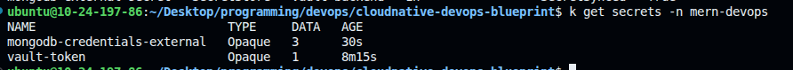
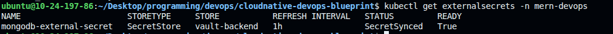

# 🔐 Git-Safe Secret Management with External Secrets Operator (ESO)

This guide demonstrates **secure, Git-safe secret management in Kubernetes** using:

* **HashiCorp Vault** as the secret store
* **External Secrets Operator (ESO)** as the sync mechanism

The goal is simple but critical:

> **Never store secrets in Git. Ever.**

Instead:

* Secrets live in Vault
* Git contains only *references*
* Kubernetes gets native `Secret` objects at runtime


## 🧠 Why This Matters

Traditional Kubernetes workflows often do this:

```yaml
apiVersion: v1
kind: Secret
data:
  password: cGFzc3dvcmQxMjM=
```

Problems:

* Secrets are committed to Git
* Base64 ≠ encryption
* Repo access = secret access

With ESO + Vault:

* Git stays clean
* Secrets are centrally managed
* Rotation does not require redeploying manifests


## 🧩 Core Components

| Component                 | Responsibility               |
| ------------------------- | ---------------------------- |
| HashiCorp Vault           | Secure secret storage        |
| External Secrets Operator | Sync secrets into Kubernetes |
| Kubernetes Secret         | Runtime consumption by pods  |


## 🔄 High-Level Flow (Important to Understand)

1. Secret is securely stored in **Vault**
2. Git contains **only a reference** to that secret
3. ESO reads the secret from Vault
4. ESO creates a native Kubernetes `Secret`
5. Pods consume it like any normal secret

👉 **Git never sees secret values**


## 🧪 Local Setup (Kind Cluster)

Create a local Kubernetes cluster using **Kind**:

```yaml
kind: Cluster
apiVersion: kind.x-k8s.io/v1alpha4
nodes:
  - role: control-plane
    extraPortMappings:
      - containerPort: 31000 # frontend
        hostPort: 31000
        protocol: TCP
      - containerPort: 31100 # backend
        hostPort: 31100
        protocol: TCP
```

**Why this matters**

* Port mappings allow you to access services from localhost
* Keeps everything local and reproducible


## ⚙️ Install External Secrets Operator (ESO)

```bash
helm repo add external-secrets https://charts.external-secrets.io
helm repo update

helm install external-secrets external-secrets/external-secrets \
  -n external-secrets \
  --create-namespace
```

Verify installation:

```bash
kubectl get pods -n external-secrets
```

✅ You should see ESO controller pods running.


## 🔐 Install HashiCorp Vault

Create a namespace:

```bash
kubectl create namespace vault
kubectl create namespace mern-devops
```

Deploy Vault (dev mode for learning):

```bash
kubectl apply -f hashicorp-vault/vault-deployment.yml
```

Expose Vault locally:

```bash
kubectl port-forward -n vault deploy/vault 8200:8200
```
Access the Vault UI at: [http://localhost:8200](http://localhost:8200)  
Token: `root`, after applying the belwo step.


## 🗄️ Store Secrets in Vault

Open a shell inside the Vault pod:

```bash
kubectl exec -it -n vault deploy/vault -- sh
```

Set Vault environment variables:

```bash
export VAULT_ADDR=http://127.0.0.1:8200
export VAULT_TOKEN=root
```

Store MongoDB credentials:

```bash
vault kv put secret/dev/mern-backend/mongodb \
  username=admin \
  password=password123
```

✅ Secret is now securely stored in Vault


## 🔑 Allow ESO to Access Vault

ESO needs a Vault token to read secrets.

Create a Kubernetes Secret with the Vault token:

```bash
kubectl create secret generic vault-token \
  --from-literal=token=root \
  -n mern-devops
```
> Note: This allows ESO to authenticate with Vault using the provided token.


## 🔌 Create SecretStore (Vault Connection)

Apply the SecretStore configuration:

```bash
kubectl apply -f hashicorp-vault/secretStore.yml
```
It tells ESO *how* to connect to Vault


## 🧾 Create ExternalSecret (Git-Safe)

This is the **only secret-related file that goes into Git**:

```bash
kubectl apply -f hashicorp-vault/externalSecret.yml
```

Verify Kubernetes Secret creation:

```bash
kubectl get secrets -n mern-devops
```

You should see a newly created secret.



Verify ExternalSecret:

```bash
kubectl get externalsecret -n mern-devops
```

Look for status: `SecretSynced`



## ✅ Verify Secret Synchronization

Check if the Kubernetes secret was created successfully:

```bash
kubectl describe secret mongodb-credentials-external -n mern-devops
```

### 🔍 Inspect Secret Values

Decode and verify the synchronized secret values:

```bash
# Get the secret in YAML format
kubectl get secret mongodb-credentials-external -n mern-devops -o yaml

# Decode specific values
kubectl get secret mongodb-credentials-external -n mern-devops -o jsonpath='{.data.MONGODB_USER}' | base64 --decode
kubectl get secret mongodb-credentials-external -n mern-devops -o jsonpath='{.data.MONGODB_PASSWORD}' | base64 --decode
kubectl get secret mongodb-credentials-external -n mern-devops -o jsonpath='{.data.MONGODB_URL}' | base64 --decode
```

Matches what you stored in Vault.


## 🧩 Consume Secrets in Applications

No application changes required.

Pods consume secrets like normal:

```yaml
env:
  - name: MONGO_INITDB_ROOT_USERNAME
    valueFrom:
      secretKeyRef:
        name: db-secret
        key: username
```

This is the **big win**:

* App developers don’t need to know about Vault
* Platform handles secrets centrally


## 🚀 Deploy the Application

### MongoDB

```bash
kubectl apply -f hashicorp-vault//mongodb.yml
```


## ✅ What You’ve Achieved

- ✔ Git-safe secret management
- ✔ Vault as a central source of truth
- ✔ Zero secret values in Git
- ✔ Kubernetes-native consumption

---