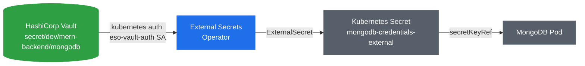

# 🔐 Git-Safe Secret Management with External Secrets Operator (ESO)

> 📘 See [concepts/SecretsManagement.md](./concepts/SecretsManagement.md) for why native Secrets aren't enough and how Vault + ESO fit together.

This guide demonstrates **secure, Git-safe secret management in Kubernetes** using:

* **HashiCorp Vault** as the secret store
* **External Secrets Operator (ESO)** as the sync mechanism

The goal is simple but critical:

> **Never store secrets in Git. Ever.**

Instead:

* Secrets live in Vault
* Git contains only *references*
* Kubernetes gets native `Secret` objects at runtime




## 🧠 Why This Matters

Traditional Kubernetes workflows often do this:

```yaml
apiVersion: v1
kind: Secret
data:
  password: cGFzc3dvcmQxMjM=
```

Problems:

* Secrets are committed to Git
* Base64 ≠ encryption
* Repo access = secret access

With ESO + Vault:

* Git stays clean
* Secrets are centrally managed
* Rotation does not require redeploying manifests


## 🧩 Core Components

| Component                 | Responsibility               |
| ------------------------- | ---------------------------- |
| HashiCorp Vault           | Secure secret storage        |
| External Secrets Operator | Sync secrets into Kubernetes |
| Kubernetes Secret         | Runtime consumption by pods  |


## 🔄 High-Level Flow (Important to Understand)

1. Secret is securely stored in **Vault**
2. Git contains **only a reference** to that secret
3. ESO reads the secret from Vault
4. ESO creates a native Kubernetes `Secret`
5. Pods consume it like any normal secret

👉 **Git never sees secret values**


## 🧪 Local Setup (Kind Cluster)

Create a local Kubernetes cluster using **Kind**:

```yaml
kind: Cluster
apiVersion: kind.x-k8s.io/v1alpha4
nodes:
  - role: control-plane
    extraPortMappings:
      - containerPort: 31000 # frontend
        hostPort: 31000
        protocol: TCP
      - containerPort: 31100 # backend
        hostPort: 31100
        protocol: TCP
```

**Why this matters**

* Port mappings allow you to access services from localhost
* Keeps everything local and reproducible


## ⚙️ Install External Secrets Operator (ESO)

```bash
helm repo add external-secrets https://charts.external-secrets.io
helm repo update

helm install external-secrets external-secrets/external-secrets \
  -n external-secrets \
  --create-namespace
```

Verify installation:

```bash
kubectl get pods -n external-secrets
```

✅ You should see ESO controller pods running.


> 💡 Everything below (`kubectl apply -f external-secrets/...`) can instead be handed to
> ArgoCD once, via `external-secrets/argocd-application.yml` — it GitOps-manages this whole
> folder. Manual `kubectl apply` is shown here so each step is visible while you're learning
> the flow; switch to the Application once you're comfortable with it.

## 🔐 Install HashiCorp Vault

Apply the raft-based Vault StatefulSet (creates the `vault` namespace itself). Its PVC uses
`standard` — kind's built-in StorageClass, backed by `local-path-provisioner` — no separate
StorageClass to apply:

```bash
kubectl apply -f external-secrets/vault-statefulset.yml
kubectl create namespace mern-devops
```

This is production-mode Vault (Integrated Storage / raft, PVC-backed) — it needs a one-time
init + unseal below, and Vault's data survives pod restarts, which is what you'll later back
up with Velero (see [Velero.md](./Velero.md)).

Expose Vault locally:

```bash
kubectl port-forward -n vault vault-0 8200:8200
```
Access the Vault UI at: [http://localhost:8200](http://localhost:8200)

The pod comes up **sealed and uninitialized** — the UI/API will 501/503 until you
initialize and unseal it below.

## 🔓 Initialize and Unseal Vault

One-time setup, from your shell (not inside the pod):

```bash
export VAULT_ADDR=http://127.0.0.1:8200

# -key-shares=1 -key-threshold=1: single unseal key, fine for local learning.
# Production Vault normally splits this into multiple shares (Shamir's secret sharing).
vault operator init -key-shares=1 -key-threshold=1
```

This prints one **Unseal Key** and one **Initial Root Token** — save both somewhere local
(e.g. a gitignored file), never in git. You need the unseal key again every time the Vault
pod restarts (no auto-unseal is configured), and you need it again to unlock Vault after a
Velero restore onto a new cluster.

```bash
vault operator unseal <UNSEAL_KEY>
export VAULT_TOKEN=<INITIAL_ROOT_TOKEN>

# enable the kv-v2 secrets engine at "secret/" — not mounted by default:
vault secrets enable -path=secret kv-v2
```

## 🗄️ Store Secrets in Vault

```bash
vault kv put secret/dev/mern-backend/mongodb \
  username=admin \
  password=password123
```

✅ Secret is now securely stored in Vault


## 🔑 Configure Kubernetes Auth Method in Vault

ESO never sees or holds the root token. Instead, it authenticates as a Kubernetes
ServiceAccount, and Vault verifies that ServiceAccount's identity directly against the
Kubernetes API.

```bash
vault auth enable kubernetes

vault write auth/kubernetes/config \
  kubernetes_host="https://kubernetes.default.svc:443"
```

A read-only policy, scoped to exactly the path this app's secret lives at — nothing else in
Vault is reachable through it:

```bash
vault policy write mern-mongodb-read - <<EOF
path "secret/data/dev/mern-backend/*" {
  capabilities = ["read"]
}
EOF
```

A role binding that policy to one specific ServiceAccount + namespace (`eso-vault-auth` in
`mern-devops` — created by the RBAC manifest below, not ESO's own controller SA):

```bash
vault write auth/kubernetes/role/eso-mongodb-role \
  bound_service_account_names=eso-vault-auth \
  bound_service_account_namespaces=mern-devops \
  policies=mern-mongodb-read \
  ttl=1h
```

Apply the ServiceAccount ESO impersonates, plus the RBAC letting ESO's controller mint a
token for it:

```bash
kubectl apply -f external-secrets/vault-auth-rbac.yml
```

> Confirm the RoleBinding's subject matches your installed ESO controller's ServiceAccount
> name — `kubectl get sa -n external-secrets` — before applying, in case it differs from the
> `external-secrets` default.


## 🔌 Create SecretStore (Vault Connection)

Apply the SecretStore configuration:

```bash
kubectl apply -f external-secrets/secretStore.yml
```
It tells ESO *how* to connect to Vault — via the `eso-vault-auth` ServiceAccount and
`eso-mongodb-role` configured above, not a static token.


## 🧾 Create ExternalSecret (Git-Safe)

This is the **only secret-related file that goes into Git**:

```bash
kubectl apply -f external-secrets/externalSecret.yml
```

Verify Kubernetes Secret creation:

```bash
kubectl get secrets -n mern-devops
```

You should see a newly created secret.


Verify ExternalSecret:

```bash
kubectl get externalsecret -n mern-devops
```

Look for status: `SecretSynced`


## ✅ Verify Secret Synchronization

Check if the Kubernetes secret was created successfully:

```bash
kubectl describe secret mongodb-credentials-external -n mern-devops
```

### 🔍 Inspect Secret Values

Decode and verify the synchronized secret values:

```bash
# Get the secret in YAML format
kubectl get secret mongodb-credentials-external -n mern-devops -o yaml

# Decode specific values
kubectl get secret mongodb-credentials-external -n mern-devops -o jsonpath='{.data.MONGODB_USER}' | base64 --decode
kubectl get secret mongodb-credentials-external -n mern-devops -o jsonpath='{.data.MONGODB_PASSWORD}' | base64 --decode
kubectl get secret mongodb-credentials-external -n mern-devops -o jsonpath='{.data.MONGODB_URL}' | base64 --decode
```

Matches what you stored in Vault.


## 🧩 Consume Secrets in Applications

No application changes required.

Pods consume secrets like normal:

```yaml
env:
  - name: MONGO_INITDB_ROOT_USERNAME
    valueFrom:
      secretKeyRef:
        name: db-secret
        key: username
```

This is the **big win**:

* App developers don’t need to know about Vault
* Platform handles secrets centrally


## 🚀 Deploy the Application

### MongoDB

```bash
kubectl apply -f external-secrets/mongodb.yml
```


## ✅ What You’ve Achieved

- ✔ Git-safe secret management
- ✔ Vault as a central source of truth
- ✔ Zero secret values in Git
- ✔ Kubernetes-native consumption
- ✔ Vault + MongoDB data now persisted to a PVC, not just credentials

Note what's still missing: none of this is backed up anywhere. If the `vault` or
`mern-devops` PVCs are lost, the raft data and Mongo's data directory are gone for good —
ArgoCD can redeploy every manifest in this folder from git, but it can't recreate data that
was never in git to begin with. That's what [Velero.md](./Velero.md) covers next.

---