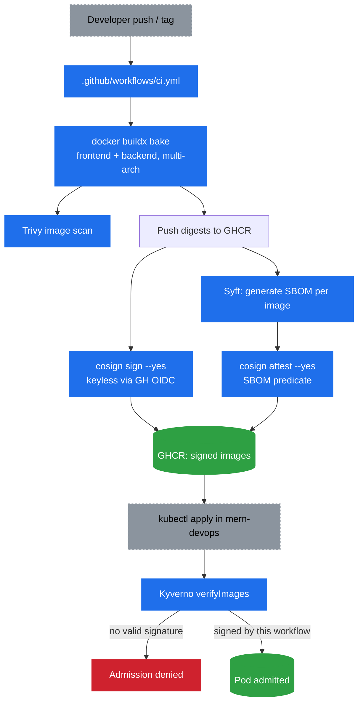

# 🔏 CI/CD Pipeline with Image Signing (GitHub Actions)

> 📘 See [concepts/SupplyChainSecurity.md](./concepts/SupplyChainSecurity.md) for *why* SBOM, keyless
> signing, and signature enforcement matter — this guide is the *how*, implementing issue
> [#14](https://github.com/atkaridarshan04/CloudNative-DevOps-Blueprint/issues/14).

This guide covers a GitHub Actions pipeline that runs **parallel to, not instead of**, the existing
[Jenkins pipeline](./Jenkins.md). Same job — build, scan, ship an image — different registry and a
stronger trust model:

| | Jenkins (existing) | GitHub Actions (this guide) |
|---|---|---|
| Registry | Docker Hub | GHCR (`ghcr.io/atkaridarshan04/cloudnative-devops-blueprint/...`) |
| Scan | Trivy | Trivy (same tool, second lane) |
| SBOM | — | Syft, attached as a signed attestation |
| Provenance | none — any image can carry the tag | cosign keyless signature (Sigstore/Fulcio/Rekor) |
| Cluster admission | tag/label policies only | + Kyverno `verifyImages`, signature required |



> 📘 This doc is purely the setup/run/verify guide. For a full breakdown of what each step in the
> workflow file does, see [`.github/workflows/ci.md`](../.github/workflows/ci.md). The Kyverno
> policy itself lives at
> [`kyverno/policies/verify-ghcr-image-signatures.yaml`](../kyverno/policies/verify-ghcr-image-signatures.yaml).

---

## Prerequisites — one-time setup

Most of this pipeline needs **zero secrets** — that's the entire point of keyless signing. But a
couple of GitHub/GHCR settings need to be right before the first run will actually work:

| What | Where | Why |
|---|---|---|
| Workflow write permissions | Repo → **Settings → Actions → General → Workflow permissions** → select **Read and write permissions** | `GITHUB_TOKEN` can't push to GHCR under the default read-only setting, no matter what `permissions:` the workflow YAML requests — the repo-level setting is a ceiling, not something the workflow can override upward. Without this, the `build` job fails on push with `denied: permission_denied`. |
| Package Actions access (if the package already exists) | Your GitHub profile → **Packages** → `bookstore-frontend` / `bookstore-backend` → **Package settings** → **Manage Actions access** → **Add Repository** → `cloudnative-devops-blueprint` with role **Write** | Only needed if a package with that name already exists — e.g. from an earlier manual `docker push` / `docker buildx bake --push` with your own local GHCR login. An existing package isn't automatically linked to grant *this* repo's `GITHUB_TOKEN` write access, and the push fails with `denied: permission_denied: write_package` (a different error from the one above) until this is added. |
| GHCR package visibility | After the **first successful push**: same **Package settings** page → confirm it's linked to this repo, and set visibility (**Public**, simplest for a demo project) | Both `kubectl` (pulling the image into a Pod) and Kyverno (pulling the signature/attestation to verify it) need to reach the registry. If you keep the package **private** instead, you'll need an `imagePullSecret` in the `mern-devops` namespace *and* Kyverno's admission controller configured with registry credentials — public is the path of least resistance here. |
| OIDC (Sigstore keyless signing) | Nothing to configure | `id-token: write` in the workflow is the entire requirement. GitHub's OIDC issuer (`token.actions.githubusercontent.com`) is already trusted by Sigstore's Fulcio CA — no app registration, no secret, no key pair. |
| Syft (SBOM generation) | Nothing to configure | Runs entirely inside the `anchore/sbom-action` step; no account, token, or external service. |

For the **manual verification** steps further down, you'll also want these installed locally:
`cosign`, `jq`, `docker buildx` (already needed for local builds), and `kubectl` pointed at a
cluster with Kyverno installed (see [Kyverno.md](./Kyverno.md) if that's not set up yet).

## When this runs

- **Push to `main`** — same trigger as the Jenkins CI; builds and signs on every merge.
- **Push of a `v*` git tag** — for a deliberate, one-off signed build (e.g. tagging `v1` on a
  commit you want to demo).
- **Manual `workflow_dispatch`** — from the Actions tab, useful for testing this pipeline without a
  real push.

Regardless of trigger, the pushed image is always tagged `signed-<short-sha>` — see
[Running the pipeline](#1-running-the-pipeline) below.

## Note

Every run pushes under its own `signed-<short-sha>` tag (e.g.
`signed-a3f9c2e`) — a separate tag created specifically for this signing/SBOM/Kyverno demo, kept outside the `1.0.0`/`2.0.0`/`3.0.0` versions already used across this repo's other implementations so this pipeline never touches or reuses those images. The same signing + SBOM + verification approach demoed here can
be pointed at those existing tags too.

## 1. Running the pipeline

Trigger it either by pushing to `main` (or a `v*` tag), or manually from the **Actions** tab
(`workflow_dispatch`). Find the digest it actually pushed
either way:

```bash
# per image, resolves the manifest digest for a given tag — copy the tag from the Actions run logs
docker buildx imagetools inspect ghcr.io/atkaridarshan04/cloudnative-devops-blueprint/bookstore-backend:signed-<sha>
docker buildx imagetools inspect ghcr.io/atkaridarshan04/cloudnative-devops-blueprint/bookstore-frontend:signed-<sha>
```

Or read it straight from the run: **Actions → the run → `build` job → "Extract pushed image
digests"** step output.

## 2. Verify the signature and SBOM yourself (cosign CLI)

Anyone can verify a signed image, without any repo access — that's the point of a public
transparency log:

```bash
cosign verify \
  --certificate-identity "https://github.com/atkaridarshan04/cloudnative-devops-blueprint/.github/workflows/ci.yml@refs/heads/main" \
  --certificate-oidc-issuer "https://token.actions.githubusercontent.com" \
  ghcr.io/atkaridarshan04/cloudnative-devops-blueprint/bookstore-backend@<digest>
```

A valid signature prints the Rekor log entry and the certificate identity that signed it. Pull the
attached SBOM attestation the same way:

```bash
cosign verify-attestation \
  --type spdxjson \
  --certificate-identity "https://github.com/atkaridarshan04/cloudnative-devops-blueprint/.github/workflows/ci.yml@refs/heads/main" \
  --certificate-oidc-issuer "https://token.actions.githubusercontent.com" \
  ghcr.io/atkaridarshan04/cloudnative-devops-blueprint/bookstore-backend@<digest> \
  | jq -r '.payload' | base64 -d | jq '.predicate.packages | length'
```

That last `jq` just proves the attestation is a real SBOM by counting the packages listed in it.

## 3. Apply the Kyverno policy and test signed vs. unsigned

```bash
kubectl apply -f kyverno/policies/verify-ghcr-image-signatures.yaml
kubectl get clusterpolicy verify-ghcr-image-signatures
```

**Positive case** — a real image from this pipeline, referenced by digest, should be admitted:

```bash
kubectl run test-signed -n mern-devops \
  --image=ghcr.io/atkaridarshan04/cloudnative-devops-blueprint/bookstore-backend@<real-digest>

kubectl get pod test-signed -n mern-devops   # Running / ContainerCreating, not blocked
```

**Negative case** — the actual test that matters. Push *something* to the same GHCR path that
never went through `cosign sign` in this workflow — e.g. retag and push an unrelated local image
under the same repo path, or just reference a tag that predates this pipeline (unsigned):

```bash
kubectl run test-unsigned -n mern-devops \
  --image=ghcr.io/atkaridarshan04/cloudnative-devops-blueprint/bookstore-backend:unsigned-test
```

Expected: the request never creates the Pod —

```
Error from server: admission webhook "validate.kyverno.svc-fail" denied the request:
...failed to verify signature...
```

Inspect why, either way:

```bash
kubectl describe clusterpolicy verify-ghcr-image-signatures
kubectl get events -n mern-devops --field-selector reason=PolicyViolation
```

If the unsigned Pod gets admitted instead of denied, the policy isn't actually enforcing — check
`validationFailureAction: Enforce` (not `Audit`) and that `background: false` isn't silently
skipping live admission checks. Clean up both test pods afterward:

```bash
kubectl delete pod test-signed test-unsigned -n mern-devops --ignore-not-found
```

## Notes

- Jenkins/Jenkinsfile is untouched — this is a second, independent workflow.
- Argo Workflows/Events and Tempo tracing are explicitly out of scope for this pass.
- Same signing/enforcement pattern on the prod branch's real EKS cluster is a possible follow-on,
  not built here.
