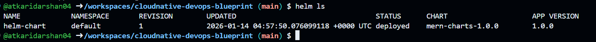
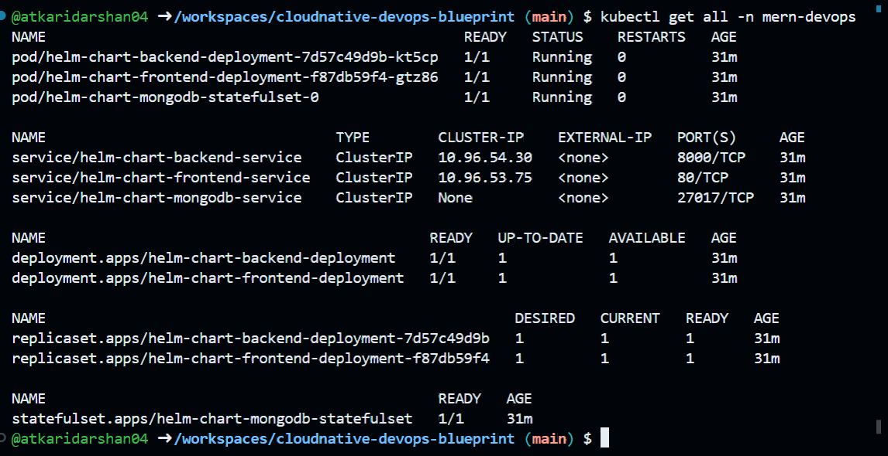
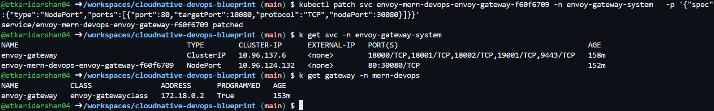

#  📦 Packaging & Deploying Applications with Helm Charts

## Step 1: Cluster Setup

Cluster Configuration: `kind-config.yaml`
```yaml
kind: Cluster
apiVersion: kind.x-k8s.io/v1alpha4
nodes:
  - role: control-plane
    extraPortMappings:
      - containerPort: 80   # for nginx ingress
        hostPort: 80
        protocol: TCP
```

- Run the following command to create a Kubernetes cluster using the provided `kind-config.yaml`:

  ```bash
  kind create cluster --config kind-config.yaml
  ```

- Create **mern-devops** namespace:

  ```bash
  kubectl create namespace mern-devops
  ```

## Step 2: Install Envoy Gateway Controller with Gateway API CRDs

```bash
helm install eg oci://docker.io/envoyproxy/gateway-helm --version v0.0.0-latest -n envoy-gateway-system --create-namespace
```

Wait for Envoy Gateway to become available:

```bash
kubectl wait --timeout=5m -n envoy-gateway-system deployment/envoy-gateway --for=condition=Available
```


## Step 3: Package the Helm Charts

```bash
helm package helm-chart
```

This will create `.tgz` files for each chart in the current directory.


## Step 4: Install the Helm Charts

Install each chart using Helm:

```bash
helm install helm-chart ./helm-chart
```

## 5. Verify

### Step 1: List all Helm releases to confirm they are deployed:

```bash
helm ls
```


Check the status of all resources in the Kubernetes cluster:

```bash
kubectl get all -n mern-devops
```



### Step 2: Verify Gateway API Resources

```bash
kubectl get gatewayclass
kubectl get gateway -n mern-devops
kubectl get httproute -n mern-devops
```


> **⚠️ Important:** If doing locally then the programmed will be false since there is no LoadBalancer support in kind. For that in further steps we will patch the service to NodePort.

#### Verify Envoy Gateway Resources

```bash
kubectl get pods -n envoy-gateway-system
kubectl get svc -n envoy-gateway-system
```

### Step 3: Access the Application

Patch the envoy-mern-devops-gateway service to use NodePort for external access:

> **🔧 Local Testing Only:** Only for local testing purposes, for production use LoadBalancer or Ingress with proper DNS.

```bash
kubectl patch svc <service-name> -n envoy-gateway-system \
  -p '{"spec":{"type":"NodePort","ports":[{"port":80,"targetPort":10080,"protocol":"TCP","nodePort":30080}]}}'
```


```bash
kubectl port-forward <service-name> 30080:80 -n envoy-gateway-system
```

Access the application at:
```
http://localhost:30080
```


## Step 6: Cleanup

If you need to uninstall the deployed Helm charts, use the following commands:

### Uninstall Chart

```bash
helm uninstall helm-chart
```

After uninstalling the charts, you can also check the status to confirm that the resources have been removed:

```bash
kubectl get ns
```

List all Helm releases to confirm they are uninstalled:

```bash
helm ls
```

---

## (Optional) Publish Helm Chart to GHCR (OCI)

This project supports publishing and consuming the Helm chart using **GitHub Container Registry (GHCR)** as an **OCI registry**.

---

### 1) Login to GHCR

```bash
export GHCR_USERNAME="atkaridarshan04"
export GHCR_TOKEN="<your_github_token>"

echo $GHCR_TOKEN | helm registry login ghcr.io -u $GHCR_USERNAME --password-stdin
```

---

### 2) Package the Helm Chart

Run this inside the chart directory (where `Chart.yaml` exists):

```bash
helm package .
```

This generates a versioned chart archive like:

```
mern-chart-2.0.0.tgz
```

---

### 3) Push the Chart to GHCR

```bash
helm push mern-chart-2.0.0.tgz oci://ghcr.io/atkaridarshan04/helm-charts
```

This will publish the chart as:

```
ghcr.io/atkaridarshan04/helm-charts/mern-charts:2.0.0
```

---

### 4) Pull the Chart from GHCR

```bash
helm pull oci://ghcr.io/atkaridarshan04/helm-charts/mern-chart --version 2.0.0
```

(Optional) Extract it:

```bash
helm pull oci://ghcr.io/atkaridarshan04/helm-charts/mern-chart --version 2.0.0 --untar
```

---

### 5) Install the Chart from GHCR

```bash
helm install mern-chart oci://ghcr.io/atkaridarshan04/helm-charts/mern-chart --version 2.0.0
```

---

### 6) Upgrade an Existing Release

```bash
helm upgrade mern-chart oci://ghcr.io/atkaridarshan04/helm-charts/mern-chart --version 2.0.0
```

---

### 7) Show Chart Metadata (Verify Version)

```bash
helm show chart oci://ghcr.io/atkaridarshan04/helm-charts/mern-chart --version 2.0.0
```


---
