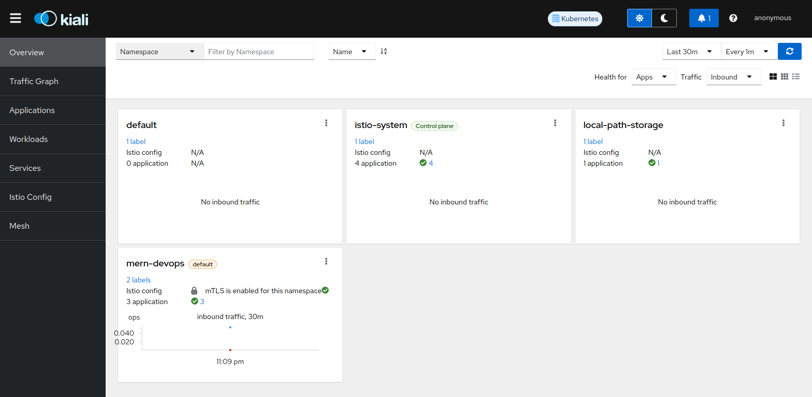
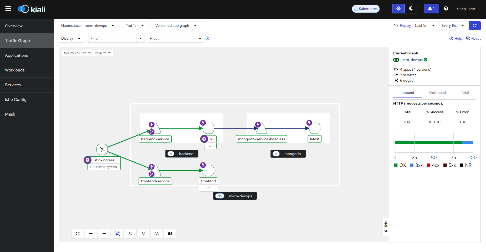
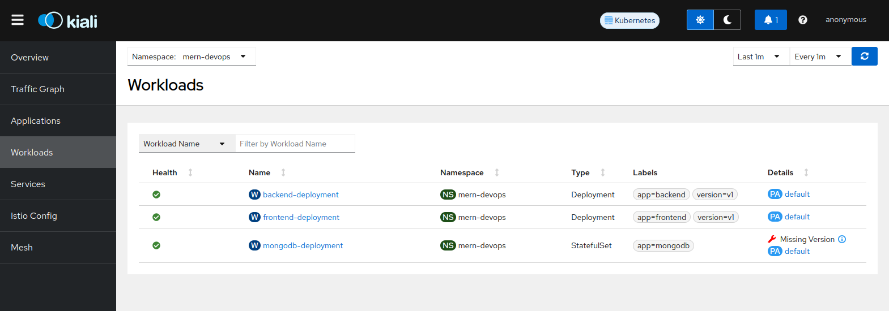
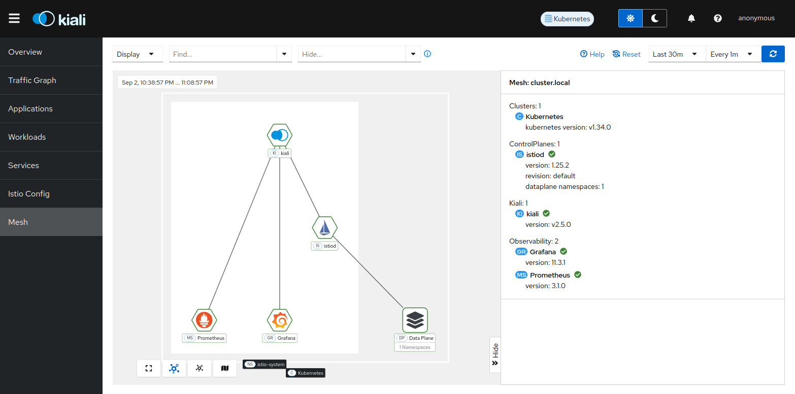
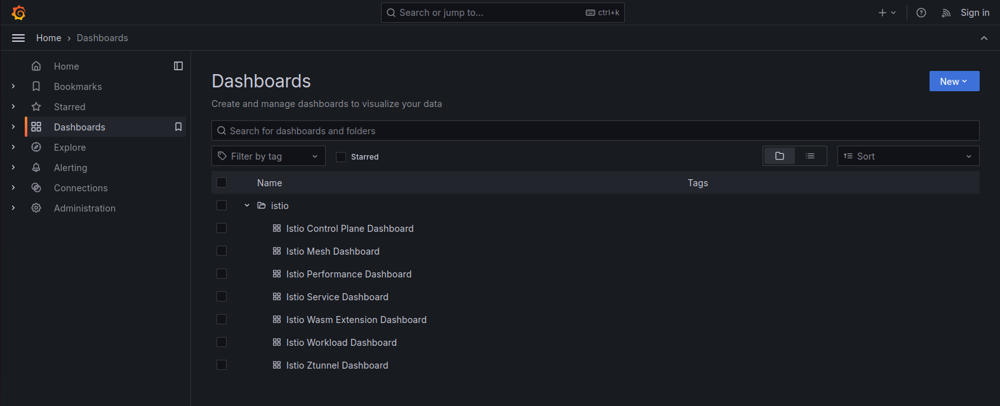
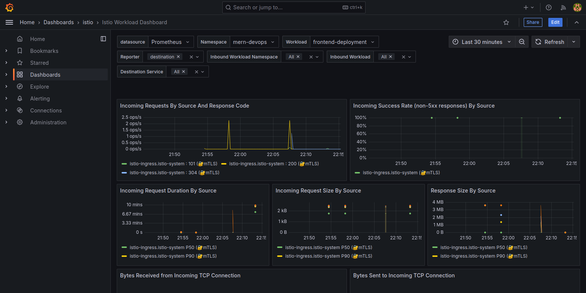

# 🕸️ Service Mesh Implementation with Istio

This guide provides step-by-step instructions to **install and configure Istio service mesh** and **deploy the MERN application** with advanced traffic management, security, and observability features.


## **1. Install Istio Service Mesh**

### **Step 1: Create Istio System Namespace**
```bash
kubectl create namespace istio-system
```

### **Step 2: Add Istio Helm Repository**
```bash
helm repo add istio https://istio-release.storage.googleapis.com/charts
helm repo update
```

### **Step 3: Install Istio Components**
Install Istio base components:
```bash
helm install istio-base istio/base -n istio-system 
```

Install Istio control plane (istiod):
```bash
helm install istiod istio/istiod -n istio-system --wait
```

Install Istio ingress gateway:
```bash
helm install istio-ingress istio/gateway -n istio-system
```

### **Step 4: Verify Installation**
```bash
kubectl get pods -n istio-system
kubectl get svc -n istio-system
```


## **2. Install Istio Add-ons**

### **Step 1: Download Add-on Manifests**
```bash
cd ./istio-manifests
mkdir -p istio-addons

curl -L https://raw.githubusercontent.com/istio/istio/release-1.25/samples/addons/prometheus.yaml -o istio-addons/prometheus.yaml
curl -L https://raw.githubusercontent.com/istio/istio/release-1.25/samples/addons/grafana.yaml -o istio-addons/grafana.yaml
curl -L https://raw.githubusercontent.com/istio/istio/release-1.25/samples/addons/kiali.yaml -o istio-addons/kiali.yaml
curl -L https://raw.githubusercontent.com/istio/istio/release-1.25/samples/addons/jaeger.yaml -o istio-addons/jaeger.yaml
```

### **Step 2: Deploy Add-ons**
```bash
kubectl apply -f istio-addons/prometheus.yaml
kubectl apply -f istio-addons/grafana.yaml
kubectl apply -f istio-addons/kiali.yaml
kubectl apply -f istio-addons/jaeger.yaml
```

### **Step 3: Verify Add-ons**
```bash
kubectl get pods -n istio-system
```


## **3. Prepare Application Namespace**

### **Step 1: Create Application Namespace**
```bash
kubectl create namespace mern-devops
```

### **Step 2: Enable Istio Sidecar Injection**
```bash
kubectl label namespace mern-devops istio-injection=enabled
```

### **Step 3: Verify Namespace Labels**
```bash
kubectl get namespace mern-devops --show-labels
```


## **4. Deploy the Application**

### **Step 1: Deploy Application Components**
Deploy the application manifests in the following order:

```bash
kubectl apply -f ../kubernetes/secrets.yml
kubectl apply -f ../kubernetes/config.yml
```

```bash
kubectl apply -f ../kubernetes/mongodb.yml
kubectl apply -f ../kubernetes/backend.yml
kubectl apply -f ../kubernetes/frontend.yml
```

### **Step 2: Deploy Istio Traffic Management Configuration**
Apply all Istio-specific configurations:

```bash
# mTLS enforcement
kubectl apply -f mtls.yml

# Service accounts (required for AuthorizationPolicy principal matching)
kubectl apply -f serviceaccounts.yml

# Ingress gateway and routing
kubectl apply -f gateway.yml
kubectl apply -f virtualService.yml

# Traffic policies (load balancing, circuit breaking, connection pools)
kubectl apply -f destinationRule.yml

# Sidecar scope (limits egress to namespace + istio-system)
kubectl apply -f sidecar.yml

# Authorization policies (deny-all + allow rules)
kubectl apply -f authorizationPolicy.yml
```

### **Step 3: Verify Deployment**
```bash
kubectl get pods -n mern-devops
kubectl get svc -n mern-devops
```

---

## **5. Access Applications and Dashboards**

### **Step 1: Access the MERN Application**
```bash
kubectl port-forward svc/istio-ingress -n istio-system 8080:80
```
Access the application at: `http://localhost:8080`

### **Step 2: Access Kiali Dashboard**
```bash
kubectl port-forward svc/kiali -n istio-system 20001:20001
```
Access Kiali at: `http://localhost:20001`

### **Step 3: Access Grafana Dashboard**
```bash
kubectl port-forward svc/grafana -n istio-system 3000:3000
```
Access Grafana at: `http://localhost:3000`

### **Step 4: Access Jaeger Tracing**
```bash
kubectl port-forward svc/jaeger -n istio-system 16686:16686
```
Access Jaeger at: `http://localhost:16686`


## **6. Service Mesh Observability**

### **Kiali Service Mesh Dashboard**

*Kiali overview dashboard showing service mesh topology*


*Application graph view with traffic flow visualization*


*Workloads view showing deployment status and health*


*Service mesh configuration and policies*

### **Grafana Metrics Dashboard**

*Grafana dashboard for Istio service mesh metrics*


*Workload-specific performance metrics and monitoring*


## **7. Security Features**

### **Mutual TLS (mTLS)**
All service-to-service traffic is encrypted and authenticated via STRICT mTLS. The `PeerAuthentication` resource enforces this at the namespace level, and each `DestinationRule` sets `tls.mode: ISTIO_MUTUAL` to ensure the client side also uses mTLS.

```bash
kubectl get peerauthentication -n mern-devops
kubectl get destinationrule -n mern-devops
```

### **AuthorizationPolicy (Zero-Trust)**
The `deny-all` policy blocks all traffic by default. Explicit allow rules then permit only:
- Istio ingress gateway → frontend & backend
- frontend SA → backend (on `/books*`)
- backend SA → mongodb

This requires the `frontend` and `backend` ServiceAccounts to be created and referenced in the respective Deployments.


## **Key Benefits**

- **Traffic Management**: Advanced routing, load balancing, retries, and timeouts
- **Security**: Automatic mTLS, zero-trust AuthorizationPolicies
- **Resilience**: Circuit breakers (outlier detection), connection pool limits, retries
- **Observability**: Distributed tracing, metrics, and service topology visualization via Kiali
