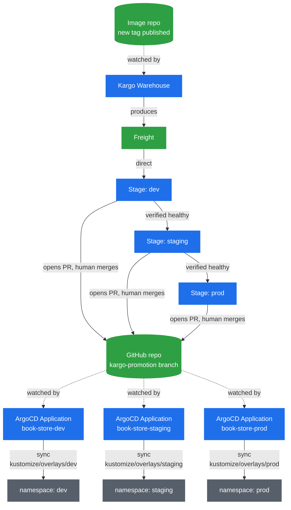

# 🚚 Progressive Delivery Across Environments with Kargo

> 📘 See [`concepts/Kargo.md`](./concepts/Kargo.md) for the object model (Project, Warehouse,
> Freight, Stage, Promotion, PromotionTask), why the promotion chain works the way it does,
> and the theme-color design conflict this setup resolves. Read that first — this doc is
> just the runnable checklist.

Depends on [`docs/ArgoCD.md`](./ArgoCD.md) §5 and [`docs/Kustomize.md`](./Kustomize.md) — the
three per-environment ArgoCD `Application`s need to already be `Synced`/`Healthy` on their
own, standalone, before anything here will make sense.



## Cluster Configuration

`kind-config.yml` maps a NodePort for the Kargo dashboard, same pattern as the ArgoCD UI in
[`docs/ArgoCD.md`](./ArgoCD.md). `30001` is already taken by ArgoCD, and `80`/`443` are
occupied on the host by other services in this repo, so Kargo gets `30002`:

```yaml
# kind-config.yml
kind: Cluster
apiVersion: kind.x-k8s.io/v1alpha4
nodes:
  - role: control-plane
    extraPortMappings:
      - containerPort: 30001 # for ArgoCD UI
        hostPort: 30001
        protocol: TCP
      - containerPort: 30002 # for Kargo UI
        hostPort: 30002
        protocol: TCP
```

## Step 1 — Install cert-manager

Kargo's Helm chart requires cert-manager already running in the cluster — it provisions the
TLS certs Kargo's own webhook servers need:

```bash
helm repo add jetstack https://charts.jetstack.io
helm repo update
helm install cert-manager jetstack/cert-manager \
  -n cert-manager --create-namespace \
  --set crds.enabled=true

kubectl get pods -n cert-manager
```

## Step 2 — Install Kargo

Kargo ships as an OCI Helm chart, not a classic chart-repo install, and needs a generated
admin password + signing key even for local testing:

```bash
pass=$(openssl rand -base64 48 | tr -d "=+/" | head -c 32)
hashed_pass=$(htpasswd -bnBC 10 "" "$pass" | tr -d ':\n')
signing_key=$(openssl rand -base64 48 | tr -d "=+/" | head -c 32)
echo "Kargo admin password: $pass"   # save this, you'll need it to log into the UI

helm install kargo \
  oci://ghcr.io/akuity/kargo-charts/kargo \
  --namespace kargo \
  --create-namespace \
  --set api.adminAccount.passwordHash="$hashed_pass" \
  --set api.adminAccount.tokenSigningKey="$signing_key" \
  --wait

kubectl get pods -n kargo
# all pods Running before continuing
```

> This configuration is only suitable for trying Kargo locally, not for anything
> internet-facing — see [Advanced Installation](https://docs.kargo.io/operator-guide/advanced-installation/advanced-with-helm) if that ever matters here.

**Accessing the dashboard:** the `kind-config.yml` above maps hostPort `30002` through to the
node, same as ArgoCD's `30001` — patch the `kargo-api` Service to a matching NodePort rather
than reaching for `kubectl port-forward`:

```bash
# Check the existing service/ports first
kubectl get svc kargo-api -n kargo -o yaml

kubectl patch svc kargo-api -n kargo --type='json' -p='[
  {"op": "replace", "path": "/spec/type", "value": "NodePort"},
  {"op": "replace", "path": "/spec/ports/0/nodePort", "value": 30002}
]'

kubectl get svc kargo-api -n kargo
```

Open `https://localhost:30002` and log in with the admin password saved from Step 2. The
`kargo-api` Service serves HTTPS with a self-signed/local cert — your browser will flag it as
untrusted, same as the Let's Encrypt staging warnings elsewhere in this repo; accept and
continue.

## Step 3 — Create the Project, and enable auto-promotion

Auto-promotion is **not** automatic by default — without a `ProjectConfig` explicitly
enabling it per Stage, Freight just sits there "available" and nothing ever creates a
`Promotion` for it, even for `dev`'s `sources.direct: true`.

```bash
kubectl apply -f kargo/project.yml
kubectl get namespace book-store
# should exist, created by the Project controller

kubectl apply -f kargo/project-config.yml
```

## Step 4 — Authorize the ArgoCD Applications

Already present as annotations on `argocd/application-{dev,staging,prod}.yml`
(`kargo.akuity.io/authorized-stage: book-store:<stage>`):

```bash
kubectl apply -f argocd/application-dev.yml
kubectl apply -f argocd/application-staging.yml
kubectl apply -f argocd/application-prod.yml
```

## Step 5 — Git credentials for the promotion commits

`promote-overlay`'s `git-push` step pushes to `https://github.com/...` — anonymous HTTPS has
no way to authenticate that, so without this the Stage fails at `promote::step-4` with
`could not read Username for 'https://github.com': No such device or address`. Kargo looks
for a Secret labeled `kargo.akuity.io/cred-type: git` whose `repoURL` matches the repo, in
the Project's namespace:

```bash
# classic PAT for <YOUR_GITHUB_USERNAME> scoped to `repo`, https://github.com/settings/tokens
kubectl create secret generic git-repo-creds -n book-store \
  --from-literal=repoURL=https://github.com/atkaridarshan04/cloudnative-devops-blueprint.git \
  --from-literal=username=<YOUR_GITHUB_USERNAME> \
  --from-literal=password=<your-github-pat>

kubectl label secret git-repo-creds -n book-store kargo.akuity.io/cred-type=git
```

## Step 6 — Create the Warehouse, confirm Freight actually appears

```bash
kubectl apply -f kargo/warehouse.yml
kubectl get freight -n book-store -w
```

**Stop here and confirm Freight shows up before continuing.**

## Step 7 — Create the PromotionTask and the three Stages

```bash
kubectl apply -f kargo/promotion-task.yml
kubectl apply -f kargo/stage-dev.yml
kubectl apply -f kargo/stage-staging.yml
kubectl apply -f kargo/stage-prod.yml

kubectl get stages -n book-store
```

`dev` should pick up the existing Freight and _start_ a Promotion automatically
(`sources.direct: true` means it takes any new Freight right away) — but `promote-overlay` now opens a PR instead of pushing straight to `vars.branch` (see `promotion-task.yml`), so the Promotion sits `Running`, parked on the `git-wait-for-pr` step, until that PR is merged on GitHub. Same gate for staging and prod — auto-started or not, nothing reaches ArgoCD without a merge. Watch it happen:

```bash
kubectl get promotions -n book-store -w
```

## Step 8 — Verify the full chain

```bash
kubectl get stages -n book-store
# dev picks up new Freight first; staging and prod only move once their upstream Stage
# is actually verified healthy, not just synced
kubectl get application -n argocd -w
```

If a build makes it all the way to `prod` and the app's theme color visibly changes at each
stage in sequence, that's the whole pipeline confirmed working end to end.

## Related reading

- [`concepts/Kargo.md`](./concepts/Kargo.md) — the object model and design notes
- [`ArgoCD.md`](./ArgoCD.md) §5 — the per-environment `Application`s this depends on
- [Kargo docs: Basic Installation](https://docs.kargo.io/operator-guide/basic-installation)
- [Kargo docs: Working with Warehouses](https://docs.kargo.io/user-guide/how-to-guides/working-with-warehouses)
- [Kargo docs: Working with Stages](https://docs.kargo.io/user-guide/how-to-guides/working-with-stages)
- [Kargo docs: Argo CD Integration](https://docs.kargo.io/user-guide/how-to-guides/argo-cd-integration)
- [Kargo promotion steps reference](https://docs.kargo.io/user-guide/reference-docs/promotion-steps)
