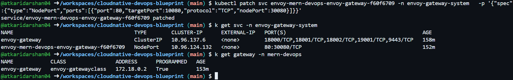
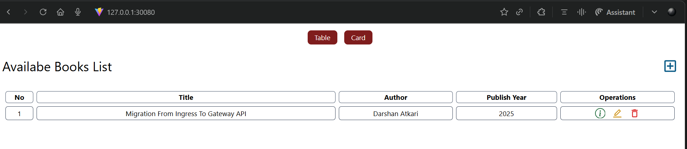

# ☸️ Kubernetes Deployment & Container Orchestration

## 📋 Cluster Configuration: `kind-config.yaml`

```yaml
kind: Cluster
apiVersion: kind.x-k8s.io/v1alpha4
nodes:
  - role: control-plane
    extraPortMappings:
      - containerPort: 80   # for nginx ingress
        hostPort: 80
        protocol: TCP
      - containerPort: 30080   # for gateway api
        hostPort: 30080
        protocol: TCP
      - containerPort: 31000 # for frontend container
        hostPort: 31000
        protocol: TCP
      - containerPort: 31100 # for backend container
        hostPort: 31100
        protocol: TCP
```


## 1️⃣ Create the Kind Cluster

### 🚀 Step 1: Initialize the Cluster
Run the following command to create a Kubernetes cluster using the provided `kind-config.yaml`:

```bash
kind create cluster --config kind-config.yaml
```

### ✅ Step 2: Verify the Cluster
Confirm the cluster setup:

```bash
kubectl get nodes
```


## 2️⃣ Create a Namespace 

Organize your resources by creating a dedicated namespace:

```bash
kubectl create namespace mern-devops
```

Switch to your working directory containing the YAML configuration files:
```bash
cd kubernetes/
```


## 3️⃣ Deploy MongoDB with Service and Secrets

Deploy MongoDB using a ClusterIP service, secured with Kubernetes Secrets:

```bash
kubectl apply -f secrets.yml
kubectl apply -f mongodb.yml
```

### 🔍 Verify DNS Accessibility
```bash
kubectl run -it --rm --restart=Never -n default --image=busybox dns-test -- nslookup mongodb-deployment-0.mongodb-service-headless.mern-devops.svc.cluster.local
```


## 4️⃣ Deploy the Backend (Node.js) Service and Frontend (React) Service

Deploy the backend API and React application and expose it using a NodePort service:

```bash
# Apply config
kubectl apply -f config.yml

kubectl apply -f backend.yml
kubectl apply -f frontend.yml
```

> **📝 Note:** Configure the [config](../kubernetes/frontend-config.yml) file accordingly.

### 🧪 Test the Application

```bash
kubectl get all -n mern-devops
```  

### 🌐 Access Points

- **Frontend:** Access the application at:
  
  ```
  http://<node-ip>:31000
  ```
  

- **Backend API Test:**

  ```
  http://<node-ip>:31100
  ```


## 5️⃣ Application Traffic Routing (Ingress → Gateway API)

<details>
<summary><strong>NGINX Ingress (Retired Setup)</strong></summary>

#### Step 1: Install Nginx Ingress Controller

Deploy the Ingress controller:

```bash
kubectl apply -f https://kind.sigs.k8s.io/examples/ingress/deploy-ingress-nginx.yaml
```

Wait for the Ingress controller pods to become ready:

```bash
kubectl wait --namespace ingress-nginx \
  --for=condition=ready pod \
  --selector=app.kubernetes.io/component=controller \
  --timeout=90s
```

Verify the Ingress controller is running:

```bash
kubectl get pods --namespace ingress-nginx
```

#### Step 2: Apply Ingress Configuration

Configure ingress rules for the MERN stack:

```bash
kubectl apply -f ingress.yaml
```

#### Step 3: Verify Ingress Configuration

Ensure the Ingress rules are properly set up:

```bash
kubectl get ingress -n mern-devops
```

#### Step 4: Access the Application
In browser navigate to `http://<node-ip>`


</details>

<details>
<summary><strong>Gateway API (Modern Day Setup - Recommended)</strong></summary>

#### Step 1: Install Envoy Gateway Controller with Gateway API CRDs

```bash
helm install eg oci://docker.io/envoyproxy/gateway-helm --version v0.0.0-latest -n envoy-gateway-system --create-namespace
```

Wait for Envoy Gateway to become available:

```bash
kubectl wait --timeout=5m -n envoy-gateway-system deployment/envoy-gateway --for=condition=Available
```

#### Step 2: Apply Gateway API Manifests

```bash
kubectl apply -f gateway-api.yml
```

#### Step 3: Verify Gateway API Resources

```bash
kubectl get gatewayclass
kubectl get gateway -n mern-devops
kubectl get httproute -n mern-devops
```


> **⚠️ Important:** If doing locally then the programmed will be false since there is no LoadBalancer support in kind. For that in further steps we will patch the service to NodePort.

##### Verify Envoy Gateway Resources

```bash
kubectl get pods -n envoy-gateway-system
kubectl get svc -n envoy-gateway-system
```

#### Step 4: Access the Application

Patch the envoy-mern-devops-gateway service to use NodePort for external access:

> **🔧 Local Testing Only:** Only for local testing purposes, for production use LoadBalancer or Ingress with proper DNS.

```bash
kubectl patch svc <service-name> -n envoy-gateway-system \
  -p '{"spec":{"type":"NodePort","ports":[{"port":80,"targetPort":10080,"protocol":"TCP","nodePort":30080}]}}'
```


Access the application at:
```
http://localhost:30080
```


</details>


## 6️⃣ Configure DNS with DuckDNS

Integrate DuckDNS for domain-based access:

1. **🔐 Sign up and configure DuckDNS.**
2. **📝 Create a DNS record:** Point it to your Kubernetes instance IP.
3. **🔗 Update configuration:** Associate your DuckDNS domain with the IP address of your Kubernetes node.
4. **✅ Verify DNS:** Ensure the application is accessible through your domain.


## 7️⃣ Access the Application

> **📝 Note:** Configure the [fronted-config](../kubernetes/frontend-config.yml) file accordingly.

### 🌐 Application Endpoints

- **Frontend:** Visit your domain:

  ```
  http://yourdomain.duckdns.org
  ```
  

- **Backend API Test:** Access the backend:

  ```
  http://yourdomain.duckdns.org/books
  ```
  


## 8️⃣ Deploying Kubernetes Dashboard (Optional)

### 📊 Step 1: Add kubernetes-dashboard repository

```bash
# Add kubernetes-dashboard repository
helm repo add kubernetes-dashboard https://kubernetes.github.io/dashboard/
# Deploy a Helm Release named "kubernetes-dashboard" using the kubernetes-dashboard chart
helm upgrade --install kubernetes-dashboard kubernetes-dashboard/kubernetes-dashboard --create-namespace --namespace kubernetes-dashboard
```

### ⏳ Step 2: Wait for the pods to be running
```bash
kubectl get pods -n kubernetes-dashboard
```


### 🌐 Step 3: Access the Dashboard
```bash
# Port Forwarding the port
kubectl -n kubernetes-dashboard port-forward svc/kubernetes-dashboard-kong-proxy 8443:443
```

> Navigate to [https://localhost:8443](https://localhost:8443)

### 🔑 Step 4: Generate the Bearer Token required to login

- **Create ServiceAccount and give permissions:**

  ```bash
  kubectl create serviceaccount dashboard-sa -n mern-devops

  kubectl create clusterrolebinding dashboard-sa-binding \
    --clusterrole=cluster-admin \
    --serviceaccount=mern-devops:dashboard-sa
  ```

- **Generate the token:**
  ```bash
  kubectl -n mern-devops create token dashboard-sa
  ```


## 🧹 Cleanup

To remove all deployed resources and delete the cluster:

```bash
kubectl delete ns mern-devops
kind delete cluster
```

This ensures a complete cleanup of all resources, including the Kubernetes cluster and Ingress setup.
