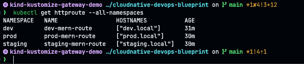

# Multi-Environment Configuration with Kustomize

> 📘 See [concepts/HelmVsKustomize.md](./concepts/HelmVsKustomize.md) for how Kustomize compares to Helm and when to reach for each.

## Overview
Kustomize simplifies Kubernetes configurations by allowing environment-specific customizations without modifying the base YAML files. This part demonstrates how to manage multiple environments using Kustomize with Gateway API hostname-based routing (see [concepts/IngressVsGatewayAPI.md](./concepts/IngressVsGatewayAPI.md) for why Gateway API over Ingress — plain Ingress is still demoed on the `begineer` branch), enabling you to deploy and access different versions of your MERN application through distinct hostnames.

## Environment Stages
We have configured the following environments with separate namespaces and hosts:

- **Development (`overlays/dev`)** - Accessible via `dev.local`
- **Staging (`overlays/staging`)** - Accessible via `staging.local`
- **Production (`overlays/prod`)** - Accessible via `prod.local`

### Environment Matrix

> ⚠️ The Image Tag / Theme columns below are only accurate if you're following *this*
> section's manual `kubectl apply -k` path standalone. Once Kargo is actively promoting
> through these same overlays (see [`Kargo.md`](./Kargo.md)), each environment shows
> whatever was most recently promoted into it, not a fixed version — the tags here will
> drift out of sync with what's actually running.

| Environment | Namespace | Host | Replicas | Image Tag | Theme |
|-------------|-----------|------|----------|-----------|-------|
| **Development** | `dev` | `dev.local` | 1 | `1.0.0` | 🔵 Blue |
| **Staging** | `staging` | `staging.local` | 1 | `2.0.0` | 🔴 Red |
| **Production** | `prod` | `prod.local` | 2 | `3.0.0` | 🟣 Purple |

**If you're working standalone** (this doc's manual `kubectl apply -k` path, no Kargo
involved), manually edit the image tags in each overlay file before deploying, so each
environment shows its own distinct version/theme:

- [`kustomize/overlays/dev/kustomization.yml`](../kustomize/overlays/dev/kustomization.yml) → `newTag: 1.0.0`
- [`kustomize/overlays/staging/kustomization.yml`](../kustomize/overlays/staging/kustomization.yml) → `newTag: 2.0.0`
- [`kustomize/overlays/prod/kustomization.yml`](../kustomize/overlays/prod/kustomization.yml) → `newTag: 3.0.0`

**If these files currently show something other than the values above** (e.g. all three set
to the same tag), that's most likely because [`Kargo.md`](./Kargo.md)'s promotion pipeline
has already been running against them, not a mistake — Kargo owns these tags once it's
active, and manually editing them here works against what it's doing. Only hand-edit them
if you're deliberately returning to this standalone, Kargo-free demo.


## Configuration Management
We use `configMapGenerator` and `secretGenerator` in Kustomize to manage ConfigMaps and Secrets. Each environment has its own backend configuration with environment-specific MongoDB URLs.

## Prerequisites

### 1. Create the kind Cluster

If you're running this demo standalone (its own dedicated cluster, not the shared one used
alongside the Kargo/ArgoCD docs), a `kind-config.yml` mapping host port `80` straight to the
Gateway's NodePort is enough — host `80` is free unless something else is using it. This is
just a local file you create yourself for this demo; it isn't something this repo commits:

```yaml
# kind-config.yml
kind: Cluster
apiVersion: kind.x-k8s.io/v1alpha4
nodes:
  - role: control-plane
    extraPortMappings:
      - containerPort: 30080 # for gateway api
        hostPort: 80
        protocol: TCP
```

```bash
kind create cluster --config kind-config.yml
```

### 2. Install the Gateway API Controller

Same Envoy Gateway controller as [`Kubernetes.md`](./Kubernetes.md#5️⃣-application-traffic-routing-ingress--gateway-api),
plus the one shared `Gateway`/`GatewayClass` in [`kustomize/gateway.yml`](../kustomize/gateway.yml)
— applied once, standalone, **not** part of any overlay (`dev`/`staging`/`prod` each attach
their own `HTTPRoute` to this same `Gateway` cross-namespace, instead of each getting their
own listener):

```bash
helm install eg oci://docker.io/envoyproxy/gateway-helm --version v0.0.0-latest \
  -n envoy-gateway-system --create-namespace

kubectl wait --timeout=5m -n envoy-gateway-system deployment/envoy-gateway --for=condition=Available

kubectl apply -f kustomize/gateway.yml
```

Kind has no `LoadBalancer` support, so patch the Envoy-managed Service to `NodePort` on the
port already mapped in `kind-config.yml`:

```bash
kubectl get svc -n envoy-gateway-system   # find the envoy-<gateway-ns>-envoy-gateway-* Service

kubectl patch svc <service-name> -n envoy-gateway-system \
  -p '{"spec":{"type":"NodePort","ports":[{"port":80,"targetPort":10080,"protocol":"TCP","nodePort":30080}]}}'
```

Access is via port `80` for all three environments — e.g. `http://dev.local` — since they
all share this one Gateway/listener.

### 3. Configure /etc/hosts
To access the applications via their respective hostnames, add the following entries to your `/etc/hosts` file:

```bash
sudo tee -a /etc/hosts << EOF
127.0.0.1 dev.local
127.0.0.1 staging.local
127.0.0.1 prod.local
EOF
```

**Note:** The kind cluster setup and port mapping above is only required for local development. If you are using a cloud cluster (EKS, GKE, AKS), skip the kind step — the controller gets a real public IP/hostname automatically, and you'd point real DNS at it instead of `/etc/hosts`.

## Step-by-Step Deployment Guide

### Step 1: Verify Kustomize Configuration
Before deploying, verify the configurations for each environment:

```bash
# Verify Development environment
kubectl kustomize kustomize/overlays/dev

# Verify Staging environment
kubectl kustomize kustomize/overlays/staging

# Verify Production environment
kubectl kustomize kustomize/overlays/prod
```

### Step 2: Deploy Development Environment

```bash
# Deploy to Development
kubectl apply -k kustomize/overlays/dev

# Verify deployment
kubectl get pods -n dev
kubectl get svc -n dev
kubectl get httproute -n dev
```

Wait for all pods to be running:

```bash
kubectl wait --for=condition=ready pod --all -n dev --timeout=300s
```

**Access Development Application:**
`http://dev.local`

### Step 3: Deploy Staging Environment

```bash
# Deploy to Staging
kubectl apply -k kustomize/overlays/staging

# Verify deployment
kubectl get pods -n staging
kubectl get svc -n staging
kubectl get httproute -n staging
```

Wait for all pods to be running:

```bash
kubectl wait --for=condition=ready pod --all -n staging --timeout=300s
```

**Access Staging Application:**
`http://staging.local`

### Step 4: Deploy Production Environment

```bash
# Deploy to Production
kubectl apply -k kustomize/overlays/prod

# Verify deployment
kubectl get pods -n prod
kubectl get svc -n prod
kubectl get httproute -n prod
```

Wait for all pods to be running:

```bash
kubectl wait --for=condition=ready pod --all -n prod --timeout=300s
```

**Access Production Application:**
`http://prod.local`


## Application Testing

> ⚠️ Same caveat as the Environment Matrix above — accurate for the standalone manual path
> only; drifts once Kargo is promoting through these overlays.

| Environment | Frontend URL | API Endpoint | Expected Version |
|-------------|--------------|--------------|-----------------|
| Development | http://dev.local | http://dev.local/books | 🔵 Blue banner — v1.0.0 |
| Staging | http://staging.local | http://staging.local/books | 🔴 Red banner — v2.0.0 |
| Production | http://prod.local | http://prod.local/books | 🟣 Purple banner — v3.0.0 |

> Verify the backend version: `curl http://<host>/books` should return `Welcome to MERN Stack Book Shop - v<X.0.0>`


## Post-Deployment Verification

### Check All Environments
```bash
# View all namespaces
kubectl get namespaces

# Check pods across all environments
kubectl get pods --all-namespaces | grep -E "(dev|staging|prod)"

# Check routing configuration
kubectl get httproute --all-namespaces
```


## Cleanup

### Delete Specific Environment
```bash
# Delete development environment
kubectl delete -k kustomize/overlays/dev

# Delete staging environment
kubectl delete -k kustomize/overlays/staging

# Delete production environment
kubectl delete -k kustomize/overlays/prod
```

### Delete All Environments
```bash
# Delete all application namespaces
kubectl delete namespace dev staging prod
```

`kustomize/gateway.yml` isn't part of any overlay (deliberately, so it isn't torn down by the
commands above) — remove it separately if you're done with it entirely:

```bash
kubectl delete -f kustomize/gateway.yml
```

### Remove /etc/hosts Entries
```bash
# Remove the added entries from /etc/hosts
sudo sed -i '/dev.local/d; /staging.local/d; /prod.local/d' /etc/hosts
```

---

## GitOps Deployment via ArgoCD (multi-environment)

Everything above deploys each overlay by hand via `kubectl apply -k`. Each overlay can
instead be managed by its own ArgoCD `Application` — one per environment, each watching its
own `kustomize/overlays/{dev,staging,prod}` path and syncing automatically whenever that
path changes in Git, instead of anyone running `kubectl apply -k` by hand.

```bash
kubectl apply -f argocd/project.yml
kubectl apply -f argocd/application-dev.yml
kubectl apply -f argocd/application-staging.yml
kubectl apply -f argocd/application-prod.yml
```

Verify all three synced:

```bash
kubectl get application -n argocd
# SYNC STATUS should show Synced, HEALTH STATUS should show Healthy for all three
```

`kustomize/gateway.yml` still needs its own one-time `kubectl apply` — it's deliberately
outside `kustomize/overlays/*`, so none of these three `Application`s ever sync it.

---
