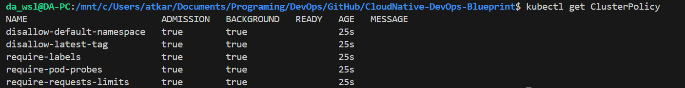
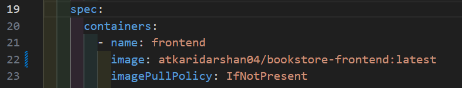
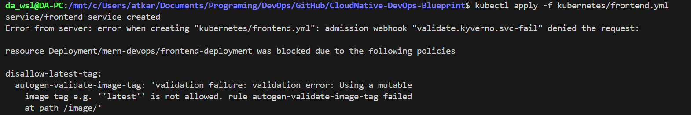
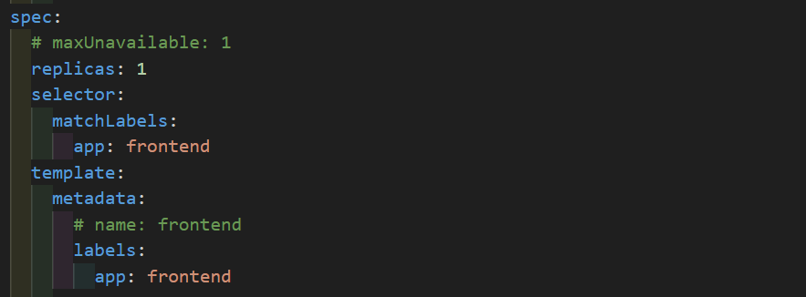
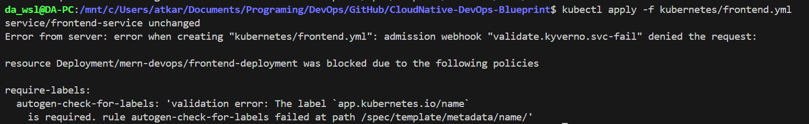
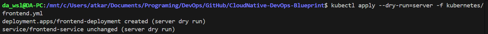

# 🛡️ Policy Management with Kyverno

This guide demonstrates how to implement Kubernetes policy management using Kyverno, a policy engine designed for Kubernetes that enables security, compliance, and governance through declarative policies.

## Overview

Kyverno provides policy management for Kubernetes clusters through:

- **Admission Control**: Validate, mutate, and generate resources
- **Background Scanning**: Continuous compliance monitoring
- **Policy Violations**: Real-time policy enforcement
- **Security Governance**: Enforce security best practices
- **Resource Management**: Standardize resource configurations

## Cluster Configuration

```yaml
# kind-config.yaml
kind: Cluster
apiVersion: kind.x-k8s.io/v1alpha4
nodes:
  - role: control-plane
    extraPortMappings:
      - containerPort: 80
        hostPort: 80
        protocol: TCP
```

## 1. Install and Configure Kyverno

### Create Kind Cluster

```bash
kind create cluster --config kind-config.yaml
```

### Install Kyverno using Helm

```bash
helm repo add kyverno https://kyverno.github.io/kyverno/
helm repo update
helm install kyverno kyverno/kyverno -n kyverno --create-namespace
```

### Verify Installation

```bash
kubectl get pods -n kyverno
```


## 2. Policy Enforcement in Action

### Apply Policies Manifests

```bash
kubectl apply -f kyverno/policies/

# Verify Applied Policies
kubectl get clusterpolicy
```

<div align="center">

</div>

### Image Tag Validation

When attempting to deploy with `latest` tag:

<div align="center">

</div>

The policy blocks the deployment:

<div align="center">

</div>

### Label Validation

When deploying without required labels:

<div align="center">

</div>

The policy enforcement blocks the deployment:

<div align="center">

</div>

## Policy Testing

```bash
# Test policy with dry-run
kubectl apply --dry-run=server -f deployment.yaml

# Check policy violations in background
kubectl describe policyreport -n <namespace>
```


