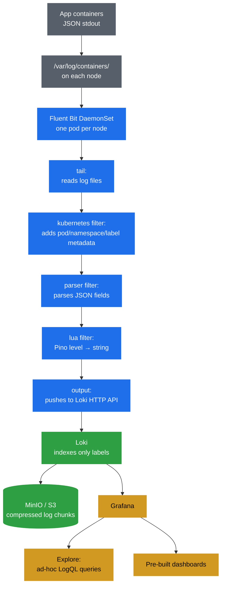

# 📋 Logging Stack: Fluent Bit → Loki → Grafana

Production-grade log collection using Fluent Bit DaemonSet, Loki for storage, and Grafana for visualization.

> **Prerequisites:** Complete [Monitoring.md](./Monitoring.md) first — Grafana is deployed as part of the monitoring stack and is reused here as the Loki frontend.

## ⚠️ Prerequisites

The backend image must be `3.0.1` or later — this version replaces `console.log` with structured JSON logging (pino), which makes logs queryable by field in Grafana.

Update the image tag in `kubernetes/backend.yml` before deploying:

```yaml
image: your-dockerhub-username/bookstore-backend:3.0.1
```

## 🎯 Architecture



## 🎯 Components

- **Fluent Bit** — Lightweight log collector (DaemonSet, ~5MB/node)
- **Loki** — Log aggregation & storage (label-indexed, S3-backed)
- **Grafana** — Visualization via LogQL queries

## 🚀 Setup

### 1. Deploy Loki

```bash
kubectl create namespace logging

helm repo add grafana https://grafana.github.io/helm-charts
helm repo update

helm install loki grafana/loki -f ./observability/logging/loki-values.yml -n logging
```

### 2. Deploy Fluent Bit

```bash
kubectl apply -f ./observability/logging/fluent-bit-scripts.yml
kubectl apply -f ./observability/logging/fluent-bit-config.yml
kubectl apply -f ./observability/logging/fluent-bit-daemonset.yml
```

### 3. Verify

```bash
# All pods should be Running
kubectl get pods -n logging

# Check Fluent Bit is shipping logs — no errors in output
kubectl logs -n logging daemonset/fluent-bit

# Check Loki is receiving logs
kubectl port-forward svc/loki 3100:3100 -n logging
curl http://localhost:3100/ready

# Verify labels are flowing into Loki
curl http://localhost:3100/loki/api/v1/labels
```

### 4. Grafana

Grafana is already configured with Loki as a datasource via `monitoring-values.yml`.


#### Explore (Ad-hoc Log Queries)

Go to Grafana → **Explore** → select **Loki** datasource.

Query all logs from every pod/namespace that Fluent Bit is collecting. Filter by namespace, pod, container, or log level using LogQL:

```logql
# All logs from the app namespace
{namespace="mern-devops"}

# Only backend logs
{namespace="mern-devops", container="backend"}

# Filter by log level (mapped from Pino numeric levels)
{namespace="mern-devops", level="error"}

# Search for a specific message
{namespace="mern-devops"} |= "Book not found"

# Parse JSON fields and filter
{namespace="mern-devops"} | json | method="GET"
```


#### Dashboards

Pre-built dashboards are auto-imported into Grafana under the **Logs** folder:

| Dashboard | ID | Datasource | Description |
|---|---|---|---|
| Node & Container Logs | 16966 | Loki | Namespace/pod dropdowns — main container log viewer |
| Logging Operator | 7752 | Prometheus | Fluent Bit input/output rates, errors, retries |
| Fluent Bit | 19549 | Prometheus | Fluent Bit metrics — cleaner panels |


---

## 🔄 How Fluent Bit Works

**INPUT (tail):** Watches `/var/log/containers/*.log` on the node via a `hostPath` volume mount. Every container's stdout/stderr ends up here.

**FILTER (kubernetes):** Calls the Kubernetes API to enrich each log record with metadata: `namespace_name`, `pod_name`, `container_name`, `labels`. This is what makes logs queryable by app/namespace in Grafana.

**FILTER (parser):** Detects JSON in the `log` field and promotes the fields to top-level. So `{"level":30,"msg":"Book not found"}` becomes queryable as individual fields in LogQL.

**FILTER (lua):** Maps Pino's numeric `level` field to a human-readable string before the log reaches Loki:

| Pino numeric | String |
|---|---|
| 10 | trace |
| 20 | debug |
| 30 | info |
| 40 | warn |
| 50 | error |
| 60 | fatal |

This makes Grafana's `detected_level` work correctly and enables filtering by `level="error"` in LogQL.

**OUTPUT (loki):** Pushes log streams to Loki's HTTP push API. Labels `namespace`, `pod`, `container`, and `level` become Loki stream selectors.

---

## ☁️ Production (EKS) — Switch to Real S3

In `observability/logging/loki-values.yml`, replace the MinIO storage block with:

```yaml
minio:
  enabled: false

loki:
  storage:
    type: s3
    s3:
      region: ap-south-1
      bucketnames: your-loki-logs-bucket
      insecure: false
```

Use IAM roles for service accounts (IRSA) on EKS — no hardcoded credentials needed.
