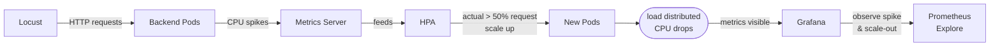
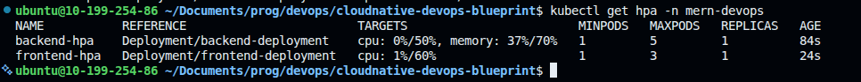
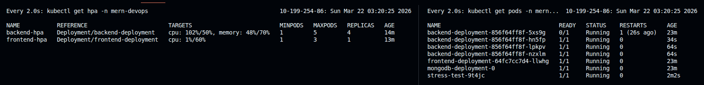
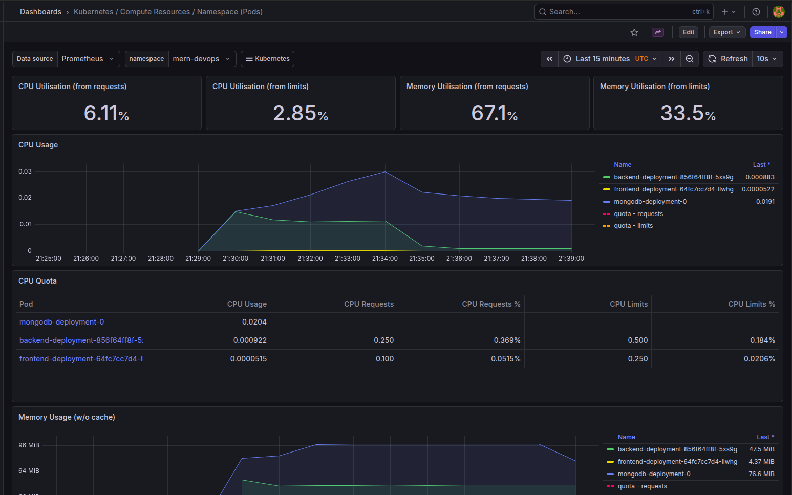
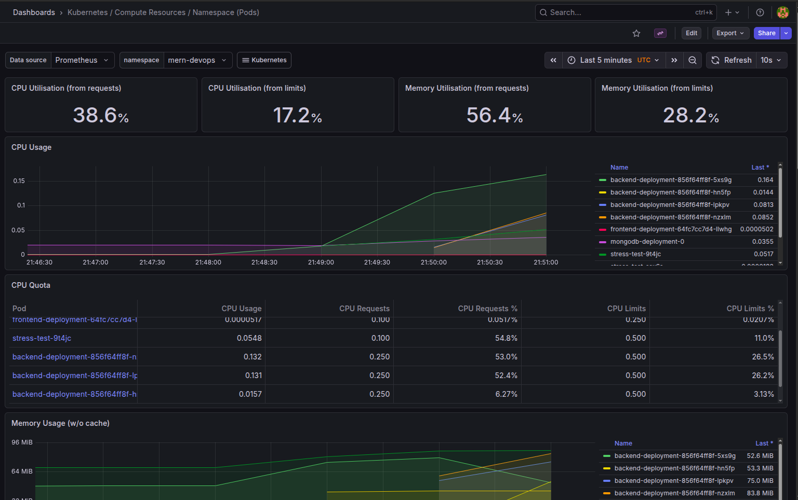

# 🔥 Stress Testing & HPA Autoscaling

Load test the bookstore backend with Locust, trigger Kubernetes HPA autoscaling, and observe it live through Prometheus and Grafana.

> **Prerequisites:** Complete [Observability.md](./Observability.md) first — the cluster and monitoring stack must be running before proceeding here.

---

## 🧠 Concepts

### Stress Testing

A stress test sends a high volume of HTTP requests to your application to simulate heavy load. The goal is to push CPU/memory high enough that the infrastructure is forced to react — in this case, trigger HPA to scale out pods.

**Tool: Locust** — Python-based load testing framework. Each virtual user is a lightweight coroutine (not a real thread), so a single machine can simulate hundreds of concurrent users. Users pick tasks randomly based on weights (`@task(5)` runs 5x more often than `@task(1)`), and wait a random `between(0.5, 2)` seconds between requests to simulate realistic pacing.

### HPA (Horizontal Pod Autoscaler)

HPA automatically adjusts the number of pod replicas based on observed resource usage. The scaling formula is:

```
desiredReplicas = ceil(currentReplicas × (currentUsage / targetUsage))
```

**Key requirement:** pods must have `resources.requests` defined. HPA calculates utilization as `actual usage / requested amount`. Without a request value, HPA has no reference and shows `<unknown>` — it will not scale.

**Metrics Server** is the component that feeds HPA with real-time CPU/memory data scraped from kubelets every 15 seconds. Without it, `kubectl top pods` doesn't work and HPA is blind.

**Scale-down stabilization** (`stabilizationWindowSeconds: 120`) — HPA waits 2 minutes of sustained low usage before removing pods. This prevents flapping where pods are removed and immediately needed again.

### How it connects



---

## 📁 Files

| File | Purpose |
|------|---------|
| `stress-test/locustfile.py` | Locust test script — virtual user behavior across all API routes |
| `stress-test/Dockerfile` | Containerizes Locust for running inside Kubernetes |
| `stress-test/k8s-job.yml` | Kubernetes Job — runs the stress test headless inside the cluster |
| `kubernetes/hpa.yml` | HPA for backend (CPU + memory) and frontend (CPU) |

---

## 🚀 Step 1 — Install Metrics Server

HPA reads pod CPU/memory from the Metrics Server. kind nodes use self-signed TLS, so the `--kubelet-insecure-tls` flag is required.

```bash
kubectl apply -f https://github.com/kubernetes-sigs/metrics-server/releases/latest/download/components.yaml

kubectl patch deployment metrics-server -n kube-system \
  --type='json' \
  -p='[{"op":"add","path":"/spec/template/spec/containers/0/args/-","value":"--kubelet-insecure-tls"}]'
```

Verify it can read pod metrics:

```bash
kubectl top pods -n mern-devops
```

---

## 🚀 Step 2 — Deploy Application

```bash
kubectl create namespace mern-devops

kubectl apply -f kubernetes/secrets.yml
kubectl apply -f kubernetes/config.yml
kubectl apply -f kubernetes/mongodb.yml
kubectl apply -f kubernetes/backend.yml
kubectl apply -f kubernetes/frontend.yml
```

---

## 🚀 Step 3 — Apply HPA

```bash
kubectl apply -f kubernetes/hpa.yml
```

Verify HPA is reading metrics (~1 min after Metrics Server is ready):

```bash
kubectl get hpa -n mern-devops
```

`TARGETS` must show actual percentages, not `<unknown>`:



> If `TARGETS` shows `<unknown>`, wait another minute and re-check. It means the Metrics Server hasn't scraped yet.

---

## 🧪 Step 4 — Run the Stress Test

### Option A: Kubernetes Job (Recommended)

Runs Locust inside the cluster — hits `backend-service:8000` directly over the internal network.

Build and push the image:

```bash
cd stress-test/
docker build -t ghcr.io/atkaridarshan04/cloudnative-devops-blueprint/stress-test:1.0.0 .
docker push ghcr.io/atkaridarshan04/cloudnative-devops-blueprint/stress-test:1.0.0
```

Update the `image:` field in `stress-test/k8s-job.yml` to your registry, then:

```bash
kubectl apply -f stress-test/k8s-job.yml
```

Watch in real time — open 3 terminals:

```bash
# Terminal 1 — Locust output
kubectl logs -f job/stress-test -n mern-devops

# Terminal 2 — HPA reacting
watch kubectl get hpa -n mern-devops

# Terminal 3 — pods scaling
watch kubectl get pods -n mern-devops
```

*HPA scaling up backend replicas under load:*



Clean up:

```bash
kubectl delete job stress-test -n mern-devops
```

### Option B: Local with Locust Web UI

```bash
# Terminal 1 — forward backend port
kubectl port-forward svc/backend-service 8000:8000 -n mern-devops

# Terminal 2 — run Locust
pip install locust
cd stress-test/
locust --host=http://localhost:8000
```

Open http://localhost:8089 → set **Users: 100**, **Spawn rate: 10** → **Start swarming**.

### Option C: Local Headless

```bash
cd stress-test/
locust --host=http://localhost:8000 --headless --users=100 --spawn-rate=10 --run-time=3m
```

---

## 📊 Step 5 — Observe in Grafana

Open Grafana → http://localhost:30003 (`admin / password`).

**Dashboards → Kubernetes / Compute Resources / Namespace (Pods)** → select namespace `mern-devops`.

During the test you should see:
- CPU spike sharply on the backend pod
- Pod count increase from 1 → 2 → 3 as HPA scales out
- CPU per pod drop once new pods join and share the load
- After the test ends — pods scale back down after ~2 min (stabilization window)

<table>
<tr>
<td width="50%" align="center"><em>Before stress test — 1 pod, low CPU</em></td>
<td width="50%" align="center"><em>After stress test — pods scaled out, CPU distributed</em></td>
</tr>
<tr>
<td width="50%"></td>
<td width="50%"></td>
</tr>
</table>

---

## 🛠️ Tuning

Lower threshold to trigger scaling faster:

```yaml
# kubernetes/hpa.yml
averageUtilization: 30
```

Increase load intensity:

```yaml
# stress-test/k8s-job.yml
- name: USERS
  value: "200"
- name: SPAWN_RATE
  value: "20"
- name: RUN_TIME
  value: "5m"
```
