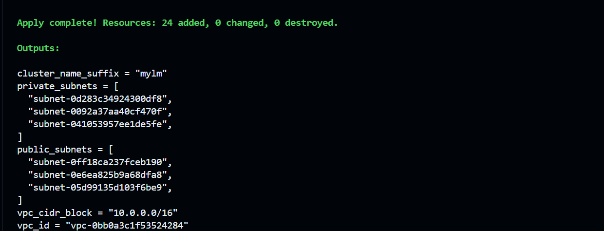
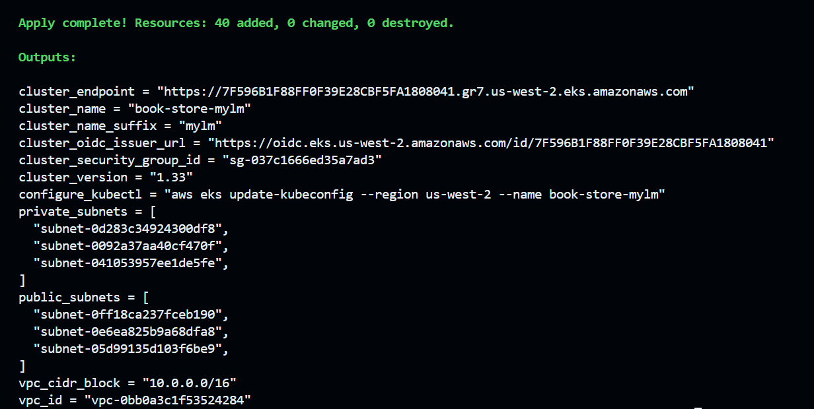
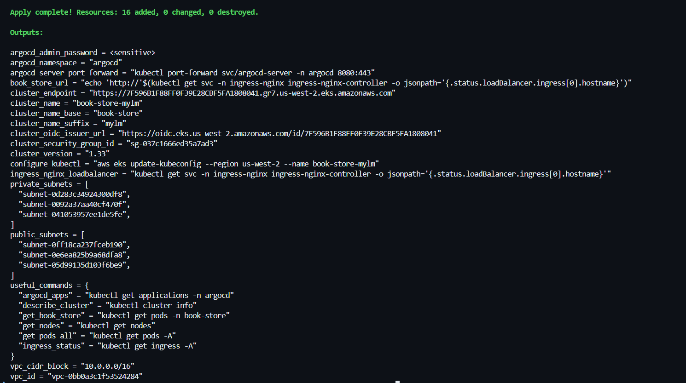
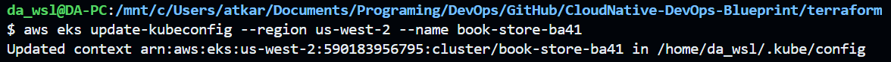
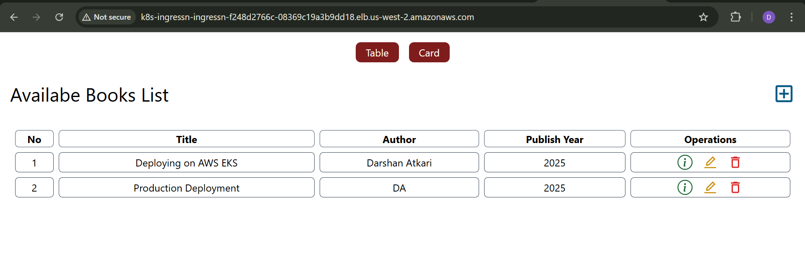

# 🏗️ Deploying Application on AWS EKS with Terraform

This guide covers the Terraform configuration for deploying the Book Store application infrastructure on AWS EKS.

## Architecture


## Module Structure

```
terraform/
├── main.tf          # root — calls all modules
├── providers.tf     # AWS, Helm, Kubernetes provider configs
├── versions.tf      # pinned provider versions
├── variables.tf     # input variables
├── locals.tf        # computed values (cluster name, AZs, tags)
├── outputs.tf       # useful post-apply values
└── modules/
    ├── vpc/         # VPC, subnets, NAT gateway
    ├── eks/         # EKS cluster + node security group rules
    ├── addons/      # Envoy Gateway, cert-manager
    └── gitops/      # ArgoCD
```

**Dependency chain:** `vpc → eks → addons → gitops`

## Prerequisites

- AWS CLI configured with appropriate credentials
- Terraform >= 1.9
- kubectl

---

## How it works

When you run `terraform apply`, it provisions infrastructure in this exact order:

```
terraform apply
    │
    ├── module.vpc      → creates VPC, subnets, NAT gateway
    ├── module.eks      → creates EKS cluster (waits ~10 min)
    ├── module.addons   → installs Envoy Gateway + cert-manager
    │                     → Envoy Gateway creates the NLB on AWS
    └── module.gitops   → installs ArgoCD
                          → applies ArgoCD AppProject + Application from argocd/
                          → ArgoCD detects the Helm chart in Git
                          → ArgoCD syncs and deploys the app automatically
```

**This is why the Helm chart must be EKS-ready before `terraform apply`** — ArgoCD deploys it straight from Git the moment it's installed. There is no manual `helm install` step on EKS.

---

## Step 1: Prepare the Helm Chart for EKS

> Terraform installs ArgoCD, which automatically syncs and deploys the Helm chart from Git. The Helm chart must be EKS-ready **before** you run `terraform apply`.

Make these changes, then commit and push to your Git branch:

**1. Enable persistent MongoDB storage (`helm-chart/templates/mongodb.yaml`)**

Uncomment `volumeMounts` and `volumeClaimTemplates`:

```yaml
volumeMounts:
  - name: mongodb-vol
    mountPath: /data/db

volumeClaimTemplates:
  - metadata:
      name: mongodb-vol
    spec:
      accessModes: ["ReadWriteOnce"]
      storageClassName: mern-devops-ebs-sc
      resources:
        requests:
          storage: 5Gi
```

**2. Enable the EBS StorageClass (`helm-chart/templates/volume.yaml`)**

Uncomment the EBS StorageClass block:

```yaml
apiVersion: storage.k8s.io/v1
kind: StorageClass
metadata:
  name: mern-devops-ebs-sc
provisioner: ebs.csi.aws.com
parameters:
  type: gp3
  fsType: ext4
reclaimPolicy: Retain
volumeBindingMode: WaitForFirstConsumer
```

> The EBS CSI driver is pre-installed on EKS Auto Mode — no extra setup needed.

**3. Comment out the local GatewayClass + Gateway in `helm-chart/templates/gateway-api.yml`**

Terraform creates `bookstore-gateway` in the `default` namespace. Deploying them again via the Helm chart will conflict. Comment out the GatewayClass and Gateway blocks at the bottom of that file — only the HTTPRoute is needed on EKS.

```bash
git add helm-chart/
git commit -m "chore: enable EBS storage and remove local gateway resources for EKS deploy"
git push
```

---

## Step 2: Deploy Infrastructure

```bash
terraform init
terraform plan
terraform apply
```

**Provisioning time:** ~15–20 minutes.

### Phased deployment (optional, for better visibility)

```bash
# Phase 1: VPC
terraform apply -target=module.vpc --auto-approve

# Phase 2: EKS cluster
terraform apply -target=module.eks --auto-approve

# Phase 3: Everything else (addons + ArgoCD)
terraform apply --auto-approve
```







---

## Step 3: Configure kubectl

Run this from inside the `terraform/` directory:

```bash
cd terraform

# Get the cluster name from outputs
terraform output -raw cluster_name
# → book-store-dev

# Configure kubectl
aws eks update-kubeconfig --region us-west-2 --name book-store-dev

# Or in one command (must be run from terraform/ directory)
aws eks update-kubeconfig --region $(terraform output -raw aws_region 2>/dev/null || echo us-west-2) --name $(terraform output -raw cluster_name)

# Verify
kubectl get nodes
```

> If you get `argument --name: expected one argument`, you're running the command from outside the `terraform/` directory. `terraform output` only works where the state file is.



---

## Step 4: Access ArgoCD

```bash
# Get admin password
kubectl -n argocd get secret argocd-initial-admin-secret -o jsonpath='{.data.password}' | base64 -d

# Port-forward
kubectl port-forward svc/argocd-server -n argocd 8080:443
```

Open `http://localhost:8080` — username: `admin`


---

## Step 5: Access the Application

```bash
# Get NLB address (provisioned by Envoy Gateway)
kubectl get gateway bookstore-gateway -n default -o jsonpath='{.status.addresses[0].value}'
```

Open the address in your browser.



---

## What Gets Deployed

| Module | Resources |
|--------|-----------|
| **vpc** | VPC, 3 public + 3 private subnets across 3 AZs, NAT gateway, IGW |
| **eks** | EKS cluster (Auto Mode, K8s 1.33), KMS encryption, node SG rules |
| **addons** | Envoy Gateway v1.7.0, GatewayClass, EnvoyProxy (NLB config), Gateway, cert-manager |
| **gitops** | ArgoCD 7.8.23, AppProject, Application |

> **Note:** ingress-nginx was retired in March 2026. This configuration uses **Envoy Gateway** which implements the Kubernetes Gateway API — the official successor.

## Variables

| Variable | Default | Description |
|----------|---------|-------------|
| `aws_region` | `us-west-2` | AWS region |
| `cluster_name` | `book-store` | Base cluster name |
| `environment` | `dev` | Environment suffix |
| `kubernetes_version` | `1.36` | EKS Kubernetes version |
| `vpc_cidr` | `10.0.0.0/16` | VPC CIDR |
| `enable_single_nat_gateway` | `true` | Single NAT (cost saving; set `false` for prod HA) |
| `argocd_chart_version` | `7.8.23` | ArgoCD Helm chart version |

## Key Design Decisions

**Cluster name:** `book-store-dev` (environment suffix, not random) — stable across destroy/apply cycles.

**Security group rules on node SG:** Traffic from the NLB goes to nodes, not the control plane. Rules are placed on `node_security_group_id`, not `cluster_security_group_id`.

**No `CreatedDate` tag:** `formatdate(timestamp())` in tags causes every `terraform plan` to show a diff even when nothing changed.

**`wait = true` on Helm releases:** Replaces the old `time_sleep` anti-pattern. Terraform waits for the Helm release to be fully ready before proceeding.

**`kubernetes_manifest` for ArgoCD apps:** Replaces `null_resource + local-exec kubectl apply`. Proper Terraform resource — tracks state, diffs on changes, idempotent.

## Cleanup

```bash
terraform destroy
```

> Deletes all AWS resources: EKS cluster, VPC, NLB, and all associated infrastructure.
