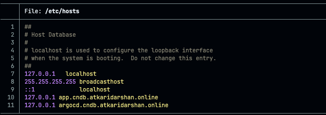
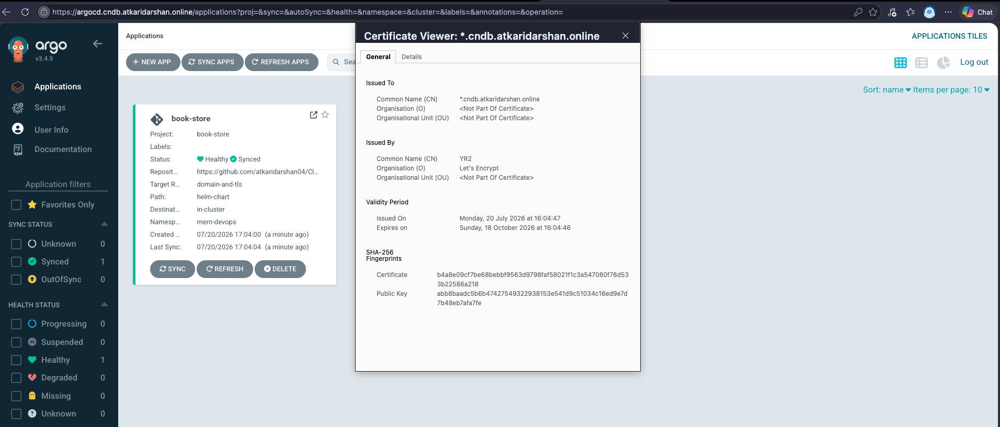

# Deploying via ArgoCD (GitOps)

Alternative to Phase 5's `helm install` in [`tls-setup-guide.md`](./tls-setup-guide.md) —
instead of a one-off Helm install, ArgoCD continuously syncs the same `helm-chart/` from
this repo. Exposed at `argocd.cndb.atkaridarshan.online`, reusing the same wildcard cert
and Gateway from the main TLS setup — do Phases 0–4 there first (ArgoCD needs the Gateway
and `wildcard-tls` Secret already in place).

## Why ArgoCD needs `server.insecure: true`

Our Gateway terminates TLS itself (`mode: Terminate`, Phase 3) and forwards plain HTTP
downstream to whichever Service the `HTTPRoute` points at — that's how frontend/backend
already work. `argocd-server` by default serves **HTTPS-only** internally (a self-signed
cert), so routing plain HTTP to it would fail with a protocol mismatch. Installing with
`server.insecure: true` makes `argocd-server` speak plain HTTP instead, which is the correct
setup here — the browser still only ever sees our real Let's Encrypt wildcard cert,
terminated at the Gateway, exactly like the app.

## Steps

**1. Install ArgoCD:**

```bash
helm repo add argo https://argoproj.github.io/argo-helm
helm repo update
helm install argocd argo/argo-cd \
  -n argocd --create-namespace \
  --set configs.params."server\.insecure"=true
```

Verify:

```bash
kubectl get pods -n argocd
```

**2. Apply the routing + bootstrap manifests directly via `kubectl`** — not through ArgoCD
itself, same reasoning as installing ArgoCD before it can manage anything:

```bash
kubectl apply -f argocd/httproute.yml
kubectl apply -f argocd/project.yml
kubectl apply -f argocd/application.yml
```

`argocd/httproute.yml` routes `argocd.cndb.atkaridarshan.online` to the `argocd-server`
Service — it needs `gateway/gateway-api.yml`'s `allowedRoutes.namespaces.from: All` (already
set) since `argocd-server` lives in the `argocd` namespace, not `mern-devops` where the
Gateway itself lives.

`argocd/project.yml` (`AppProject`) and `argocd/application.yml` (`Application`) bootstrap
ArgoCD to start managing the `book-store` app from `helm-chart/` in this repo, targeting the
`mern-devops` namespace, with automated sync (`prune` + `selfHeal`).

**3. Verify the app synced:**

```bash
kubectl get application -n argocd
# SYNC STATUS should show Synced, HEALTH STATUS should show Healthy
```

**4. Log into the ArgoCD UI** — same local-testing pattern as the app itself (Phase 6a):

```bash
echo "127.0.0.1 argocd.cndb.atkaridarshan.online" | sudo tee -a /etc/hosts
```


Get the initial admin password:

```bash
kubectl -n argocd get secret argocd-initial-admin-secret -o jsonpath="{.data.password}" | base64 -d
```

Then open `https://argocd.cndb.atkaridarshan.online/` — username `admin`, the password
above. Same clean padlock as the app, since it's the same wildcard cert terminated at the
same Gateway.



## After this, deploy via git instead of `helm upgrade`

Once ArgoCD owns the `book-store` Application, changes to `helm-chart/` should go through a
git commit/push to the branch `argocd/application.yml`'s `targetRevision` points at —
ArgoCD's `selfHeal` will otherwise revert a manual `helm upgrade`/`kubectl edit` back to
match git on its next reconcile.
