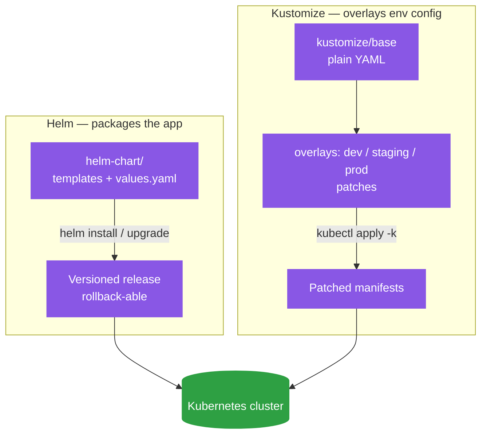

# 📦 Helm vs Kustomize

> Hands-on guides: [Helm.md](../Helm.md) · [Kustomize.md](../Kustomize.md)

## Same problem, different philosophy

Both tools exist to answer: "how do I run the same application across dev/staging/prod without maintaining three full copies of every YAML file?" They solve it in almost opposite ways.

## Helm: templating + packaging

Helm treats your manifests as a **template**, with placeholders filled in from a `values.yaml` (or `--set` overrides) using Go's templating syntax (`{{ .Values.replicaCount }}`). The packaged bundle is a **chart** — versioned, installable, upgradeable, and rollback-able as a unit (`helm upgrade`, `helm rollback`) via a release history Helm tracks in-cluster.

Reach for Helm when you want:
- Parameterization (the same chart producing meaningfully different output per environment)
- To consume charts other people published (Prometheus, Istio, Vault — all installed as Helm charts in this repo)
- Release lifecycle tracking (what's currently installed, what version, easy rollback)

## Kustomize: template-free overlays

Kustomize doesn't template anything. You write one **base** of plain, valid YAML, then **overlays** per environment that *patch* specific fields (change replica count, add a label, swap an image tag) on top of the base — using strategic merge patches or JSON patches, not string substitution.

Reach for Kustomize when you want:
- Manifests that stay plain, readable YAML with no templating language to learn
- Small, explicit per-environment diffs (patches read like a diff, not a parameterized template)
- No extra tool — `kubectl apply -k` supports it natively

## Why this repo uses both

They're not actually competing for the same job here: **Helm packages the application** (`helm-chart/`) — the reusable, versioned unit — while **Kustomize overlays environment-specific config** (`kustomize/overlays/{dev,staging,prod}`) on top of plain base manifests. Third-party infrastructure (Istio, Prometheus, Vault) comes in as Helm charts because that's how upstream ships them; this repo's own app manifests use Kustomize because the differences between dev/staging/prod are a handful of small, explicit patches, not a parameterized template.

They can also be combined (`helm template | kustomize build -`), but in this repo each tool is scoped to the job it's naturally better at.

## Architecture

