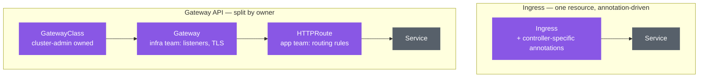

# 🌐 Ingress vs Gateway API

> Hands-on guide: [Kubernetes.md](../Kubernetes.md) (Section 5 — both are shown, Gateway API is the recommended path)

## Ingress: simple, but limited

`Ingress` is the original Kubernetes resource for routing external HTTP(S) traffic to Services. It works, but it has one resource type trying to cover every controller's feature set — anything beyond basic host/path routing (rewrites, traffic splitting, timeouts) is bolted on via **annotations**, and those annotations are controller-specific (an nginx annotation doesn't mean anything to a different ingress controller). Effectively there's one shared schema and dozens of incompatible dialects on top of it.

## Gateway API: the successor

Gateway API splits routing into multiple resources aligned with who actually owns each part:

- **`GatewayClass`** — which controller implementation is in play (cluster-admin owned)
- **`Gateway`** — the actual listener/entry point: ports, TLS, hostnames (platform/infra team owned)
- **`HTTPRoute`** (and `TCPRoute`, `GRPCRoute`, …) — the routing rules to a specific set of backends (application team owned)

This separation means the infra team can manage the shared entry point while application teams manage their own routing rules without touching it — and advanced routing (weighted traffic splitting, header-based matching, request mirroring) is part of the standard schema, not a controller-specific annotation. That portability is also *why* it plugs cleanly into [progressive delivery](./ProgressiveDelivery.md): weighted `HTTPRoute` backends are exactly the primitive a canary rollout needs, expressed the same way regardless of which Gateway implementation (Envoy Gateway, Istio, etc.) is underneath.

## Why the guide shows both

Ingress is in maintenance mode across the ecosystem — no new features are being added to the API. Gateway API is the actively developed, official successor. The Kubernetes guide keeps the Ingress setup around (marked "retired") mostly for comparison/context, and treats Gateway API as the setup to actually use going forward.

## Architecture

