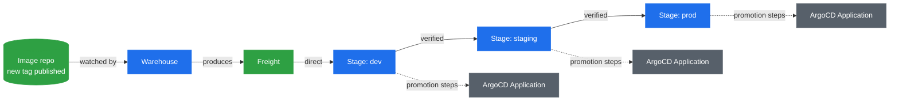

# 🚚 Kargo — Concepts & Learning Notes

> Hands-on guide: [`../Kargo.md`](../Kargo.md)

## The problem it solves

ArgoCD reconciles whatever's in Git into a cluster — that's its whole job, and it does it
well. But it deliberately doesn't decide *what should be in Git next* for each environment.
Someone (or something) still has to decide "is this build ready to go from `dev` to
`staging`," and either do that by hand or script it themselves. Kargo is that missing piece:
it automates *promotion* — moving a specific, verified build through `dev` → `staging` →
`prod` — while still leaving ArgoCD to do the actual syncing.

Kargo isn't tied to ArgoCD specifically, though — `argocd-update` is just one of several
promotion step types it supports (there's also `kubernetes-apply`, `http`, Helm-related
steps, etc.); this repo just chooses to pair the two.

## The object model

- **`Project`** — a Kargo wrapper around a Kubernetes Namespace. Creates the namespace
  everything else below lives in.
- **`Warehouse`** — watches artifact sources (container image tags, Git commits, Helm chart
  versions) and produces **`Freight`** whenever something new shows up.
- **`Freight`** — an immutable snapshot of a specific set of versions. Auto-generated by the
  Warehouse — you never hand-write these. This is the thing that actually flows through the
  pipeline.
- **`Stage`** — one per environment. Declares where its Freight is allowed to come from
  (`requestedFreight`) and the promotion steps to run when new, eligible Freight shows up.
- **`Promotion`** — one concrete instance of "move this Freight into this Stage, run its
  steps." Auto-created whenever eligible Freight appears, if the Stage allows it.
- **`PromotionTask`** — a reusable, named bundle of promotion steps, so multiple Stages don't
  each repeat the same sequence.

## Why a Stage's `requestedFreight` is the actual promotion chain

`sources.direct: true` means a Stage will take *any* Freight the Warehouse produces,
immediately — that's `dev`'s job here, since it's the first stop. `sources.stages: [dev]`
means a Stage will only request Freight that has *already been successfully promoted and
verified healthy* in `dev` — that's how `staging` and `prod` chain off their upstream
neighbor. This chain, not anything explicit about ordering, is what actually enforces
"nothing reaches prod without going through staging first."

## Why `promote-overlay` opens a PR instead of pushing directly

`autoPromotionEnabled` (in `ProjectConfig`) and the PR gate (in `promotion-task.yml`) answer
two different questions. `autoPromotionEnabled` controls whether a `Promotion` *starts* the
moment eligible Freight shows up — that's why `dev`/`staging` react instantly while `prod`
waits for someone to trigger it by hand. It says nothing about what happens once a Promotion
is running.

The PR gate controls whether a *running* Promotion is allowed to finish. Instead of
`git-push` landing straight on the branch each ArgoCD `Application` watches, `promote-overlay`
pushes to a disposable branch, opens a PR into the watched branch, then blocks on
`git-wait-for-pr` until that PR is merged (or closed). Same gate for all three Stages, since
they share this one `PromotionTask` — an auto-started dev Promotion still can't reach ArgoCD
without a human merging its PR first.

## Why `argocd-update` matters even with `selfHeal` already on

The three ArgoCD `Application`s this repo already has enable `automated: {prune, selfHeal}`
— meaning they'd eventually notice a Git change and sync on their own, with or without
Kargo. So why does the promotion steps still include an explicit `argocd-update` step?
Two reasons: it forces the sync immediately rather than waiting on ArgoCD's own poll
interval, and — more importantly — it's what **registers the health check Kargo waits on**
before marking that Freight verified in this Stage. Without it, a `Promotion` could report
"succeeded" the instant the Git commit was pushed, without ever confirming the app actually
came up healthy — which would make the whole "only promote what's verified" premise fake.

## The design conflict this repo had, and how it's resolved

`kustomize/overlays/{dev,staging,prod}` originally hardcoded a **permanently different**
version per environment (`1.0.0`/blue, `2.0.0`/red, `3.0.0`/purple) — a demo for
`docs/Kustomize.md` showing three themes side by side, not a real promotion pipeline.
Kargo's entire model is the opposite: *the same* Freight flows through all three stages as
it's verified. Those two ideas don't fit together as originally built.

**Resolution:** the theme colors now represent *whatever was most recently promoted into
that environment*, not a fixed identity. Watching the color actually change as a build moves
through the pipeline — `dev` first, then `staging` once `dev` is healthy, then `prod` once
`staging` is healthy — is the visual proof promotion is really happening, and arguably a
better demo than three permanently-fixed colors ever was.

## Related reading

- [Key Kargo Concepts (official docs)](https://docs.kargo.io/) — verify against whatever
  version you actually install; this area (promotion steps especially) has moved across releases
- [Argo CD Integration](https://docs.kargo.io/user-guide/how-to-guides/argo-cd-integration) — the `kargo.akuity.io/authorized-stage` annotation mechanism
- [`concepts/GitOps.md`](./GitOps.md) — push vs pull, why ArgoCD reconciles instead of applying
- [`concepts/ProgressiveDelivery.md`](./ProgressiveDelivery.md) — canary/blue-green: single-environment progressive delivery, a genuinely different concern from cross-environment promotion
