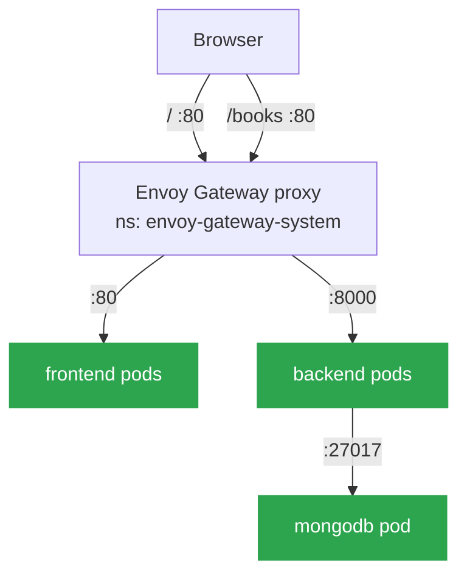

# 🚧 Network Policies: Zero-Trust Pod-to-Pod Traffic

> Standalone guide — sets up its own kind cluster, Gateway, and app from scratch. Gateway API steps mirror [Kubernetes.md](../Kubernetes.md) (Section 5); see that doc for the full Gateway API walkthrough.

## The problem

By default, every pod in a Kubernetes namespace can reach every other pod — and every pod in the cluster, across namespaces, for that matter. There's no isolation unless you add it. For a 3-tier app that means a compromised frontend pod could reach `mongodb` directly, skipping backend entirely, even though nothing in the app's actual design ever needs that path.

## The approach: default-deny, then explicit allow

Same posture as [PodSecurityHardening.md](./PodSecurityHardening.md), one layer up — instead of restricting what a process can do, this restricts who it can talk to. Start every pod with zero network access, then add back only the specific edges the app actually uses.

## Traffic map

`frontend` is a static SPA (nginx, no server-side proxy) — the browser calls the API directly via a baked-in `VITE_API_BACKEND_URL`, so frontend and backend never talk to each other over the pod network at all. Both are reached independently from outside the cluster through the same gateway.



Rules that fall out of this:

| Pod | Ingress allowed from | Egress allowed to |
|---|---|---|
| `frontend` | `envoy-gateway-system` ns, port 80 | — (none needed) |
| `backend` | `envoy-gateway-system` ns, port 8000 | `mongodb` pods, port 27017 |
| `mongodb` | `backend` pods, port 27017 | — (none needed) |
| all pods | — | `kube-system` ns, port 53 (DNS) |

Miss that last row and every DNS lookup breaks — including the backend resolving `mongodb-service-headless`. It's the single most common NetworkPolicy footgun.

## ⚠️ Before you start: the kind CNI gotcha

kind's default CNI, **kindnet, does not enforce NetworkPolicy at all** — by design, not a bug. `kubectl apply` on any NetworkPolicy against a stock kind cluster will succeed and do absolutely nothing; traffic flows exactly as before. `disableDefaultCNI` can only be set **at cluster creation**, so the cluster below is created with a policy-enforcing CNI (Calico) from the start.

## 1️⃣ Create the Kind Cluster (Calico CNI)

`kind-config.yaml`:

```yaml
kind: Cluster
apiVersion: kind.x-k8s.io/v1alpha4
networking:
  disableDefaultCNI: true # kindnet doesn't enforce NetworkPolicy — Calico installed below instead
  podSubnet: 192.168.0.0/16
nodes:
  - role: control-plane
    extraPortMappings:
      - containerPort: 80   # for nginx ingress
        hostPort: 80
        protocol: TCP
      - containerPort: 30080   # for gateway api
        hostPort: 30080
        protocol: TCP
```

### 🚀 Step 1: Initialize the Cluster

```bash
kind create cluster --config kind-config.yaml
```

### 🔒 Step 2: Install Calico

```bash
kubectl create -f https://raw.githubusercontent.com/projectcalico/calico/v3.32.1/manifests/v1_crd_projectcalico_org.yaml
kubectl create -f https://raw.githubusercontent.com/projectcalico/calico/v3.32.1/manifests/tigera-operator.yaml
kubectl create -f https://raw.githubusercontent.com/projectcalico/calico/v3.32.1/manifests/custom-resources.yaml
```

### ✅ Step 3: Verify

```bash
kubectl get nodes
watch kubectl get pods -l k8s-app=calico-node -A   # wait until Running
```

## 2️⃣ Create the Namespace

```bash
kubectl create namespace mern-devops
cd kubernetes/
```

## 3️⃣ Deploy MongoDB, Backend, and Frontend

```bash
kubectl apply -f secrets.yml
kubectl apply -f mongodb.yml
kubectl apply -f config.yml
kubectl apply -f backend.yml
kubectl apply -f frontend.yml
```

```bash
kubectl get all -n mern-devops
```

## 4️⃣ Install the Gateway API CRDs + Envoy Gateway Controller

Full walkthrough: [Kubernetes.md](../Kubernetes.md) (Section 5 — Gateway API). Summarized here so this guide stays self-contained:

### 🚀 Step 1: Install Envoy Gateway

```bash
helm install eg oci://docker.io/envoyproxy/gateway-helm --version v0.0.0-latest -n envoy-gateway-system --create-namespace
```

```bash
kubectl wait --timeout=5m -n envoy-gateway-system deployment/envoy-gateway --for=condition=Available
```

### ✅ Step 2: Apply the Gateway API Manifests

```bash
kubectl apply -f gateway-api.yml
```

`gateway-api.yml` defines the `GatewayClass`, `Gateway`, and `HTTPRoute` — routing `/` to `frontend-service:80` and `/books` to `backend-service:8000`. This is the entry point the network policies below allow ingress from.

```bash
kubectl get gatewayclass
kubectl get gateway -n mern-devops
kubectl get httproute -n mern-devops
```

### 🌐 Step 3: Expose It Locally

kind has no LoadBalancer support, so patch the Envoy service to NodePort:

```bash
kubectl get svc -n envoy-gateway-system   # find the envoy-<gateway-name>-* service
kubectl patch svc <service-name> -n envoy-gateway-system \
  -p '{"spec":{"type":"NodePort","ports":[{"port":80,"targetPort":10080,"protocol":"TCP","nodePort":30080}]}}'
```

## 5️⃣ Apply the Network Policies

```bash
kubectl apply -f network-policies.yml
kubectl get networkpolicy -n mern-devops
```

`network-policies.yml` targets namespaces by their auto-assigned `kubernetes.io/metadata.name` label (every namespace gets this since Kubernetes 1.21+) — no manual namespace labeling needed.

## 6️⃣ Verify

### Allowed paths still work

```bash
# page load + API round trip through the gateway — proves frontend, backend,
# AND backend -> mongodb all still work end to end
curl http://localhost:30080/
curl http://localhost:30080/books

# probes still passing under Calico enforcement — no restarts, 1/1 ready
kubectl get pods -n mern-devops

# direct proof of the backend -> mongodb egress rule (backend's node:20-slim image
# has no curl/wget/nc, so use Node's own net module to open the TCP connection)
kubectl exec -n mern-devops deploy/backend-deployment -- node -e "
require('net').createConnection(27017, 'mongodb-service-headless', () => {
  console.log('connected'); process.exit(0);
}).on('error', e => { console.log('failed:', e.message); process.exit(1); });
"
```

### Blocked paths now fail (the actual point of this exercise)

```bash
# frontend has no egress rule to backend — this must time out
kubectl exec -n mern-devops deploy/frontend-deployment -- wget -T 3 -qO- http://backend-service:8000/books

# a pod outside the namespace has no ingress rule into mongodb — this must time out
kubectl run netpol-test --rm -it --image=busybox:1.36 --restart=Never -n default \
  -- wget -T 3 -qO- mongodb-service-headless.mern-devops.svc.cluster.local:27017
```

Both should hang and time out (not get an immediate "connection refused" — Calico drops the packets, it doesn't reject them). If either one succeeds instead, a policy isn't matching the pod labels correctly.

## Why frontend gets no egress rule at all

It's tempting to assume a 3-tier app needs a frontend → backend rule. It doesn't here — checked against the actual source (`VITE_API_BACKEND_URL` in `.env.docker`, baked into the JS bundle at build time): the browser calls both `/` and `/books` on the gateway directly, so the frontend pod itself never opens a connection to backend. Adding that rule anyway would be a rule for traffic that never happens.

