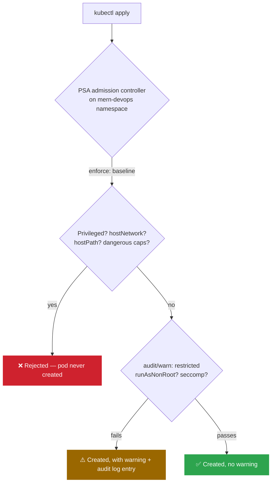

# 🛡️ Pod Security Admission: Cluster-Level Enforcement

> Hands-on guide: [Kubernetes.md](../Kubernetes.md) (Section 2 — Create a Namespace)

## The problem

[PodSecurityHardening.md](./PodSecurityHardening.md) hardened `backend.yml` and `frontend.yml` by hand — `securityContext`, dropped capabilities, `hostUsers: false`. But nothing stops the *next* manifest in this namespace from skipping all of it. Per-manifest hardening only works if every author remembers to do it, every time.

Pod Security Admission (PSA) is Kubernetes' built-in admission controller for this — it enforces the [Pod Security Standards](https://kubernetes.io/docs/concepts/security/pod-security-standards/) (`privileged` / `baseline` / `restricted`) at the **namespace** level, so the API server itself rejects (or flags) non-compliant pods before they're ever scheduled. No extra controller to install — it's been stable since Kubernetes 1.25.

## Three independent modes, one namespace

```yaml
pod-security.kubernetes.io/enforce: baseline
pod-security.kubernetes.io/audit: restricted
pod-security.kubernetes.io/warn: restricted
```

- **`enforce`** — actually rejects the pod at admission time.
- **`audit`** — allows the pod, but logs a violation to the audit log.
- **`warn`** — allows the pod, but prints a warning back to whoever ran `kubectl apply`.

These are independent and can point at different levels, which is what makes this useful rather than all-or-nothing.

## Why `mern-devops` is `enforce: baseline`, not `enforce: restricted`

`restricted` is the level that actually requires non-root (`runAsNonRoot: true`, non-zero `runAsUser`) and an explicit `seccompProfile`. Checked against what's actually in this namespace:

| Workload | Passes `restricted`? | Why |
|---|---|---|
| `backend` | ✅ Yes | non-root UID 1000, `allowPrivilegeEscalation: false`, capabilities dropped, `seccompProfile: RuntimeDefault` |
| `mongodb` | ✅ Yes | mongo:4.4's image ships a built-in `mongodb` user (UID/GID 999) — runs as that directly instead of root, same capabilities/seccomp treatment as backend |
| `frontend` | ❌ No | nginx forces root — see [PodSecurityHardening.md](./PodSecurityHardening.md) |

Setting `enforce: restricted` on the namespace would still hard-block frontend from ever starting — PSA is a namespace-wide switch, it can't exempt one workload while enforcing another in the same namespace. As long as even one workload has a real reason to run as root, `restricted` isn't a viable *enforce* level for the namespace as a whole.

So the split used in [`kubernetes/namespace.yml`](../../kubernetes/namespace.yml):

- **`enforce: baseline`** — a real floor. Blocks privileged containers, host namespaces (`hostNetwork`/`hostPID`/`hostIPC`), `hostPath` volumes, and dangerous added capabilities — categories nothing in this app legitimately needs, so there's no cost to enforcing it.
- **`audit` + `warn: restricted`** — visibility without blocking. Every `kubectl apply` on frontend prints exactly which restricted-level control it fails, without stopping the deploy. Backend and mongodb now apply clean with zero warnings.

## Verify

**1. Apply the namespace and confirm the labels landed:**

```bash
kubectl apply -f kubernetes/namespace.yml
kubectl get ns mern-devops --show-labels
```

**2. Deploy and watch the warnings:**

```bash
cd kubernetes/
kubectl apply -f secrets.yml
kubectl apply -f mongodb.yml    # clean — restricted-compliant (runs as its built-in UID 999 user)
kubectl apply -f config.yml
kubectl apply -f backend.yml    # clean — already restricted-compliant
kubectl apply -f frontend.yml   # warns: runs as root, no seccompProfile
```

`frontend` is now the only warning left. `backend` and `mongodb` applying clean is the concrete payoff of closing their gaps in [`backend.yml`](../../kubernetes/backend.yml) (`seccompProfile`) and [`mongodb.yml`](../../kubernetes/mongodb.yml) (non-root UID 999, dropped capabilities, `seccompProfile`) — both are now fully `restricted`-compliant, not just `baseline`. frontend can't follow the same path since nginx forces root — that's the one gap this namespace carries on purpose.

**3. Prove `enforce` actually blocks something (not just `warn`):**

```bash
kubectl run privileged-test -n mern-devops --image=nginx --restart=Never \
  --overrides='{"spec":{"containers":[{"name":"privileged-test","image":"nginx","securityContext":{"privileged":true}}]}}'
```

This must be **rejected outright** — `Error from server (Forbidden): ... violates PodSecurity "baseline:latest": privileged (container "privileged-test" must not set securityContext.privileged=true)`. No pod object gets created at all, unlike the mongodb/frontend warnings which still let the pod through.

## Closing the `hostUsers` blind spot with Kyverno

PSA's `restricted` level checks `runAsNonRoot`, `allowPrivilegeEscalation`, capabilities, and `seccompProfile` — but the [Pod Security Standards](https://kubernetes.io/docs/concepts/security/pod-security-standards/) have no concept of Linux user namespaces at all. A pod with `hostUsers` left at its default (`true`) and no other hardening gets zero signal from PSA about it, because `hostUsers` simply isn't one of the fields PSA looks at.

[`kyverno/policies/require-userns-or-nonroot.yaml`](../../kyverno/policies/require-userns-or-nonroot.yaml) closes that specific gap — set to `validationFailureAction: Enforce` from the start, since every workload in this namespace already satisfies it (frontend via `hostUsers: false`, backend/mongodb via `runAsNonRoot: true`):

```yaml
validate:
  anyPattern:
    - spec:
        hostUsers: false
    - spec:
        securityContext:
          runAsNonRoot: true
    - spec:
        containers:
          - securityContext:
              runAsNonRoot: true
```

**Verified**: commenting out `hostUsers: false` in `frontend.yml` and re-applying produces both signals at once — PSA's non-blocking warning, and Kyverno's hard rejection:

```
serviceaccount/frontend created
Warning: would violate PodSecurity "restricted:latest": allowPrivilegeEscalation != false
(container "frontend" must set securityContext.allowPrivilegeEscalation=false), unrestricted
capabilities (container "frontend" must set securityContext.capabilities.drop=["ALL"]),
runAsNonRoot != true (pod or container "frontend" must set securityContext.runAsNonRoot=true),
seccompProfile (pod or container "frontend" must set securityContext.seccompProfile.type to
"RuntimeDefault" or "Localhost")
service/frontend-service created
Error from server: error when creating "kubernetes/frontend.yml": admission webhook
"validate.kyverno.svc-fail" denied the request:

resource Deployment/mern-devops/frontend-deployment was blocked due to the following policies

require-userns-or-nonroot:
  autogen-require-userns-or-nonroot: 'validation error: Pod must either set spec.hostUsers:
    false ... or run as non-root ... rule autogen-require-userns-or-nonroot[0] failed at path
    /spec/template/spec/hostUsers/ rule autogen-require-userns-or-nonroot[1] failed at path
    /spec/template/spec/securityContext/runAsNonRoot/ rule autogen-require-userns-or-nonroot[2]
    failed at path /spec/template/spec/containers/0/securityContext/'
```

Two things worth noting in that output:

- **`ServiceAccount` and `Service` still got created** — only the `Deployment` was rejected. `kubectl apply` on a multi-document file applies each object independently; Kyverno's `match` only targets `Pod`/pod-controller kinds, so the other two objects in `frontend.yml` were never in scope to begin with.
- **PSA's warning fired even though the request ultimately failed** — `warn`/`audit` evaluate and report regardless of what happens later in the admission chain; Kyverno's validating webhook is a separate, later stage that's the one actually blocking the write. They're not redundant: PSA flags it, Kyverno enforces it.

The autogen rule names (`autogen-require-userns-or-nonroot[0..2]`) confirm Kyverno checked the `Deployment`'s embedded pod template directly (`/spec/template/spec/...`), the same auto-generation behavior PSA uses for controller resources — no separate policy needed for Pod vs. Deployment vs. StatefulSet.

## Architecture


