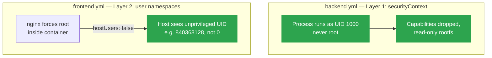

# 🔒 Pod Security Hardening: `securityContext` vs. User Namespaces

> Hands-on guide: [Kubernetes.md](../Kubernetes.md) (Section 4 — backend + frontend deployment)

Two different layers of pod hardening are used in this blueprint, on two different services, because one image can use the stronger option and the other can't.

- **App-layer** (`securityContext`) — used on [`backend.yml`](../../kubernetes/backend.yml). Changes how the process runs *inside* the container.
- **Kernel-layer** (user namespaces) — used on [`frontend.yml`](../../kubernetes/frontend.yml). Changes how the container's UIDs are seen *by the host*, regardless of what the process does inside.

They're not interchangeable — which one you reach for depends on whether the image will let you drop root at all.

## Layer 1 — `securityContext` (backend)

The Node.js backend image happily runs as any UID, so it gets the stronger, more direct fix: never be root in the first place.

```yaml
securityContext:
  runAsUser: 1000
  runAsGroup: 3000
  fsGroup: 2000
  runAsNonRoot: true        # kubelet refuses to start the pod if the image tries to run as root
containers:
  - securityContext:
      allowPrivilegeEscalation: false   # blocks setuid/sudo-style privilege gain
      readOnlyRootFilesystem: true      # container can't write to its own image layer
      capabilities:
        drop: [ALL]                    # no CAP_NET_RAW, CAP_SYS_ADMIN, etc — nothing to abuse
```

Each field closes a specific escape route: `runAsNonRoot` means there's no root UID to exploit even before namespacing enters the picture, `capabilities.drop: [ALL]` removes the Linux capabilities most container breakout CVEs depend on, and `readOnlyRootFilesystem` stops a compromised process from persisting a backdoor in the image layer.

## Layer 2 — user namespaces (frontend)

`nginx` won't run its master process as anything but root — that's baked into how it drops privilege internally (master starts as root, forks workers as a low-priv user). So `runAsNonRoot` isn't an option here. Without any isolation, "root inside the container" **is** root on the node — if the container is ever breached, the attacker has real root on the host running every other pod.

`hostUsers: false` is a pod-level Linux user namespace: the kernel maps the container's UID/GID range to a **non-overlapping, unprivileged** range on the host. Nothing changes from inside the container — root is still root there — but on the host, that root process shows up as some high, meaningless UID with no real privilege.

```yaml
spec:
  hostUsers: false # maps container root to an unprivileged host UID (K8s 1.36+)
  containers:
    - name: frontend
      image: bookstore-frontend:2.0.0
```

### Requirements

| Component | Minimum version |
|---|---|
| Kubernetes | 1.36 (GA — no feature gate needed; beta since 1.30) |
| containerd | 2.0+ |
| runc / crun | 1.2+ / 1.9+ |
| Linux kernel | 6.3+ |

References:
- [User Namespaces — Kubernetes docs](https://kubernetes.io/docs/concepts/workloads/pods/user-namespaces/)
- [Kubernetes v1.36: User Namespaces are finally GA](https://kubernetes.io/blog/2026/04/23/kubernetes-v1-36-userns-ga/)

### Verified: with vs. without

Same pod, same image, only `hostUsers: false` toggled — checked from two angles: `id` from inside the container, and `ps` on the actual kind node for the same nginx processes.

**With `hostUsers: false`:**

```
$ kubectl exec -n mern-devops deploy/frontend-deployment -- id
uid=0(root) gid=0(root) ...

$ docker exec kind-control-plane ps -eo pid,uid,cmd | grep nginx
2535   840368128   nginx: master process nginx -g daemon off;
2553   840368229   nginx: worker process
```

**Without it (`hostUsers` removed, default):**

```
$ kubectl exec -n mern-devops deploy/frontend-deployment -- id
uid=0(root) gid=0(root) ...

$ docker exec kind-control-plane ps -eo pid,uid,cmd | grep nginx
3834   0     nginx: master process nginx -g daemon off;
3851   101   nginx: worker process
```

`id` is identical in both cases — the container has no idea whether it's namespaced. The host view is where it matters: with `hostUsers: false`, the master (container UID 0) lands on host UID `840368128`, and the worker (container UID 101 — nginx's own unprivileged user) lands on `840368229`, which is exactly `840368128 + 101`. It's a fixed offset mapping, not randomization. Without it, those same UIDs (`0` and `101`) are the literal host UIDs — `0` being real root.

## Why frontend doesn't also get `securityContext`, and backend doesn't also get `hostUsers: false`

Frontend can't use layer 1 at all — nginx forces root, so `runAsNonRoot` is off the table. Backend doesn't *need* layer 2 — it already closes the root-escape gap at layer 1 (non-root, no capabilities, read-only filesystem), so adding `hostUsers: false` there would be optional defense-in-depth, not a fix for an open hole. It's a reasonable follow-up, just not an urgent one.

## Architecture


