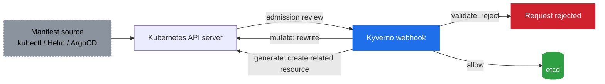

# 🛡️ Policy as Code

> Hands-on guide: [Kyverno.md](../Kyverno.md)

## The problem it solves

You can review every YAML manifest by hand in a PR, but that doesn't scale, doesn't catch things applied outside the PR flow (`kubectl apply` from a laptop, a Helm chart's defaults nobody read), and isn't consistent across people. You want the cluster itself to refuse or fix non-compliant resources, regardless of how they got submitted.

## Admission control

Every write to the Kubernetes API goes through admission control before it's persisted to etcd. Kyverno registers as an admission webhook: the API server calls out to it with the incoming object, and Kyverno's policies decide what happens next — before the object ever becomes real.

Kyverno policies are plain Kubernetes-style YAML (no separate policy language like Rego, which is what OPA/Gatekeeper uses) — that's its main practical advantage: if you can write a Kubernetes manifest, you can read a Kyverno policy.

## Three things a policy can do

- **Validate** — reject the request outright if it violates a rule (e.g. "no container may run without CPU/memory limits", "no `:latest` image tag").
- **Mutate** — silently rewrite the incoming object to be compliant instead of rejecting it (e.g. auto-inject a default resource limit if one's missing).
- **Generate** — automatically create a related resource whenever a triggering resource is created (e.g. every new namespace automatically gets a default `NetworkPolicy` or `ResourceQuota`).

## Where this fits versus the rest of the stack

Policy as code is enforcement at the platform boundary — it doesn't care whether the manifest came from a hand-written YAML file, a Helm chart, or [ArgoCD](./GitOps.md) syncing from Git. That's the point: no matter which path a resource takes to reach the API server, it passes through the same gate. It's the same zero-trust instinct as a [service mesh's](./ServiceMesh.md) `AuthorizationPolicy`, just applied to *what configuration is allowed to exist* rather than *what traffic is allowed to flow*.

## Architecture

