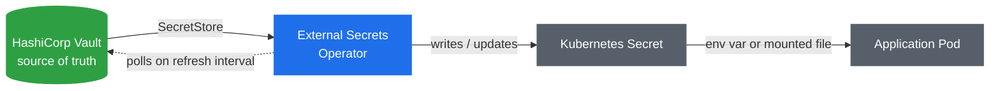

# 🔐 Secrets Management

> Hands-on guide: [ExternalSecrets.md](../ExternalSecrets.md)

## Why native Kubernetes Secrets aren't enough

A Kubernetes `Secret` looks like it solves the problem — it's a resource type literally named "Secret." But by default it's just base64-encoded text stored in etcd (encoding, not encryption, unless you've separately configured etcd encryption-at-rest). There's no rotation, no access audit trail, no central place to see who has which secret across clusters, and every secret has to be hand-created or committed somewhere for a pipeline to apply — which is exactly the kind of thing you don't want sitting in Git in plaintext.

## Vault as the source of truth

HashiCorp Vault is a dedicated secret store: it holds the actual values, applies fine-grained access policies (who/what can read which path), logs every access, and supports dynamic/rotating secrets. It's the system of record — the thing that should actually own "what is the database password."

## The gap: workloads still need secrets as Kubernetes Secrets

Vault solves storage and governance, but a pod still expects to consume a secret the Kubernetes-native way (env var or mounted file backed by a `Secret` object). Making every application talk to the Vault API directly means rewriting application code and giving every workload its own Vault credentials.

## External Secrets Operator (ESO) bridges the two

ESO runs in-cluster and does the translation: you define a `SecretStore` (how to reach Vault, with what credentials) and an `ExternalSecret` (which Vault path maps to which Kubernetes `Secret`, with which keys). ESO polls Vault on a refresh interval and keeps the resulting Kubernetes `Secret` object in sync — the application still just reads a normal `Secret`, completely unaware Vault exists.

The payoff: rotate a credential in Vault, and it propagates into the cluster on the next refresh interval automatically — no redeploy, no pipeline run, no application change. Vault stays the single governed source of truth; Kubernetes gets a native-looking `Secret` it already knows how to consume.

## Architecture

