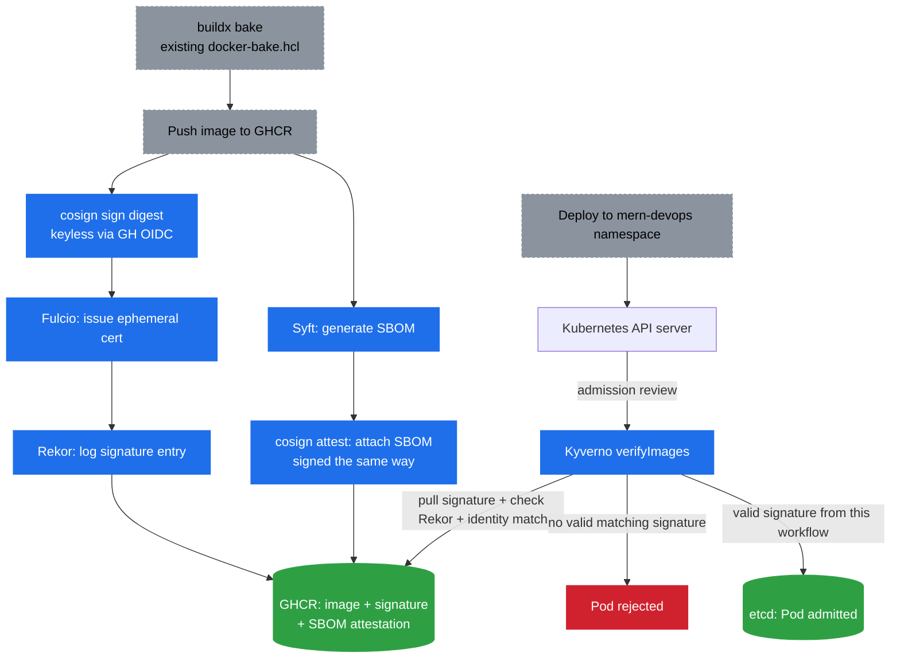

# 🔏 Supply Chain Security (SBOM, Sigstore, Signature Enforcement)

> 📘 Hands-on guides: [Kyverno.md](../Kyverno.md) and [GitHubActions.md](../GitHubActions.md).

## The problem it solves

Trivy (already in the Jenkins pipeline) answers "does this image have known CVEs?" That's a scanning concern — and on its own, a scan is only as useful as where its output goes: printed to a console log, it's gone as soon as the job finishes, with no history and nothing to show an auditor after the fact. This pipeline uploads Trivy's results as SARIF to GitHub's Security tab instead, so each finding persists, tracks across runs, and auto-resolves once fixed. But scanning — however it's stored — says nothing about a different question: is the image actually running in the cluster right now the exact, unmodified artifact that the pipeline produced — or could it have been swapped, rebuilt, or pulled from somewhere else entirely? Kubernetes will happily run any image with a matching tag; nothing about the tag proves who built it. This note covers the three pieces that close that gap: **SBOM** (what's inside the image), **Sigstore/cosign** (who built it, cryptographically), and **Kyverno `verifyImages`** (refusing to admit anything that can't prove it).

## High-Level: What & Why

### SBOM (Software Bill of Materials)

A manifest listing every package and version baked into an image — npm packages, apt/pip packages, base image layers. It's an inventory, not a scan result. The value shows up later: when a new CVE is disclosed for some transitive dependency six months from now, you don't re-scan every image you've ever built — you query the SBOMs you already generated to instantly know which images are affected.

### Sigstore / cosign (keyless signing)

Proves *which pipeline* produced an image, without anyone managing a private signing key. Traditional signing (GPG-style) means generating a key, guarding it forever, and rotating it — a liability, since a leaked key can forge any signature. Sigstore replaces that with short-lived, identity-bound certificates issued per-signing-event, so there's no long-lived secret to leak in the first place. This is why the issue calls out GitHub Actions specifically: GitHub can vouch for "this exact workflow run is executing right now" in a way Jenkins isn't set up to do, and that vouching is the whole trick.

### Kyverno `verifyImages` (admission-time enforcement)

The payoff step. Everything above is just paperwork unless something checks it before a Pod runs. Kyverno already sits in the cluster's admission path (same mechanism as the existing `disallow-latest-tag` / `require-labels` policies in `kyverno/policies/`). A `verifyImages` rule adds one more gate: don't admit a Pod whose image matches `ghcr.io/atkaridarshan04/cloudnative-devops-blueprint/*` unless it carries a valid signature *from this specific pipeline*. Push an unsigned image, or one signed by a different repo/workflow, and admission is denied — that's the actual test of whether any of this works, not just "did signing succeed."

## Internals: How It Works

### SBOM generation — Syft

Syft is pointed at a built image (or its filesystem/layers) and walks it, reading whatever each package ecosystem uses to declare its own contents — `package.json`/lockfiles for the frontend image, the apt/pip package databases for the backend image, plus base-image layer metadata. Output is a structured document (SPDX or CycloneDX JSON). It doesn't touch the image itself — it's a side artifact *about* the image, generated once per digest.

### Keyless signing — OIDC → Fulcio → Rekor → cosign

This is the part worth being precise about, since it's the novel piece:

1. **GitHub OIDC token**: mid-workflow, GitHub Actions can mint a short-lived OIDC token asserting "this workflow, this repo, this commit/ref is running right now." This is a built-in GitHub Actions capability (`permissions: id-token: write`), not something Sigstore-specific.
2. **Fulcio**: Sigstore's certificate authority. It exchanges that OIDC token for an ephemeral x.509 certificate (valid ~10 minutes), binding the GitHub identity to a keypair generated on the fly for this one signing operation.
3. **cosign**: uses that ephemeral keypair to sign the pushed image's digest (not the tag — the digest, so it's tied to immutable content), then discards the private key immediately. Nothing is ever written to disk or stored as a secret.
4. **Rekor**: a public, append-only transparency log (conceptually identical to Certificate Transparency logs for HTTPS). Because the signing cert expires in minutes, a verifier checking the signature *later* can't just check "is this cert currently valid" — it's long since expired by design. Instead, Rekor holds a permanent, timestamped log entry proving the signature was made *while* the cert was genuinely valid. That log entry is what makes an ephemeral certificate usable for verification indefinitely into the future.
5. The signature (plus a reference to its Rekor entry) is pushed back to the registry as an OCI artifact attached to the image — this is what makes GHCR "unused but defined" in the issue become actually used.

The SBOM attestation reuses this exact mechanism: instead of signing the raw digest, cosign signs a *statement* ("here is the SBOM for this digest") and attaches it the same way — so the SBOM itself inherits the same tamper-evident, identity-bound guarantee as the image signature.

### Admission-time verification — Kyverno `verifyImages`

At deploy time, Kyverno's admission webhook intercepts the Pod creation request, extracts the image reference, and:

- Pulls the attached signature + certificate from the registry (GHCR).
- Verifies the certificate chains back to Sigstore's Fulcio root of trust, and that a matching entry exists in Rekor.
- Checks the certificate's identity claims against an *expected* issuer and subject configured in the policy — e.g. issuer `https://token.actions.githubusercontent.com`, subject `https://github.com/atkaridarshan04/cloudnative-devops-blueprint/.github/workflows/ci.yml@refs/heads/main`. This is the detail that matters most: it's not "is this signed by *some* Sigstore identity," it's "is this signed by *this exact repo and workflow* " — anyone else's keyless signature fails the check.
- Allows or denies the Pod based on that match, same enforcement path as the existing image-tag and label policies.

## Architecture

## Where this fits versus the rest of the stack

This runs as a second, parallel pipeline — not a replacement. Jenkins → Trivy (console output) → DockerHub stays exactly as it is today; GitHub Actions → Trivy (SARIF → Security tab) → Syft → GHCR → cosign/Sigstore is additive, same job (build, scan, ship an image), different registry, persisted scan results, and a strictly stronger trust model. The only thing that changes on the cluster side is one more Kyverno `ClusterPolicy` alongside the existing ones in `kyverno/policies/` — same admission-control mechanism described in [PolicyAsCode.md](./PolicyAsCode.md), just checking *provenance* instead of *configuration hygiene*.
