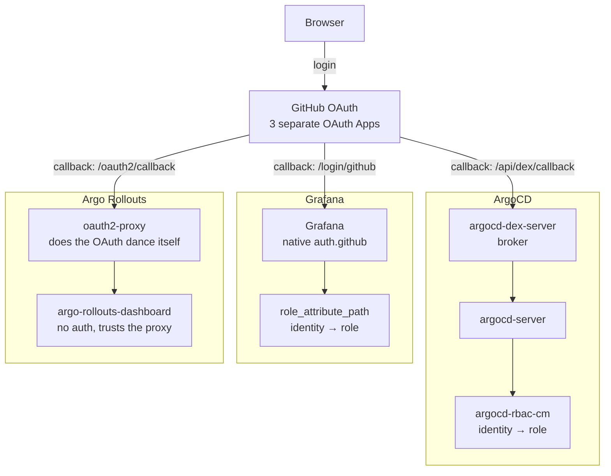

# SSO — Concepts & Learning Notes

This doc explains the *why* and *how* behind replacing local admin/password logins
(ArgoCD, Grafana) and gating the Argo Rollouts dashboard, all via GitHub OAuth. For the
runnable steps, see [`../sso-deploy.md`](../sso-deploy.md).

## The goal

Stop relying on shared local passwords (`admin`/`password` in Grafana, ArgoCD's
auto-generated initial admin secret) for anything beyond initial bootstrap/break-glass —
delegate real login to GitHub instead, and use a proper auth layer for the one tool
(Argo Rollouts dashboard) that has no login system of its own at all.

## OAuth2/OIDC, in one paragraph

Instead of the app storing a password and checking it itself, the app redirects your
browser to an external **Identity Provider** (GitHub, here) to log in. GitHub then redirects
back to the app with a short-lived authorization code, which the app exchanges
(server-to-server) for an access token and identity claims (username, email, org
membership). The app trusts those claims instead of a local password check, and maps them
to internal roles — this mapping step is what "RBAC" means in this context: not *whether*
you're who you say you are (GitHub already proved that), but *what you're allowed to do*
once identified.

This is why the callback URL matters so much in every setup step: GitHub needs to know in
advance exactly which URL it's allowed to redirect back to after login (a security
measure — otherwise anyone could register a malicious redirect target).

## Why three separate GitHub OAuth Apps, not one

A classic GitHub OAuth App has exactly **one** "Authorization callback URL" field — not a
list. Since ArgoCD (`/api/dex/callback`), Grafana (`/login/github`), and oauth2-proxy
(`/oauth2/callback`) each need their *own* distinct callback URL, that means three separate
OAuth Apps, each with its own Client ID/Secret pair — not one app shared across all three.

## ArgoCD's mechanism: Dex as a broker, not the IdP

ArgoCD doesn't speak GitHub's OAuth dialect directly — it delegates to **Dex**
(`argocd-dex-server`, already running in this repo's cluster, just unconfigured). Dex is a
federation broker: you tell it about an upstream provider (GitHub, Google, LDAP, generic
OIDC — anything) via a `connectors:` block, and Dex translates that into a standard OIDC
flow that ArgoCD understands natively. ArgoCD never talks to GitHub directly; it only ever
talks to Dex, which happens to be talking to GitHub underneath.

Once a user authenticates via Dex, **`argocd-rbac-cm`** (a separate ConfigMap from the Dex
config) maps their identity (email/username claim) to a policy role
(`g, <identity>, role:admin`, etc.) — this is the "what can they do" half, entirely
separate from "how did we verify who they are."

The client secret is referenced from ArgoCD's own `argocd-secret` Secret via a `$key.path`
placeholder in the ConfigMap (e.g. `$dex.github.clientSecret`) — never written directly
into the ConfigMap/values file, so it never lands in git.

## Grafana's mechanism: native OAuth, no broker needed

Unlike ArgoCD, Grafana speaks GitHub OAuth (and Google, Okta, generic OIDC, etc.) directly
— no Dex-equivalent needed. It's configured via `grafana.ini`'s `[auth.github]` section
(`client_id`, `client_secret`, `scopes`, `auth_url`, `token_url`, `api_url`). Grafana
supports `$__env{VARNAME}` interpolation inside `grafana.ini` values, letting the actual
secret live in a Kubernetes Secret and get injected as an env var (`envValueFrom` in the
Helm chart) rather than sitting in `values.yaml`/git as plaintext — same secret-handling
principle as ArgoCD's `$dex.github.clientSecret`, different mechanism.

`role_attribute_path` maps a GitHub identity claim (username, org/team membership, etc.) to
Grafana's Admin/Editor/Viewer roles — same "identity vs. permission" split as ArgoCD's RBAC
ConfigMap. In this repo it's a simple username check (`login=='<you>' && 'Admin' ||
'Viewer'`), since there's no org/team to key off for a personal account — everyone else who
signs in lands on the default `auto_assign_org_role` (Viewer).

## Argo Rollouts dashboard: no native auth — `oauth2-proxy` fills the gap

Confirmed directly against the project (see
[GitHub issue #1323](https://github.com/argoproj/argo-rollouts/issues/1323)):
the Rollouts dashboard has **no built-in login system at all** — it was designed to be
reached via `kubectl proxy`/`port-forward`, trusting kubeconfig RBAC as its access control,
not to be an internet-facing app with its own auth.

**`oauth2-proxy`** is a generic solution to exactly this gap: it's a standalone reverse
proxy that sits *in front of* any backend that has no auth of its own. It does the entire
OAuth dance itself (redirect to GitHub, handle the callback, set a session cookie), and only
forwards a request to the real backend (`argo-rollouts-dashboard`) once that cookie proves
the user already authenticated. The backend itself is completely unaware any of this is
happening — it never sees unauthenticated traffic, and doesn't need to understand OAuth at
all. This is why `argorollouts/httproute.yml` needs to change to point at oauth2-proxy's
Service instead of `argo-rollouts-dashboard` directly — oauth2-proxy becomes the new
front door, and only it talks to the dashboard Service internally.

This same oauth2-proxy pattern is the standard community workaround for *any* tool lacking
built-in auth (Prometheus's raw UI is another common example) — worth remembering as a
general tool, not something specific to Argo Rollouts.

## Architecture

## Related reading

- Dex connectors: https://dexidp.io/docs/connectors/github/
- ArgoCD SSO: https://argo-cd.readthedocs.io/en/stable/operator-manual/user-management/#existing-oidc-provider
- Grafana GitHub OAuth: https://grafana.com/docs/grafana/latest/setup-grafana/configure-security/configure-authentication/github/
- oauth2-proxy: https://oauth2-proxy.github.io/oauth2-proxy/
- Argo Rollouts dashboard auth gap: https://github.com/argoproj/argo-rollouts/issues/1323
