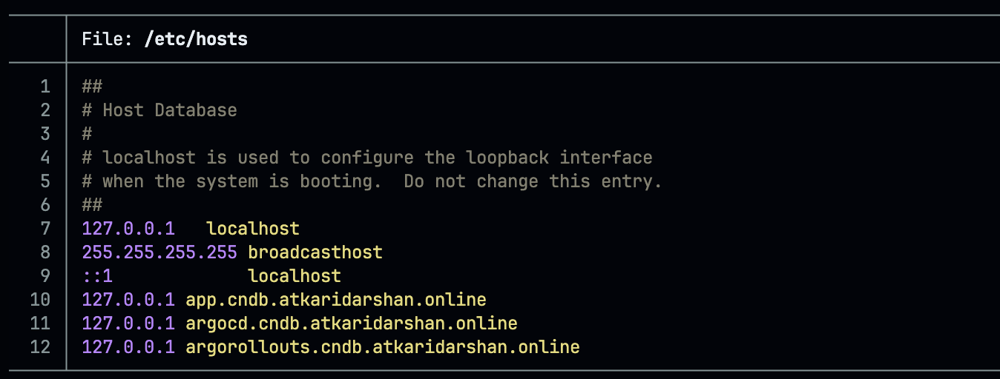
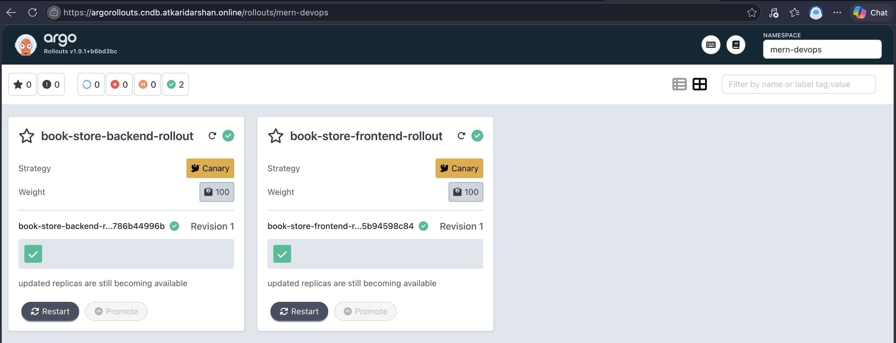

# Deploying via ArgoCD + Argo Rollouts (GitOps)

ArgoCD (GitOps) is the only supported way to deploy the app — not a one-off `helm install`.
ArgoCD continuously syncs `helm-chart/` from this repo, which itself deploys canary
`Rollout`s (Argo Rollouts) instead of plain `Deployment`s. **Order matters**: the Argo
Rollouts CRDs/controller must exist *before* ArgoCD tries to sync the chart, or the sync
fails with "resource not found" for `argoproj.io/Rollout` — so Argo Rollouts is installed
first below, ArgoCD second.

Do Phases 0–4 in [`tls-setup-guide.md`](./tls-setup-guide.md) first (Gateway and
`wildcard-tls` Secret need to already exist) — both `argocd.cndb...` and
`argorollouts.cndb...` reuse that same wildcard cert and Gateway.

## What changed in the Helm chart

`backend.yaml`/`frontend.yaml` now define an Argo Rollouts `Rollout` instead of a plain
`Deployment`, plus two Services per component (`-stable` and `-canary`, both selecting the
same Pods by label — Argo Rollouts repoints which Pods each Service's endpoints include
during a rollout). The `Rollout`'s `strategy.canary.trafficRouting.plugins.argoproj-labs/gatewayAPI`
points at the shared `HTTPRoute` (`helm-chart/templates/httproute.yaml`) — the plugin
mutates that HTTPRoute's `backendRefs[].weight` values as the canary progresses, instead of
you managing weights by hand.

Canary steps (same shape for both `Rollout`s):

```yaml
steps:
  - setWeight: 20
  - pause: {}              # indefinite — needs a manual promote
  - setWeight: 60
  - pause: { duration: 10s }
  - setWeight: 100
  - pause: { duration: 10s }
```

The first `pause: {}` has no duration — the rollout stops there until you promote it
manually. The rest advance automatically after their `duration`.

## Part 1 — Argo Rollouts (install first)

**1. Install the Argo Rollouts controller, with the dashboard enabled:**

```bash
helm repo add argo https://argoproj.github.io/argo-helm
helm repo update
helm install argo-rollouts argo/argo-rollouts \
  -n argo-rollouts --create-namespace \
  --set dashboard.enabled=true
```

This creates the `argo-rollouts-dashboard` Service (port `3100`) that
`argorollouts/httproute.yml` routes to.

**2. Configure the Gateway API traffic-routing plugin** — not bundled by default, the
controller needs to be told where to fetch it:

```bash
kubectl apply -n argo-rollouts -f - <<'EOF'
apiVersion: v1
kind: ConfigMap
metadata:
  name: argo-rollouts-config
data:
  trafficRouterPlugins: |-
    - name: "argoproj-labs/gatewayAPI"
      location: "https://github.com/argoproj-labs/rollouts-plugin-trafficrouter-gatewayapi/releases/latest/download/gatewayapi-plugin-linux-amd64"
EOF

kubectl rollout restart deployment argo-rollouts -n argo-rollouts
```

Pin `location` to a specific released version rather than `latest` once you've confirmed
this works, so upgrades don't happen silently underneath you.

**3. Install the `kubectl argo rollouts` CLI plugin** (for promoting/watching from your
terminal — the dashboard also has promote/abort buttons if you'd rather not install it):

```bash
brew install argoproj/tap/kubectl-argo-rollouts
```

**4. Route the dashboard:**

```bash
kubectl apply -f argorollouts/httproute.yml
```

## Part 2 — ArgoCD (deploys the app)

### Why ArgoCD needs `server.insecure: true`

Our Gateway terminates TLS itself (`mode: Terminate`, Phase 3) and forwards plain HTTP
downstream to whichever Service the `HTTPRoute` points at — that's how frontend/backend
already work. `argocd-server` by default serves **HTTPS-only** internally (a self-signed
cert), so routing plain HTTP to it would fail with a protocol mismatch. Installing with
`server.insecure: true` makes `argocd-server` speak plain HTTP instead, which is correct
here — the browser still only ever sees our real Let's Encrypt wildcard cert, terminated at
the Gateway, exactly like the app.

**5. Install ArgoCD:**

```bash
helm install argocd argo/argo-cd \
  -n argocd --create-namespace \
  -f argocd/values.yaml
```

`argocd/values.yaml` consolidates what used to be four separate `--set` flags: the
`server.insecure` flag (Gateway terminates TLS, same reasoning as below), the four
`*.metrics.enabled` flags — these matter for [`monitoring-deploy.md`](./monitoring-deploy.md)
later: unlike the raw upstream `install.yaml` manifest (which creates
`argocd-metrics`/`argocd-server-metrics`/`argocd-repo-server-metrics` unconditionally), this
Helm chart makes those metrics Services **opt-in per component**, without them
`monitoring/argocd-service-monitor.yml` has nothing to scrape — plus the Dex GitHub SSO
connector and RBAC policy, covered in [`sso-deploy.md`](./sso-deploy.md).

Verify:

```bash
kubectl get pods -n argocd
kubectl get svc -n argocd | grep metrics
# should show argocd-application-controller-metrics, argocd-applicationset-controller-metrics,
# argocd-repo-server-metrics, argocd-server-metrics
```

**6. Apply the routing + bootstrap manifests directly via `kubectl`** — not through ArgoCD
itself, same reasoning as installing ArgoCD before it can manage anything (and same
reasoning as Part 1 — the Rollouts CRDs from step 1 need to already exist for this sync to
succeed):

```bash
kubectl apply -f argocd/httproute.yml
kubectl apply -f argocd/project.yml
kubectl apply -f argocd/application.yml
```

`argocd/httproute.yml` routes `argocd.cndb.atkaridarshan.online` to the `argocd-server`
Service — it needs `gateway/gateway-api.yml`'s `allowedRoutes.namespaces.from: All` (already
set) since `argocd-server` lives in the `argocd` namespace, not `mern-devops` where the
Gateway itself lives.

`argocd/project.yml` (`AppProject`) and `argocd/application.yml` (`Application`) bootstrap
ArgoCD to start managing the `book-store` app from `helm-chart/` in this repo, targeting the
`mern-devops` namespace, with automated sync (`prune` + `selfHeal`). The `AppProject`'s
`namespaceResourceWhitelist` already includes `argoproj.io/Rollout`.

## Verify

**ArgoCD synced the app:**

```bash
kubectl get application -n argocd
# SYNC STATUS should show Synced, HEALTH STATUS should show Healthy
```

**The rollout progresses and pauses:**

```bash
kubectl argo rollouts get rollout mern-backend-rollout -n mern-devops --watch
```

Watch it progress to the first `pause: {}` and stop. Promote it:

```bash
kubectl argo rollouts promote mern-backend-rollout -n mern-devops
```

## Access the UIs

**This describes initial access, before SSO is set up.** Once you do
[`sso-deploy.md`](./sso-deploy.md), both of these change: ArgoCD's local admin login gets
disabled in favor of GitHub SSO, and the Rollouts dashboard goes from open access to gated
by oauth2-proxy — see that doc for the SSO-based access this gets superseded by.

Same local-testing pattern as the app itself (`tls-setup-guide.md` Phase 6a):

```bash
echo "127.0.0.1 argocd.cndb.atkaridarshan.online" | sudo tee -a /etc/hosts
echo "127.0.0.1 argorollouts.cndb.atkaridarshan.online" | sudo tee -a /etc/hosts
```


**ArgoCD** — get the initial admin password:

```bash
kubectl -n argocd get secret argocd-initial-admin-secret -o jsonpath="{.data.password}" | base64 -d
```

Open `https://argocd.cndb.atkaridarshan.online/` — username `admin`, the password above.


**Argo Rollouts dashboard** — open `https://argorollouts.cndb.atkaridarshan.online/`
directly, no login required at this stage.



Both show the same clean padlock as the app — same wildcard cert, same Gateway.

## Deploying going forward

Once ArgoCD owns the `book-store` Application, changes to `helm-chart/` (including a new
image tag to trigger a canary rollout — `values.yaml`'s `backend.image.tag` /
`frontend.image.tag`) should go through a git commit/push to the branch
`argocd/application.yml`'s `targetRevision` points at, not a manual `helm upgrade` or
`kubectl edit` — ArgoCD's `selfHeal` will otherwise revert those back to match git on its
next reconcile. ArgoCD syncs the change, the `Rollout` picks it up, and the canary steps
above run automatically until the first indefinite pause.
