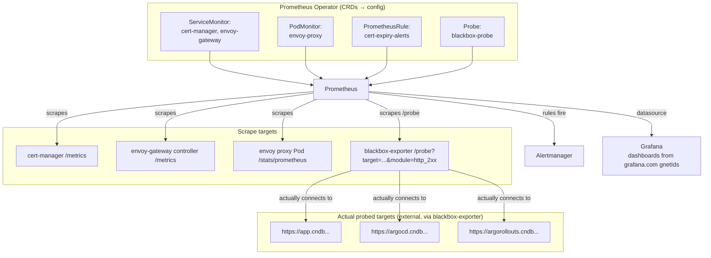

# Monitoring — Concepts & Learning Notes

This doc explains the *why* and *how* behind `monitoring/*` — the CRDs, blackbox-exporter's
probing mechanism, and how it all wires up to Prometheus/Grafana. For the runnable steps,
see [`monitoring-deploy.md`](./monitoring-deploy.md).

## The goal

See, in Grafana/Prometheus, whether the cluster, ArgoCD, and — the focus here — the
domain's TLS certificates are healthy, with alerts firing *before* something like a cert
expiry actually breaks HTTPS for users.

## kube-prometheus-stack, in one paragraph

`kube-prometheus-stack` is a Helm chart that bundles several things together: **Prometheus
Operator** (a controller that turns simple CRDs into Prometheus's actual scrape/rule
config), **Prometheus** itself (the time-series database + scraper), **Alertmanager**
(routes firing alerts to wherever), **Grafana** (dashboards), plus `node-exporter` and
`kube-state-metrics` (auto-scraped cluster/node metrics, no config needed). Installing this
one chart gets you the whole stack — everything in `monitoring/` after that is *telling*
Prometheus Operator what else to watch, via CRDs, not editing Prometheus's config directly.

## The four CRDs Prometheus Operator watches

You never hand-write Prometheus's `scrape_configs` — you create one of these, and the
Operator regenerates Prometheus's config automatically:

- **`ServiceMonitor`** — "scrape this named port on any Service matching these labels."
  Used in `cert-manager-service-monitor.yml` and half of `envoy-gateway-monitors.yml`.
- **`PodMonitor`** — same idea, but targets Pods directly instead of going through a
  Service. Needed when the port you want isn't actually exposed on a Service — exactly
  the case for the Envoy proxy's `metrics` port (see below).
- **`PrometheusRule`** — alerting/recording rules (`cert-expiry-alerts.yml`). Prometheus
  evaluates these continuously against its own stored metrics.
- **`Probe`** — a different shape: not "scrape a target's own `/metrics`", but "ask an
  *external prober* (blackbox-exporter) to check a target and report back" — see below.

All four use a `labels: { release: monitoring }` selector. That's not decorative — it's
what makes Prometheus actually pick them up. `kube-prometheus-stack`'s default
`serviceMonitorSelector`/`ruleSelector`/etc. only match resources labeled with the Helm
release name (here, `monitoring`), across **any namespace** (the namespace selector
defaults to `{}`, all namespaces — that's why `argocd-service-monitor.yml`,
`cert-manager-service-monitor.yml`, etc. can live in `argocd`/`cert-manager` while
Prometheus itself runs in `monitoring`).

## Why one metrics port needed a `PodMonitor` instead of a `ServiceMonitor`

`envoy-gateway-monitors.yml` has two resources for a reason. Checked directly against the
live cluster:

```
$ kubectl get svc envoy-gateway -n envoy-gateway-system -o jsonpath='{.spec.ports[*].name}'
grpc ratelimit wasm metrics
```

The control-plane Service (`envoy-gateway` — the Gateway API controller itself) *does*
expose a `metrics` port → plain `ServiceMonitor` works.

```
$ kubectl get pods -n envoy-gateway-system -l app.kubernetes.io/component=proxy \
    -o jsonpath='{.items[0].spec.containers[0].ports}'
[{"containerPort":10080,...},{"containerPort":10443,...},{"containerPort":19001,"name":"metrics",...}]
```

The actual **proxy** (the thing handling real app traffic — the metrics you'd actually want
for request rate/latency/error-rate dashboards) exposes `metrics` on the **Pod**, but its
Service (`envoy-mern-devops-envoy-gateway-*`) only forwards `http-80`/`https-443` — the
metrics port was never added to that Service's `spec.ports`. A `ServiceMonitor` can only
scrape ports a Service exposes, so there's nothing for it to select. A `PodMonitor` skips
the Service entirely and scrapes the Pod's port directly — that's the only way to reach it.
This is a common gotcha with any Helm-installed component: always check whether the port
you want is actually on the Service, not just the Pod, before assuming `ServiceMonitor`
will work (`kubectl get svc <name> -o jsonpath='{.spec.ports[*].name}'` is the one-liner).

## How blackbox-exporter + the `Probe` CRD actually work

This is the part that's non-obvious if you haven't used blackbox-exporter before.

**blackbox-exporter is not a normal exporter.** A normal exporter (like `node-exporter`)
exposes `/metrics` describing *itself* — you scrape it, done. blackbox-exporter instead
exposes a `/probe` endpoint that takes two query parameters — `target` (the URL to check)
and `module` (how to check it, e.g. `http_2xx`) — connects to *that target* on the spot,
and returns metrics *about that connection* (`probe_success`, `probe_duration_seconds`,
and for HTTPS targets, `probe_ssl_earliest_cert_expiry`). One running blackbox-exporter Pod
can check any number of arbitrary URLs this way — it's not tied to scraping itself.

```
GET http://blackbox-exporter:9115/probe?target=https://app.cndb.atkaridarshan.online&module=http_2xx
```

**The `Probe` CRD is what tells Prometheus to make that exact request, repeatedly, for
each target.** `blackbox-probe.yml`'s `targets.staticConfig.static` list becomes N separate
scrapes, each hitting blackbox-exporter's `/probe` with a different `target=` — not
blackbox-exporter's own `/metrics`. This is why `blackbox-exporter-values.yaml` barely
needs any config: the module (`http_2xx`) is one of several the chart ships by default, and
for any `https://` target, that module automatically captures TLS certificate details —
nothing extra to enable.

## The two sources of cert-expiry data, and why both

- **`probe_ssl_earliest_cert_expiry`** (blackbox-exporter, via the `Probe`) — a Unix
  timestamp for when the cert **currently being served** expires. This is ground truth for
  "what a browser would actually see right now."
- **`certmanager_certificate_expiration_timestamp_seconds`** (cert-manager's own
  `/metrics`, via `cert-manager-service-monitor.yml`) — when the `Certificate` **object**
  cert-manager manages says it expires, labeled by `name`/namespace.

These normally agree. They diverge when cert-manager has renewed the underlying Secret but
Envoy Gateway hasn't reloaded it yet, or if DNS/routing sends probes somewhere unexpected —
in either case, the blackbox metric reflects reality and the cert-manager metric reflects
intent. `cert-expiry-alerts.yml` has one alert per source for exactly this reason.

## PrometheusRule mechanics: `for:`, and alert states

`cert-expiry-alerts.yml`'s `expr` is evaluated on every Prometheus evaluation cycle. An
alert doesn't fire the instant the expression becomes true — the `for: 1h`/`for: 5m` means
the condition must stay true continuously for that whole duration first. Alert states, in
order: **inactive** (condition false) → **pending** (condition true, `for` timer running)
→ **firing** (timer elapsed, condition still true — this is what actually reaches
Alertmanager). This debounces noisy/flapping conditions from generating alert spam — a
single scrape blip won't fire `TLSProbeFailing`, five continuous minutes of failure will.

## Grafana dashboard provisioning: what a `gnetId` actually does

`monitoring/values.yaml`'s `dashboards.*.gnetId` entries aren't config — they're dashboard
**IDs** from [grafana.com's dashboard library](https://grafana.com/grafana/dashboards/).
The kube-prometheus-stack chart's Grafana sidecar downloads the dashboard JSON for that ID
(at the given `revision`) at startup and provisions it into the folder its
`dashboardProviders` entry maps to (`tls` → "TLS & Certificates", etc.) — same mechanism as
picking a template from a catalog rather than hand-building a dashboard's panels/queries
from scratch. `datasource: Prometheus` just tells the imported dashboard which of Grafana's
configured datasources to wire its panels to.

## Architecture



## Related reading

- Prometheus Operator design (ServiceMonitor/PodMonitor/Probe): https://prometheus-operator.dev/docs/getting-started/design/
- blackbox-exporter: https://github.com/prometheus/blackbox_exporter
- cert-manager metrics: https://cert-manager.io/docs/devops-tips/prometheus-metrics/
- Alerting rules and `for`: https://prometheus.io/docs/prometheus/latest/configuration/alerting_rules/
