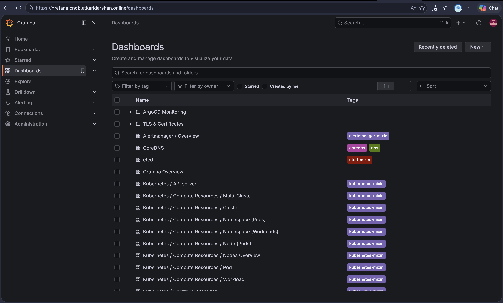
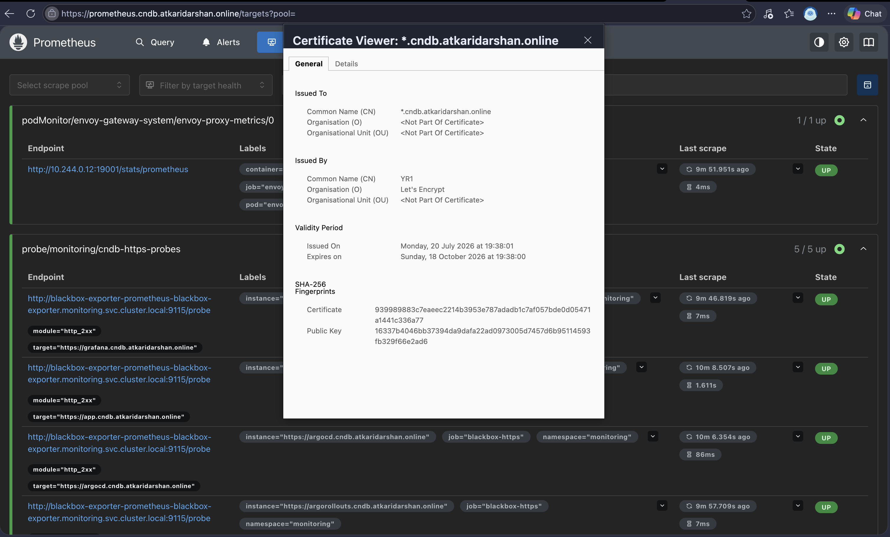

# Monitoring: Prometheus, Grafana, and TLS/Cert Expiry

Concepts and the "why" behind each piece — `ServiceMonitor` vs `PodMonitor`, how
blackbox-exporter's `Probe` actually works, `PrometheusRule` alert states — are in
[`monitoring-concepts.md`](./concepts/monitoring-concepts.md). This doc is the runnable checklist.

Metrics + alerting for the cluster, ArgoCD, and — the focus of this branch — the domain's
TLS certificates, using two complementary sources:

- **cert-manager's own metrics** (`certmanager_certificate_expiration_timestamp_seconds`) —
  the K8s-side view: is the `Certificate` object close to expiry, will cert-manager renew
  it in time.
- **blackbox-exporter's `probe_ssl_earliest_cert_expiry`** — the live-serving-side view:
  what cert is Envoy Gateway actually presenting right now, is HTTPS actually reachable.
  These can diverge (e.g. cert-manager renewed, but Envoy hasn't picked up the new Secret
  yet), which is why both exist here rather than just one.

Do Phases 0–4 in [`tls-setup-guide.md`](./tls-setup-guide.md) first (Gateway and
`wildcard-tls` Secret need to already exist) — `grafana.cndb...` and
`prometheus.cndb...` reuse that same wildcard cert and Gateway.

## Note: blackbox-exporter probes show no TLS data locally — expected, not a bug

`blackbox-exporter` runs *inside* the cluster and probes the real public hostnames
(`app`/`argocd`/`argorollouts`/`grafana`/`prometheus.cndb...`). On `kind`, these five
hostnames aren't actually publicly reachable yet (same reasoning as the `/etc/hosts`
override needed for manual browser testing in `tls-setup-guide.md` Phase 6a —
blackbox-exporter has no equivalent override), so `probe_success == 0` and no
`probe_ssl_earliest_cert_expiry` data is expected locally, not a sign of misconfiguration.

`blackbox-probe.yml` also includes a sixth target, the bare apex `atkaridarshan.online` —
this one *is* genuinely reachable, so it should show `probe_success == 1` with real cert
data even locally. It's a canary for the probe setup itself: if this one ever fails too,
the problem is blackbox-exporter/Probe config, not "app isn't public yet."

**The five `.cndb` targets resolve themselves automatically on a real cloud cluster**
(EKS/AKS/GKE, per `tls-setup-guide.md`'s production path) — DNS points directly at the
Gateway's real public address there, so the exact same `Probe` targets in
`blackbox-probe.yml` become genuinely reachable and start reporting real data, with zero
manifest changes needed. Locally, treat `TLSProbeFailing` firing for those five as expected
background noise — `cert-manager-service-monitor.yml`'s `CertManagerCertExpiringSoon` alert
(the K8s-side source) remains meaningful locally regardless, since it doesn't depend on
public reachability at all.

## Install

**1. kube-prometheus-stack** (Prometheus, Alertmanager, Grafana) — release name
**`monitoring`** matters, since every manifest below assumes it (Grafana's Service name,
and the `release: monitoring` label the operator's default selectors match on):

```bash
helm repo add prometheus-community https://prometheus-community.github.io/helm-charts
helm repo update
helm install monitoring prometheus-community/kube-prometheus-stack \
  -n monitoring --create-namespace \
  -f monitoring/values.yaml
```

**2. blackbox-exporter:**

```bash
helm install blackbox-exporter prometheus-community/prometheus-blackbox-exporter \
  -n monitoring \
  -f monitoring/blackbox-exporter-values.yaml
```

Verify the Service name matches what `monitoring/blackbox-probe.yml` expects:

```bash
kubectl get svc -n monitoring | grep blackbox
```

**3. Apply the extra `ServiceMonitor`/`PodMonitor`/`Probe`/`PrometheusRule` manifests:**

```bash
kubectl apply -f monitoring/cert-manager-service-monitor.yml
kubectl apply -f monitoring/envoy-gateway-monitors.yml
kubectl apply -f monitoring/blackbox-probe.yml
kubectl apply -f monitoring/cert-expiry-alerts.yml
```

**4. Route Grafana and Prometheus through the Gateway:**

```bash
kubectl apply -f monitoring/grafana-httproute.yml
kubectl apply -f monitoring/prometheus-httproute.yml
```

## Verify

```bash
kubectl get pods -n monitoring
kubectl get servicemonitor,podmonitor,probe,prometheusrule -n monitoring -A
```

In the Prometheus UI (**Status → Targets**), confirm `cert-manager-metrics`,
`envoy-gateway-controller-metrics`, `envoy-proxy-metrics`, and the `blackbox-https` probe
job all show `UP`. In **Alerts**, `TLSCertExpiringSoon`/`TLSProbeFailing`/
`CertManagerCertExpiringSoon` should show as `inactive` (not firing) under normal
conditions — firing would mean an actual problem worth investigating.

## Access the UIs

Same local-testing pattern as everything else (`tls-setup-guide.md` Phase 6a):

```bash
echo "127.0.0.1 grafana.cndb.atkaridarshan.online" | sudo tee -a /etc/hosts
echo "127.0.0.1 prometheus.cndb.atkaridarshan.online" | sudo tee -a /etc/hosts
```

**Grafana** — `https://grafana.cndb.atkaridarshan.online/`, login `admin` /
`password` (from `monitoring/values.yaml` — this is break-glass only once GitHub SSO is set
up, see [`sso-deploy.md`](./sso-deploy.md)). Dashboards auto-provisioned: `kubernetes-cluster` (default folder),
two ArgoCD dashboards (`ArgoCD Monitoring` folder), and the Blackbox Exporter dashboard
(`TLS & Certificates` folder) — the last one graphs `probe_ssl_earliest_cert_expiry` and
`probe_success` for all three probed hostnames.



**Prometheus** — `https://prometheus.cndb.atkaridarshan.online/`, no login by default.



Same clean padlock as everything else — same wildcard cert, same Gateway.

## Note: no Grafana dashboard for cert-manager's own metrics yet

Unlike the blackbox-exporter dashboard (a well-known, verified community dashboard, ID
`7587`), there isn't a cert-manager-specific community dashboard ID included here — didn't
want to hardcode one without verifying it actually resolves. `certmanager_certificate_expiration_timestamp_seconds`
is available as a Prometheus metric now (via `cert-manager-service-monitor.yml`) and can be
graphed directly in Grafana's Explore view, or added as a dashboard panel later once a
suitable community dashboard ID is confirmed.

## Note: Loki/logging removed from `values.yaml`

The `additionalDataSources: Loki` block and its dashboard provider were removed — they
referenced a `logging` namespace/Loki stack that doesn't exist in this branch. Re-add both
if/when a logging stage (Fluent Bit + Loki) gets built here.
