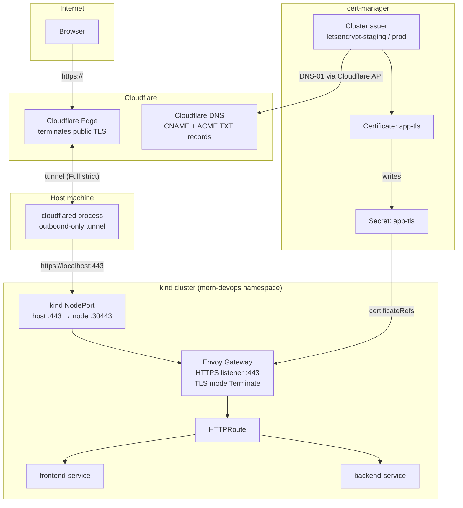
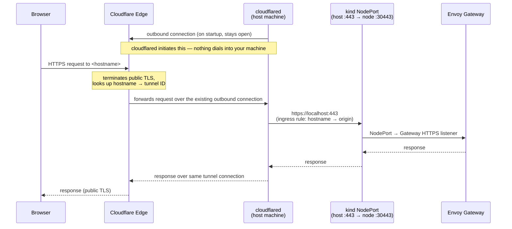

# Public Access via Cloudflare Tunnel (Alternative Approach)

**Status: not currently used.** The current focus for this repo is local NodePort/browser
testing (`tls-setup-guide.md` Phase 6a), using the nested hostname
`app.cndb.atkaridarshan.online`. This doc is kept for if/when public access to the local
`kind` cluster is picked back up — it documents the approach, the problem hit, and the fix,
so it doesn't need re-discovering.

## The approach

`kind` has no public IP for a Gateway to hand out. **Cloudflare Tunnel** (`cloudflared`)
solves this without port-forwarding: it runs as a process on your host machine and opens an
*outbound-only* connection to Cloudflare's edge. Cloudflare then routes public requests down
the tunnel to `https://localhost:443` — the same NodePort mapping `kind-config.yml` already
exposes for local testing — no inbound firewall/router changes needed. DNS becomes a
`CNAME` to `<tunnel-id>.cfargotunnel.com` instead of to a load balancer.

This tunnel never becomes a Kubernetes manifest — it doesn't exist in the production path
(a real cloud LB, see the README) either.



**Where TLS terminates, twice:**

1. **Public leg** (browser ↔ Cloudflare edge): Cloudflare terminates this with its own
   automatic edge certificate. This is what the browser's padlock actually reflects.
2. **Origin leg** (Cloudflare ↔ your Gateway, over the tunnel): this is where the
   Let's Encrypt cert from this repo's `cert-manager` setup matters. With the Cloudflare
   zone's SSL/TLS mode set to **Full (strict)**, Cloudflare validates that the origin
   (your Gateway) presents a certificate signed by a publicly trusted CA and matching the
   hostname — Let's Encrypt satisfies that. Without this, people fall back to "Flexible"
   (edge↔origin unencrypted) or "Full" (encrypted, but no cert validation) — both weaker.

Cloudflare Tunnel is unrelated to how the ACME challenge itself is solved — DNS-01 only
needs the Cloudflare API to write a TXT record, never inbound traffic — so nothing about
tunnel setup changes the cert-manager config in `tls-concepts.md`.

## The problem: nested hostnames don't work here

This repo's hostname, `app.cndb.atkaridarshan.online`, is **two levels** below the
registered domain (`cndb` + `app`). Cloudflare's free **Universal SSL** edge certificate
only covers the apex and exactly **one level** of subdomain —
`atkaridarshan.online` and `*.atkaridarshan.online`. It does not cover
`app.cndb.atkaridarshan.online`.

When this hostname is proxied through Cloudflare's edge (as Cloudflare Tunnel requires),
Cloudflare has no certificate to present for it via SNI and refuses the TLS handshake
outright — confirmed directly while testing this:

```
$ echo | openssl s_client -connect app.cndb.atkaridarshan.online:443 -servername app.cndb.atkaridarshan.online
809D14F101000000:error:0A000410:SSL routines:ssl3_read_bytes:ssl/tls alert handshake failure
no peer certificate available
```

Comparing SNI responses at the same Cloudflare edge IP confirmed exactly where the line is:

| SNI hostname | Result |
|---|---|
| `atkaridarshan.online` (apex) | valid cert, `CN=atkaridarshan.online` |
| `cndb.atkaridarshan.online` (1 level deep) | valid cert, same wildcard |
| `app.cndb.atkaridarshan.online` (2 levels deep) | handshake refused — no cert |

This is a Cloudflare-edge-specific limit, not a DNS-01/cert-manager/Let's Encrypt one —
cert-manager can issue an origin cert for any nesting depth via DNS-01 without issue. It
only matters because Cloudflare is terminating *public* TLS in front of the tunnel.

Two ways to fix it, if this path is revisited:

1. **Flatten to one level** (free, no Cloudflare dashboard changes) — see below.
2. **Cloudflare Advanced Certificate Manager** (paid add-on, ~$5–10/mo per zone) — issues an
   edge cert for `*.cndb.atkaridarshan.online`, letting the nested naming stay as-is.

## The fix: flatten to one-level hostnames

Pattern: `<service>-cndb.atkaridarshan.online` — e.g. `app-cndb.atkaridarshan.online`,
`argocd-cndb.atkaridarshan.online`, `argorollouts-cndb.atkaridarshan.online`. All one level
under the apex, so they're covered automatically and for free by Cloudflare's Universal SSL
wildcard (`*.atkaridarshan.online`) the moment they're proxied — no dashboard changes, no
paid add-on.

Confirmed working when tested: SNI for a one-level name (`cndb.atkaridarshan.online`) at the
same Cloudflare edge IP returned a valid cert immediately, same as the apex.

If adopting this, the rename touches:

- `gateway/certificate.yml` — `spec.dnsNames`
- `gateway/gateway-api.yml` — both listeners' `hostname`
- `helm-chart/values.yaml` — `gateway.hostname`
- `cloudflared`'s `config.yml` — `ingress[].hostname` and `originRequest.originServerName`

Note this only affects the *edge* cert (Cloudflare's, for the public leg) — the *origin*
cert from cert-manager (`app-tls`) can be requested for any hostname/depth regardless, via
DNS-01, no matter which naming scheme is chosen.

## How Cloudflare Tunnel actually works (mechanics)

This is the part that's non-obvious if you haven't used it before — worth understanding
since it explains *why* no ports need to be opened at all.

1. **`cloudflared` dials out, it never listens.** On startup, the `cloudflared` process (on
   your host machine) opens several long-lived, encrypted connections *outbound* to nearby
   Cloudflare edge locations (usually 4, for redundancy) — the same kind of connection a
   browser makes when it calls an HTTPS API. From your network's point of view this is
   indistinguishable from any other outbound API call, which is exactly why it needs zero
   inbound firewall/router/NAT configuration.
2. **Cloudflare's edge registers those connections against your tunnel's ID.** Once
   connected, Cloudflare's control plane knows "requests for tunnel `<uuid>` can be
   delivered down any of these 4 open connections."
3. **The DNS `CNAME` isn't really "resolved" by the browser the normal way.** Because the
   record is Cloudflare-proxied (orange-cloud), the browser just connects to Cloudflare's
   anycast network like it would for any Cloudflare site — Cloudflare's edge terminates
   the public TLS connection, reads the `Host`/SNI, and internally looks up which tunnel
   owns that hostname (this mapping is what `cloudflared tunnel route dns` writes down for
   you). The CNAME mainly exists so Cloudflare's own systems have a stable record to hang
   that routing rule off of.
4. **The request is multiplexed down one of the 4 existing outbound connections** to
   `cloudflared` on your host — no new connection is opened *to* your machine; it rides the
   connection your host already opened *out*.
5. **`cloudflared` reads its ingress rules** (a hostname → origin mapping you configure,
   e.g. `<hostname>` → `https://localhost:443`) and makes an ordinary local request to that
   address — the exact same request the Phase 6a `curl` command makes by hand. `kind`'s
   NodePort mapping (`30443 → host 443`) is what takes it from there into the cluster, to
   the Gateway's HTTPS listener.
6. **The response travels back the same path** — Gateway → `kind` NodePort → `cloudflared`
   → the same outbound tunnel connection → Cloudflare edge → browser.

**Why `kind-config.yml` matters here:** the NodePort mapping isn't just for manual local
testing — it's the one and only door `cloudflared` uses to reach the cluster at all. The
Phase 6a local curl test is a dry run of the exact path the tunnel uses here.



## Setup steps (for later)

Tunnel name used when this was last tried: `cndb-local`.

Confirm the tunnel exists and grab its ID/credentials path:

```bash
cloudflared tunnel list
# note the ID for cndb-local — credentials file is ~/.cloudflared/<tunnel-id>.json
```

Create `~/.cloudflared/config.yml` (use the flattened hostname if adopting the fix above):

```yaml
tunnel: cndb-local
credentials-file: /Users/<you>/.cloudflared/<tunnel-id>.json

ingress:
  - hostname: <hostname>
    service: https://localhost:443
    originRequest:
      originServerName: <hostname>
  - service: http_status:404   # catch-all, required as the last rule
```

Route DNS — this points `<hostname>` at the tunnel (replaces whatever record is there now
with a CNAME to `<tunnel-id>.cfargotunnel.com`):

```bash
cloudflared tunnel route dns cndb-local <hostname>
```

Run the tunnel:

```bash
cloudflared tunnel run cndb-local
```

Leave that running, then in another terminal set the zone's SSL/TLS mode to **Full
(strict)** in the Cloudflare dashboard (`atkaridarshan.online` zone → SSL/TLS → Overview) —
without this, Cloudflare won't validate the Let's Encrypt cert on the origin leg.

**Test:**

```bash
# confirm the CNAME actually took
dig CNAME <hostname> +short
# should show something like <tunnel-id>.cfargotunnel.com

# then hit the real public URL
curl -v https://<hostname>/
```

Since this is a Cloudflare-proxied record, propagation is usually fast (seconds to a couple
minutes) — Cloudflare's own edge picks up the routing change directly, there's no real
DNS TTL wait involved. If `curl`/the browser still fails right after routing it, re-run the
`dig CNAME` check first before assuming something's broken — it may just not have
propagated yet. Once it resolves to `cfargotunnel.com` and `curl` succeeds, try the browser.

No Kubernetes manifests needed for any of this — the tunnel lives entirely outside the
cluster.

## Related reading

- Cloudflare Tunnel: https://developers.cloudflare.com/cloudflare-one/connections/connect-networks/
- Cloudflare Universal SSL: https://developers.cloudflare.com/ssl/edge-certificates/universal-ssl/
- Cloudflare Advanced Certificate Manager: https://developers.cloudflare.com/ssl/edge-certificates/advanced-certificate-manager/
