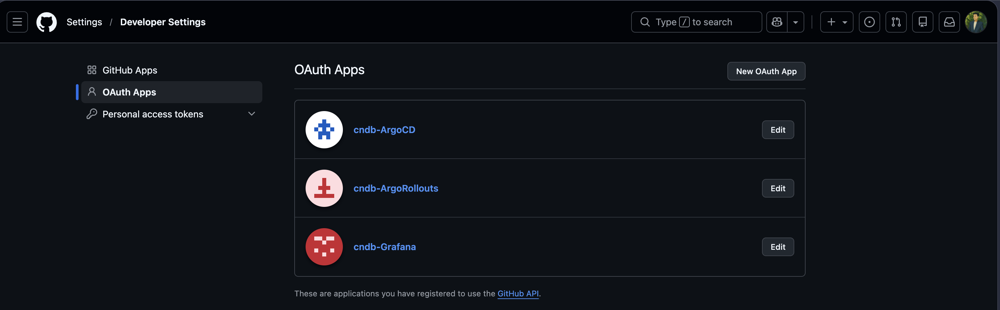
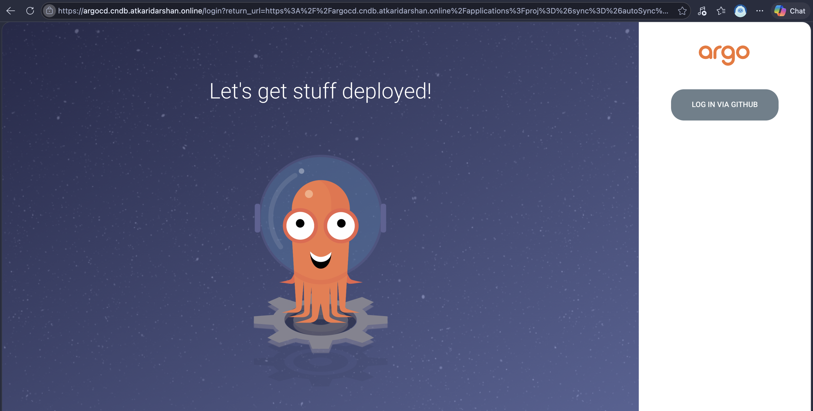
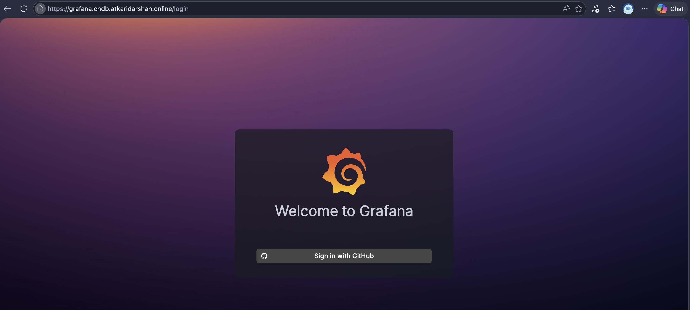
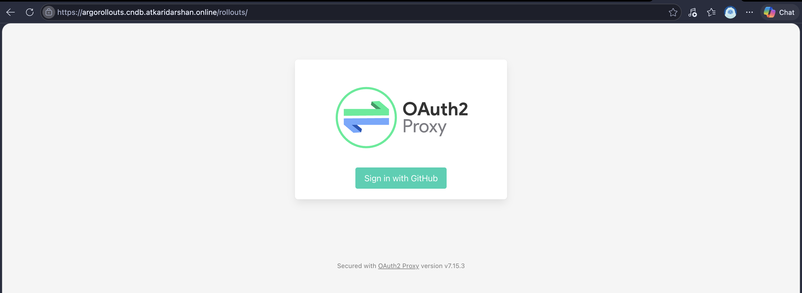

# SSO Setup — ArgoCD, Grafana, Argo Rollouts Dashboard

Concepts and the "why" — Dex as a broker, Grafana's native OAuth, why the Rollouts
dashboard needs oauth2-proxy in front of it instead — are in
[`concepts/sso-concepts.md`](./concepts/sso-concepts.md). This doc is the runnable
checklist.

Do [`tls-setup-guide.md`](./tls-setup-guide.md), [`gitops-deploy.md`](./gitops-deploy.md),
and [`monitoring-deploy.md`](./monitoring-deploy.md) first — ArgoCD, Argo Rollouts, and
Grafana all need to already be installed.

## 1. Create three GitHub OAuth Apps

GitHub → Settings → Developer settings → OAuth Apps → New OAuth App. One app per tool
(classic OAuth Apps only support a single callback URL each):

| App name | Homepage URL | Authorization callback URL |
|---|---|---|
| ArgoCD | `https://argocd.cndb.atkaridarshan.online` | `https://argocd.cndb.atkaridarshan.online/api/dex/callback` |
| Grafana | `https://grafana.cndb.atkaridarshan.online` | `https://grafana.cndb.atkaridarshan.online/login/github` |
| Argo Rollouts | `https://argorollouts.cndb.atkaridarshan.online` | `https://argorollouts.cndb.atkaridarshan.online/oauth2/callback` |

Note the Client ID and generate a Client Secret for each — you'll need all six values in
the next step.



## 2. Create the Secrets each tool reads (never commit these)

**ArgoCD** — add Dex's keys to ArgoCD's existing `argocd-secret` (a merge patch, doesn't
touch its other keys):

```bash
kubectl patch secret argocd-secret -n argocd --type merge -p '{
  "stringData": {
    "dex.github.clientId": "<argocd-oauth-app-client-id>",
    "dex.github.clientSecret": "<argocd-oauth-app-client-secret>"
  }
}'
```

**Grafana:**

```bash
kubectl create secret generic grafana-github-oauth -n monitoring \
  --from-literal=client-id='<grafana-oauth-app-client-id>' \
  --from-literal=client-secret='<grafana-oauth-app-client-secret>'
```

**oauth2-proxy** (for the Rollouts dashboard) — also needs a cookie-encryption secret,
generated locally, not from GitHub:

```bash
COOKIE_SECRET=$(python3 -c 'import secrets,base64; print(base64.urlsafe_b64encode(secrets.token_bytes(32)).decode())')

kubectl create namespace argo-rollouts --dry-run=client -o yaml | kubectl apply -f -
kubectl create secret generic argorollouts-oauth2-proxy -n argo-rollouts \
  --from-literal=client-id='<rollouts-oauth-app-client-id>' \
  --from-literal=client-secret='<rollouts-oauth-app-client-secret>' \
  --from-literal=cookie-secret="$COOKIE_SECRET"
```

## 3. ArgoCD — fill in the RBAC placeholder, then upgrade

Edit `argocd/values.yaml`, replace `REPLACE_WITH_YOUR_GITHUB_EMAIL` in `policy.csv` with
the email your GitHub account uses (this is what Dex's `email` claim will contain):

```bash
helm upgrade argocd argo/argo-cd -n argocd -f argocd/values.yaml
```

`configs.cm.url` (already set to `https://argocd.cndb.atkaridarshan.online`) matters here —
without it, Dex builds the wrong `redirect_uri` and GitHub rejects the callback with
"Invalid redirect URL: the protocol and host ... must match".

**This same upgrade also disables the local `admin` login** — `configs.cm."admin.enabled":
"false"` is already in `argocd/values.yaml`, so it's not a separate step later. From this
point, GitHub is the only way into the UI. That means: if the OAuth App/secret from steps
1–2 has a mistake, there's no local-login fallback in the browser — you'd fix it via
`kubectl`/`helm` (still fully available) and re-run this same upgrade, not via the UI. Keep
the `argocd-initial-admin-secret` around rather than deleting it — flipping
`admin.enabled` back to `"true"` and re-upgrading restores local login for recovery if
needed.

**If `role:admin` logs in fine but an action still gets denied unexpectedly**: ArgoCD's
RBAC changes are usually hot-reloaded from the ConfigMap, but this can lag — if a
`policy.csv` change doesn't seem to take effect, force a fresh read:

```bash
kubectl rollout restart deployment argocd-server -n argocd
```

You can also test a policy directly against the live config without going through the UI,
using ArgoCD's built-in simulator:

```bash
kubectl exec -n argocd deploy/argocd-server -- argocd admin settings rbac can \
  <your-email> <action> <resource> <object> --namespace argocd
```

## 4. Grafana — upgrade to pick up the OAuth config

Edit `monitoring/values.yaml`, replace `REPLACE_WITH_YOUR_GITHUB_USERNAME` in
`role_attribute_path` with your actual GitHub username — without this, your GitHub login
only gets the default Viewer role, same as anyone else; the local `admin`/`password`
account would remain the only way to get real Admin access.

```bash
helm upgrade monitoring prometheus-community/kube-prometheus-stack -n monitoring \
  -f monitoring/values.yaml
```

**This same upgrade also hides the local login form** —
`grafana.ini.auth.disable_login_form: true` is already in `monitoring/values.yaml`, so
there's no separate later step. `adminUser`/`adminPassword` still exist underneath it for
recovery (flip `disable_login_form` back to `false` and re-upgrade if GitHub OAuth ever
breaks) — they're just not reachable from the login page anymore.

If `argocd-server`-style stale-policy caching bit you already, the same class of issue can
happen here too — if your GitHub login still shows as Viewer after upgrading, restart
Grafana to force a fresh config read:

```bash
kubectl rollout restart deployment monitoring-grafana -n monitoring
```

## 5. Argo Rollouts — install oauth2-proxy, then re-route the dashboard

Unlike ArgoCD/Grafana, oauth2-proxy has no readonly/viewer role — anyone who passes its
gate gets full dashboard access, including promote/abort. Edit
`argorollouts/oauth2-proxy-values.yaml` first, replace `REPLACE_WITH_YOUR_GITHUB_USERNAME`
in `extraArgs.github-user` with your actual GitHub username.

```bash
helm repo add oauth2-proxy https://oauth2-proxy.github.io/manifests
helm repo update
helm upgrade --install argorollouts-oauth2-proxy oauth2-proxy/oauth2-proxy \
  -n argo-rollouts \
  -f argorollouts/oauth2-proxy-values.yaml
```

`--install` makes this safe to re-run after config changes (e.g. the `scope`/`upstream` fixes
during initial setup) without hitting `cannot reuse a name that is still in use`.

Two real gotchas hit setting this up, both already fixed in `oauth2-proxy-values.yaml`,
worth knowing if you touch this config again:

- **`scope` needs `read:org`, even with `github-user` (not `github-org`/`team`)
  restriction** — oauth2-proxy's GitHub provider always tries to list orgs as part of
  session creation regardless of which restriction mode you use. Without it, GitHub
  returns a 403 ("You need at least read:org scope...").
  `kubectl logs -n argo-rollouts -l app.kubernetes.io/name=oauth2-proxy` for the real
  error whenever that page shows up, since it's used for both real errors and (less
  usefully) intentional access denials.

Verify the Service name matches what `argorollouts/httproute.yml` expects, adjust if not:

```bash
kubectl get svc -n argo-rollouts
```

```bash
kubectl apply -f argorollouts/httproute.yml
```

## Verify

Same `/etc/hosts` local-testing pattern as everything else:

```bash
echo "127.0.0.1 argocd.cndb.atkaridarshan.online" | sudo tee -a /etc/hosts
echo "127.0.0.1 grafana.cndb.atkaridarshan.online" | sudo tee -a /etc/hosts
echo "127.0.0.1 argorollouts.cndb.atkaridarshan.online" | sudo tee -a /etc/hosts
```

- **ArgoCD**: open the UI — since step 3 already disabled local admin login, you should see
  *only* "LOG IN VIA GITHUB", no local login form at all. After logging in, check you
  actually landed with `role:admin` (ArgoCD's UI shows current user/roles under the user
  icon) — if not, check the exact claim Dex returned
  (`kubectl logs -n argocd deploy/argocd-dex-server`) and adjust `policy.csv`. If the local
  form still shows up, the upgrade/restart from step 3 didn't fully land — retry those.
- **Grafana**: only "Sign in with GitHub" should appear — no local login form, same
  reasoning (step 4 already hid it). If the local form still shows, retry step 4's
  upgrade/restart.
- **Argo Rollouts dashboard**: navigating there should redirect straight to GitHub's OAuth
  page before showing anything — if it shows the dashboard with no redirect, oauth2-proxy
  isn't actually in front of it; recheck the `backendRefs` name in `httproute.yml`.






