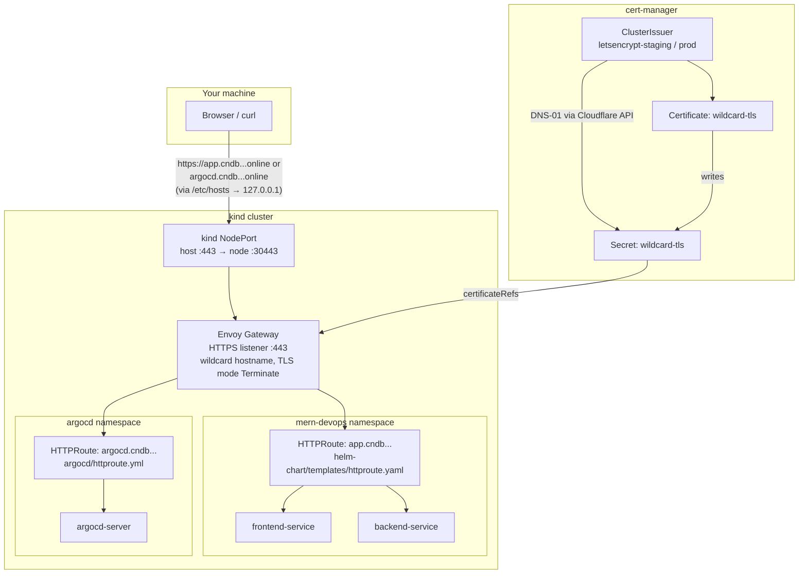

# TLS on the Gateway — Concepts & Learning Notes

This doc explains the *why* behind the TLS setup in this repo (`gateway/certificate.yml`,
`gateway/cluster-issuer.yml`, `gateway/gateway-api.yml`). For the runnable steps, see
[`tls-setup-guide.md`](./tls-setup-guide.md).

## The goal

Serve `app.cndb.atkaridarshan.online` over HTTPS with a certificate that's actually trusted
by browsers (not self-signed), auto-renewed, with no manual cert handling.

## cert-manager

`cert-manager` is a Kubernetes controller that watches for `Certificate` resources and
automates getting a real TLS cert for them — requesting it from a CA, proving domain
ownership, storing the result as a `Secret`, and renewing it before it expires. Without it,
you'd be manually running `certbot`, copying files into a `Secret`, and remembering to redo
it every ~90 days.

Three resource kinds we use:

- **`ClusterIssuer`** — a cluster-scoped config that says *which CA to use and how to prove
  domain ownership*. Cluster-scoped (not namespaced) because it's shared infrastructure —
  any namespace's `Certificate` can reference it.
- **`Certificate`** — namespaced, says "I want a cert for these DNS names, issued by this
  issuer, stored in this Secret." This is the per-app resource.
- The `Secret` cert-manager writes the actual key/cert pair into — this is what the
  `Gateway`'s HTTPS listener reads (`certificateRefs`).

## Let's Encrypt & ACME

Let's Encrypt is a free CA that issues certs via **ACME**, an automated protocol: you prove
you control the domain, and in return you get a signed cert, valid 90 days. cert-manager
speaks ACME on your behalf.

Two ACME endpoints matter:

- **Staging** (`acme-staging-v02...`) — issues certs signed by a *non-trusted* test root.
  Browsers will warn. Used only to prove the whole flow (DNS records, API token, solver
  config) works, without touching...
- **Production** (`acme-v02...`) — real, browser-trusted certs. Rate-limited (currently 5
  duplicate certs per exact domain set per week). This is why we test on staging first —
  a typo in the Cloudflare token or a DNS propagation issue is cheap to retry on staging,
  expensive to retry against prod's rate limit.

This is why `gateway/cluster-issuer.yml` defines **both** `letsencrypt-staging` and
`letsencrypt-prod` as separate `ClusterIssuer`s — you point a `Certificate`'s `issuerRef` at
whichever one you're ready for.

## HTTP-01 vs DNS-01 — and why we picked DNS-01

Both are ways ACME proves you control a domain. The difference is *what* you have to expose.

**HTTP-01**: the CA gives you a token, cert-manager spins up a temporary endpoint at
`http://app.cndb.atkaridarshan.online/.well-known/acme-challenge/<token>`, and Let's Encrypt
connects to it over the public internet on port 80 to check it matches.

- Requires port 80 to be publicly reachable, pointed at your cluster, *before* the cert
  exists.
- Cannot issue wildcard certs (`*.cndb.atkaridarshan.online`) — CAs refuse HTTP-01 for
  wildcards because it only proves you control that one exact hostname.
- One challenge per hostname, so N subdomains = N separate public endpoints to expose.

**DNS-01**: the CA gives you a token, cert-manager creates a TXT record
`_acme-challenge.app.cndb.atkaridarshan.online` (via the Cloudflare API) containing it, and
Let's Encrypt checks DNS instead of HTTP.

- Never touches port 80/443 at all — works even if nothing is publicly reachable yet.
- The **only** method that supports wildcard certs, because proving you control DNS for the
  zone proves you control every subdomain under it.
- Needs API credentials for your DNS provider (a Cloudflare API token, in our case),
  scoped to `Zone:DNS:Edit` on `atkaridarshan.online` only.

**Why this project uses DNS-01:** the cluster is a local `kind` cluster with no public IP —
there's nothing to point an HTTP-01 challenge at. DNS-01 decouples "getting a cert" from
"having a publicly reachable ingress", which is also why `gateway/certificate.yml` requests
a single wildcard cert (`*.cndb.atkaridarshan.online`) rather than one cert per hostname —
it covers `app.cndb...`, `argocd.cndb...`, and any future `*.cndb...` subdomain with one
`Certificate`/`Secret`, and wildcards are only issuable via DNS-01 in the first place.

Note: this nested `cndb.` naming works fine for everything in this doc and for local
testing (`tls-setup-guide.md` Phase 6a) — it only runs into a wall if the hostname is later
put behind Cloudflare's proxy/edge (e.g. Cloudflare Tunnel for public access), which has its
own, unrelated one-level certificate limit. See
[`public-access-cloudflare-tunnel.md`](./public-access-cloudflare-tunnel.md) for that.

## How the Gateway consumes the cert

`gateway/gateway-api.yml`'s `Gateway` has an HTTPS listener:

```yaml
- name: https
  protocol: HTTPS
  port: 443
  hostname: '*.cndb.atkaridarshan.online'
  allowedRoutes:
    namespaces:
      from: All
  tls:
    mode: Terminate
    certificateRefs:
      - name: wildcard-tls   # the Secret cert-manager writes to
```

`mode: Terminate` means Envoy Gateway decrypts TLS right here, using the `wildcard-tls`
Secret, then forwards plain HTTP internally to whichever Service the request's `HTTPRoute`
points at. The listener's `hostname` is now a wildcard, so it accepts any one-level
subdomain (`app.cndb...`, `argocd.cndb...`, etc.) via SNI — each individual `HTTPRoute`
(`helm-chart/templates/httproute.yaml` for the app, `argocd/httproute.yml` for ArgoCD)
still declares its own exact hostname underneath that. `allowedRoutes.namespaces.from: All`
is what lets `HTTPRoute`s from *other* namespaces (like `argocd`) attach to this Gateway at
all — by default a listener only accepts routes from its own namespace (`mern-devops`).

## Architecture (current: local testing, no public exposure)



Public access (Cloudflare Tunnel) is a separate, currently-unused path — see
[`public-access-cloudflare-tunnel.md`](./public-access-cloudflare-tunnel.md).

## Related reading

- cert-manager ACME DNS-01: https://cert-manager.io/docs/configuration/acme/dns01/
- cert-manager Cloudflare solver: https://cert-manager.io/docs/configuration/acme/dns01/cloudflare/
- Let's Encrypt rate limits: https://letsencrypt.org/docs/rate-limits/
- Gateway API TLS: https://gateway-api.sigs.k8s.io/guides/tls/
