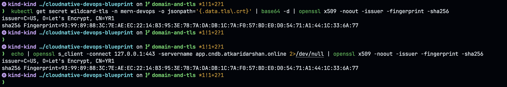
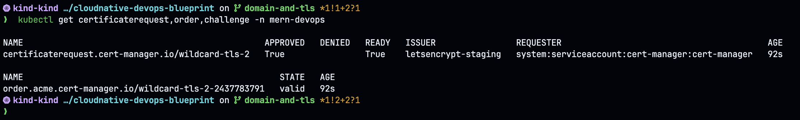
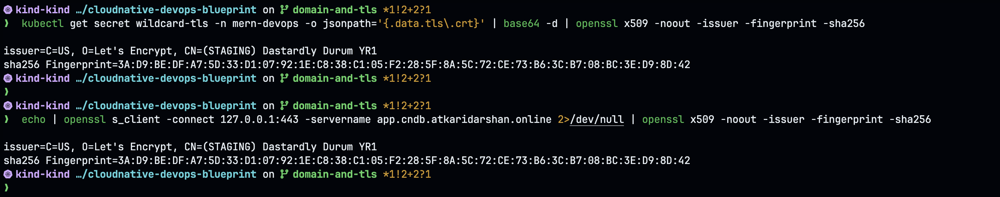

# Validating TLS Cert Renewal Actually Reaches the Gateway

This doc tests something the rest of the TLS setup only *assumes*: that when cert-manager
renews the wildcard certificate, Envoy Gateway actually starts serving the new one — without
anyone restarting anything. For the cert-manager/ACME/DNS-01 fundamentals, see
[`concepts/tls-concepts.md`](./concepts/tls-concepts.md) first; this doc builds on that and
doesn't repeat it.

## Why this needs testing, not just trusting the config

cert-manager automates *renewal* — requesting a new cert before the old one expires, proving
domain ownership again via DNS-01, and writing the result into the `wildcard-tls` Secret.
Monitoring alerts on expiry (`TLSCertExpiringSoon`, `CertManagerCertExpiringSoon`, see
[`monitoring-concepts.md`](./concepts/monitoring-concepts.md)) so you'd notice if renewal
itself failed.

None of that proves the *last mile*: does Envoy Gateway notice the Secret's contents changed
and start using the new cert on its own, or does it keep serving whatever cert it loaded at
startup until something tells it to reload? Kubernetes doesn't push config changes into a
running process by default — a mounted Secret updating doesn't mean the process reading it
knows to re-read it. If Envoy doesn't watch for this, the setup would silently keep serving an
**expired** cert well past the renewal, and monitoring's alert would have fired for nothing —
the actual failure it's meant to prevent would still happen. This doc finds out which case
we're actually in, instead of assuming the better one.

## The two "current certs" this test compares

There are two independent ways to answer "what cert is active right now," and the whole test
is just comparing them:

- **The desired state** — the `wildcard-tls` Secret's contents, as Kubernetes/cert-manager
  see it. Read directly from the Secret object.
- **The live state** — what Envoy Gateway actually hands a real client during a real TLS
  handshake, right now, over the network. Read by literally performing a handshake against
  it.

If they match, the Gateway picked up the change. If they don't, it's serving something stale
regardless of what the Secret says.

## openssl primer for this test

Two commands do all the work here, worth understanding rather than just copy-pasting:

**`openssl x509 -noout -issuer -fingerprint -sha256`** — reads a PEM certificate and prints
selected fields. `-noout` suppresses dumping the cert itself (otherwise you get a base64
blob). `-issuer` shows which CA signed it — the fast way to tell "is this the real
`letsencrypt-prod` cert or the `(STAGING) ...`-signed one." `-fingerprint -sha256` prints a
SHA-256 hash of the *entire* certificate — this is the actual trick this test relies on: two
certs are only guaranteed to have the same fingerprint if they're byte-for-byte the same
cert. Comparing fingerprints is unambiguous in a way comparing issuer names or expiry dates
alone isn't (a re-issued cert from the same issuer could otherwise look confusingly similar
at a glance).

**`openssl s_client -connect <ip>:<port> -servername <hostname>`** — makes `openssl` act as a
raw TLS client, connecting exactly like a browser would. `-servername` sends SNI (Server Name
Indication) — it tells the Gateway *which* hostname's cert to present, which matters here
because our Gateway serves one wildcard cert across several hostnames off a single HTTPS
listener. Piping this into `openssl x509 -noout -issuer -fingerprint -sha256` extracts the
same fields as above, but this time from an actual live handshake against the running Envoy
process — the "live state" side of the comparison, as opposed to reading the Secret directly.

## Prerequisites

Cluster already fully up per `tls-setup-guide.md` (Phases 0–4) and `sso-deploy.md` — Envoy
Gateway running, `wildcard-tls` Certificate issued via `letsencrypt-prod`, SSO configured.
Nothing here needs SSO or the app itself; it's purely a Gateway/cert-manager test.

## Step 1 — Capture the baseline before touching anything

```bash
# fingerprint of the cert cert-manager currently has in the Secret
kubectl get secret wildcard-tls -n mern-devops -o jsonpath='{.data.tls\.crt}' | base64 -d | openssl x509 -noout -issuer -fingerprint -sha256

# fingerprint of what the live Gateway is actually presenting right now
echo | openssl s_client -connect 127.0.0.1:443 -servername app.cndb.atkaridarshan.online 2>/dev/null | openssl x509 -noout -issuer -fingerprint -sha256
```

These two should match right now, both showing the current `letsencrypt-prod` cert — that's
the known-good baseline the rest of this test compares against.



## Step 2 — Force a new cert on staging

Forces a genuinely new cert *right now*, without waiting 90 days or touching the production
rate limit — switching issuer means a different CA, so cert-manager requests a fresh cert
regardless of the current one's age.

Edit `gateway/certificate.yml`:

```yaml
  issuerRef:
    name: letsencrypt-staging   # temporarily, for this test
```

```bash
kubectl apply -f gateway/certificate.yml
kubectl get certificate wildcard-tls -n mern-devops -w
# wait for READY=True, then Ctrl+C
kubectl get certificaterequest,order,challenge -n mern-devops
```



## Step 3 — Confirm the Secret actually changed

```bash
kubectl get secret wildcard-tls -n mern-devops -o jsonpath='{.data.tls\.crt}' | base64 -d | openssl x509 -noout -issuer -fingerprint -sha256
```

Should now show a **different** fingerprint and a staging issuer
(`CN=(STAGING) ...`-style name). This confirms cert-manager did its job — never in question,
but establishes the new fingerprint to test against.

## Step 4 — The actual test

```bash
echo | openssl s_client -connect 127.0.0.1:443 -servername app.cndb.atkaridarshan.online 2>/dev/null | openssl x509 -noout -issuer -fingerprint -sha256
```



Both commands above (Secret vs live handshake) show the **same** fingerprint and issuer —
side by side in that screenshot, that's the whole test result in one shot.

- **Fingerprint matches the new (staging) one from Step 3** → Envoy Gateway hot-reloads the
  Secret automatically. Question answered, no gap — go to Step 6 and record that.
- **Fingerprint still matches the old baseline** → it's not hot-reloading. Continue to Step 5.

## Step 5 — Only if Step 4 still shows the old cert

Try forcing Envoy's data-plane proxy pods to restart specifically (not the whole `Gateway`
resource, not `envoy-gateway`'s control-plane deployment):

```bash
kubectl get pods -n envoy-gateway-system -l app.kubernetes.io/component=proxy
kubectl delete pod -n envoy-gateway-system -l app.kubernetes.io/component=proxy
```

Re-run the Step 4 check. If *that's* what makes it pick up the new cert, the gap is now
precise: cert-manager renews correctly, but the Envoy proxy needs a bounce afterward to
actually serve it — a real operational step currently missing from the docs.

## Step 6 — Record the result

## Result

**Confirmed: Envoy Gateway hot-reloads automatically. No gap.**

Tested by switching `wildcard-tls`'s issuer from `letsencrypt-prod` to `letsencrypt-staging`
and letting cert-manager reissue — see the Step 4 screenshot above for the actual before/after
fingerprints: Secret and live handshake match exactly, with zero manual intervention on
Envoy in between.

Envoy Gateway itself watches the referenced Secret and reloads its TLS config the moment
cert-manager writes a new cert — no pod restart, no `kubectl rollout restart`, nothing
manual required. This means the `TLSCertExpiringSoon`/`CertManagerCertExpiringSoon` alerts
in `monitoring-deploy.md` are genuine downtime protection, not just early warning that a
manual reload step will still be needed afterward.

## Step 7 — Clean up

Switch `gateway/certificate.yml`'s `issuerRef.name` back to `letsencrypt-prod` and re-apply,
so you're not left running on a staging (browser-untrusted) cert:

```yaml
  issuerRef:
    name: letsencrypt-prod
```

```bash
kubectl apply -f gateway/certificate.yml
```

## Related reading

- [`concepts/tls-concepts.md`](./concepts/tls-concepts.md) — cert-manager, ACME, HTTP-01 vs DNS-01
- [`tls-setup-guide.md`](./tls-setup-guide.md) — the base setup this test assumes is already running
- GitHub issue tracking this: TLS cert renewal hot-reload validation
