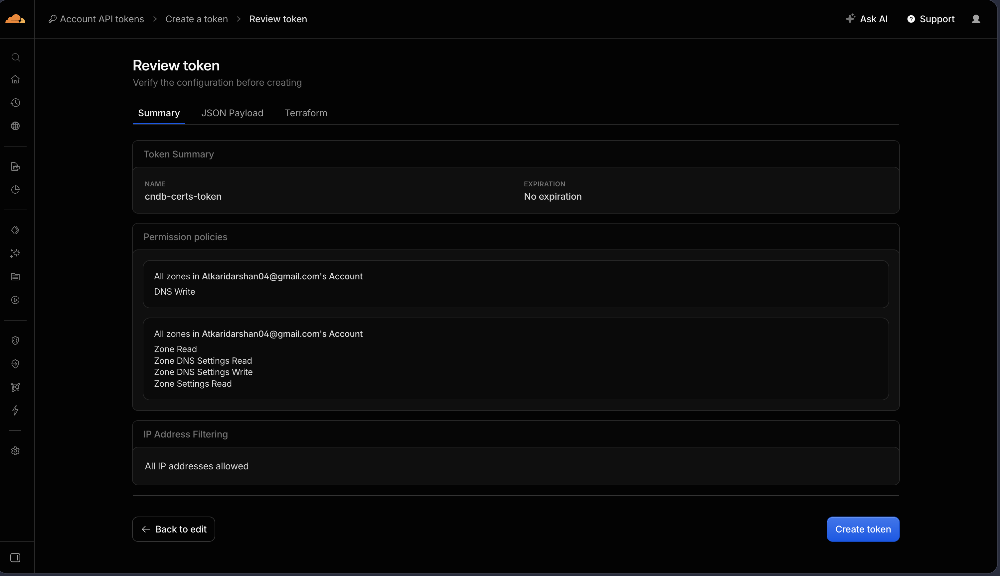
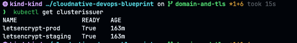
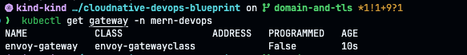
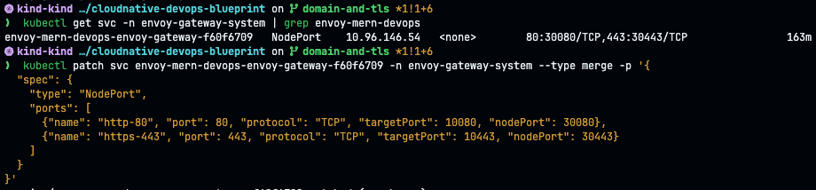
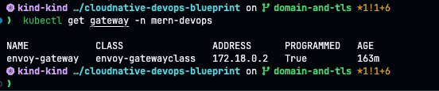
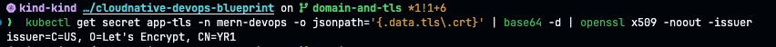
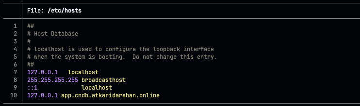
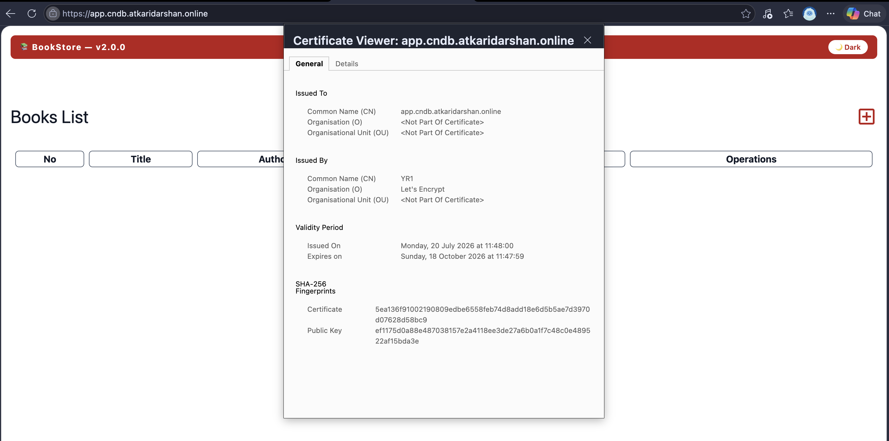

# TLS Setup — Implementation Guide

Concepts and the "why" behind each step are in [`tls-concepts.md`](./tls-concepts.md) — read
that first if anything below is unclear. This doc is the runnable checklist.

Phases 0–5 are identical regardless of where the cluster runs. Phase 6 forks: **Path A**
covers a real cloud cluster (EKS/AKS/GKE) — the industry-normal case. **Path B** covers
running this locally on `kind`, which is what this repo currently does — local
NodePort/browser testing (current focus); public access via Cloudflare Tunnel is a
separate, currently-unused doc (`public-access-cloudflare-tunnel.md`).

## `kind` vs production — what's local-only scaffolding

| Step | Local (`kind`) | Production (EKS/AKS/GKE) |
|---|---|---|
| Cluster | `kind create cluster` | already provisioned |
| Gateway controller | Envoy Gateway, self-installed via Helm (Phase 0) | same Helm install works identically — Envoy Gateway is portable; or use the cloud's own Gateway controller if it has one (e.g. GKE's native Gateway support) instead |
| Gateway API CRDs, cert-manager, `ClusterIssuer`s, `Certificate` (DNS-01 via Cloudflare) | identical | identical — none of this is cloud-specific, DNS-01 only cares about the DNS provider's API |
| Envoy Gateway's backing Service | **must patch `LoadBalancer` → `NodePort`** with specific ports (Phase 3 gotcha) — `kind` has no LB controller to fulfill it | **not needed** — stays `type: LoadBalancer`, the cloud's own controller (AWS/Azure/GCP) assigns a real address automatically |
| Public DNS record | none — no public IP to point at. Local-only `/etc/hosts` override instead, for browser testing | a real `A`/`CNAME` record pointed at the Gateway's `ADDRESS` (Phase 6, Path A) |
| Public internet access | No Public Endpoint | **not needed** — the load balancer is already public |
| Helm app chart (frontend/backend/mongodb/HTTPRoute) | identical | identical — fully portable |

The short version: everything except "how the Gateway gets a real address" is identical
between local and production. That one difference is why Phase 3's NodePort patch and any
tunnel exist at all — both are `kind`-specific stand-ins for what a cloud's LB controller
does automatically.

## Phase 0 — Prerequisites

Cluster controllers this repo's manifests depend on but doesn't install itself:

```bash
# Cluster — pick one:
kind create cluster --config kind-config.yml          # local (Path B)
# or: point kubeconfig at your existing EKS/AKS/GKE cluster (Path A)

kubectl create namespace mern-devops

# Envoy Gateway (provides the envoy-gatewayclass controller)
helm install eg oci://docker.io/envoyproxy/gateway-helm \
  --version v1.1.0 \
  -n envoy-gateway-system --create-namespace

# Gateway API CRDs
kubectl apply -f https://github.com/kubernetes-sigs/gateway-api/releases/download/v1.1.0/standard-install.yaml

# cert-manager
helm repo add jetstack https://charts.jetstack.io
helm repo update
helm install cert-manager jetstack/cert-manager \
  -n cert-manager --create-namespace \
  --set crds.enabled=true
```

Verify:

```bash
kubectl get pods -n envoy-gateway-system
kubectl get pods -n cert-manager
```

## Phase 1 — Cloudflare API token

1. Cloudflare dashboard → **My Profile → API Tokens → Create Token**.
2. Permissions: `Zone / DNS / Edit`.
3. Zone Resources: scope to `atkaridarshan.online` only (not "All zones").
4. Copy the token — Cloudflare only shows it once.



Create the Secret directly (never commit the real token to git):

```bash
kubectl create secret generic cloudflare-api-token-secret \
  -n cert-manager \
  --from-literal=api-token='<paste-token-here>'
```

## Phase 2 — ClusterIssuers

```bash
kubectl apply -f gateway/cluster-issuer.yml
kubectl get clusterissuer
# both letsencrypt-staging and letsencrypt-prod should show READY=True
```


If `READY` is `False`, check:

```bash
kubectl describe clusterissuer letsencrypt-staging
```

Common cause: the Secret from Phase 1 doesn't exist yet, or is in the wrong namespace
(must be `cert-manager` — that's the ClusterIssuer's default resource namespace).

## Phase 3 — Gateway

```bash
kubectl apply -f gateway/gateway-api.yml
kubectl get gateway -n mern-devops
```



The `Gateway` will show `Programmed: Unknown/False` until the `wildcard-tls` Secret exists
(Phase 4) — that's expected, not an error.

**`kind`-only gotcha — Gateway stays `Programmed: False` even after Phase 4:** Envoy Gateway
creates a backing Service for the Gateway, defaulting to `type: LoadBalancer`. `kind` has no
LoadBalancer controller, so it sits `<pending>` forever with no address, and the Gateway's
condition shows `reason: AddressNotAssigned`. Its auto-assigned NodePorts also won't match
what `kind-config.yml` expects (`30080`/`30443`). Fix: find the Service and patch it to
`NodePort` with the right ports.

```bash
kubectl get svc -n envoy-gateway-system | grep envoy-mern-devops
```

```bash
kubectl patch svc <envoy-svc-name> -n envoy-gateway-system --type merge -p '{
  "spec": {
    "type": "NodePort",
    "ports": [
      {"name": "http-80", "port": 80, "protocol": "TCP", "targetPort": 10080, "nodePort": 30080},
      {"name": "https-443", "port": 443, "protocol": "TCP", "targetPort": 10443, "nodePort": 30443}
    ]
  }
}'
```



(`targetPort` values `10080`/`10443` are Envoy's internal container ports — check your
Service's current `spec.ports` first with `kubectl get svc <name> -n envoy-gateway-system -o yaml`
and keep those as-is; only `type` and `nodePort` need to change.)

Verify:

```bash
kubectl get gateway envoy-gateway -n mern-devops -o jsonpath='{.status.conditions}'
# Programmed should flip to True (on a cloud cluster with a real LB controller, this
# gotcha doesn't apply — skip this patch entirely there)
```


## Phase 4 — Certificate (test on staging first)

`gateway/certificate.yml` currently points `issuerRef.name` at `letsencrypt-prod`. Before
using prod, **temporarily switch it to `letsencrypt-staging`** to prove the DNS-01 flow
works without touching Let's Encrypt's production rate limit:

```yaml
  issuerRef:
    name: letsencrypt-staging   # temporarily, for the first run
    kind: ClusterIssuer
```

Apply and watch:

```bash
kubectl apply -f gateway/certificate.yml
kubectl describe certificate wildcard-tls -n mern-devops
```

<details>
<summary>Troubleshooting: Certificate hangs in <code>Pending</code></summary>

Walk down the chain cert-manager creates:

```bash
kubectl get certificaterequest,order,challenge -n mern-devops
kubectl describe challenge -n mern-devops
```

The `Challenge` describe output shows the exact DNS record it's waiting on. Confirm the
TXT record actually landed and has propagated:

```bash
# note: for a wildcard cert (*.cndb.atkaridarshan.online), the TXT record is on the
# base name, not any specific subdomain — one record covers every hostname under it.
dig TXT _acme-challenge.cndb.atkaridarshan.online +short
# or, to bypass local DNS caching:
dig @1.1.1.1 TXT _acme-challenge.cndb.atkaridarshan.online +short
```

</details>

Once `kubectl get certificate wildcard-tls -n mern-devops` shows `READY=True`, confirm which
issuer actually signed it:

```bash
kubectl get secret wildcard-tls -n mern-devops -o jsonpath='{.data.tls\.crt}' | base64 -d | openssl x509 -noout -issuer
```


Staging certs show an issuer like `CN=(STAGING) Artificial Apricot R3` — expected, browsers
will flag it as untrusted, that's fine for this test.

**Switch to production:**

```yaml
  issuerRef:
    name: letsencrypt-prod
```

```bash
kubectl apply -f gateway/certificate.yml
```

cert-manager detects the `issuerRef` change and re-requests a cert automatically — no need
to delete anything manually. Re-run the `openssl x509 -issuer` check above and confirm it
now shows `C=US, O=Let's Encrypt`.

## Phase 5 — App + HTTPRoute (via ArgoCD)

ArgoCD (GitOps) is the only supported way to deploy the app from here — not a one-off
`helm install`. The Helm chart is still what gets deployed, but ArgoCD renders and syncs it
continuously from git instead of you running Helm by hand, so changes go through a commit,
not a manual `helm upgrade`. See [`argocd-deploy.md`](./argocd-deploy.md) for the full
steps: installing ArgoCD (with `server.insecure: true`, required behind our
TLS-terminating Gateway), the `argocd.cndb...` hostname this adds, and bootstrapping the
`Application` that deploys `helm-chart/` into `mern-devops`.

**Note:** `helm-chart/` deploys `Rollout` resources (Argo Rollouts), not plain
`Deployment`s, for the frontend and backend — do the Argo Rollouts controller install from
[`argorollouts-deploy.md`](./argorollouts-deploy.md) *before* this phase, or ArgoCD's sync
will fail with a "resource not found" error for `argoproj.io/Rollout` (the CRD won't exist
yet).

## Phase 6 — Public exposure

### Path A — Public cloud (EKS / AKS / GKE)

The `Gateway` applied in Phase 3 is enough on its own — the cloud's controller provisions a
real load balancer for it. No tunnel, no extra manifests.

```bash
kubectl get gateway envoy-gateway -n mern-devops -o wide
# wait until ADDRESS is populated
```

Then create the DNS record pointing at that address:

- **EKS**: the address is a hostname (ALB/NLB DNS name) — create a **CNAME**
  `app.cndb.atkaridarshan.online → <the-hostname>`. AWS can rotate the underlying IP, which
  is why a CNAME is required here, not an A record.
- **AKS / GKE**: usually a public IP — create an **A** record
  `app.cndb.atkaridarshan.online → <the-ip>`. Reserve/annotate it as static if you don't
  want it to change should the Service ever get recreated.

```bash
curl -v https://app.cndb.atkaridarshan.online/
```

That's the whole path — done once DNS propagates. Skip to "done" — Path B below doesn't
apply here.

### Path B — Local (`kind`) — what this repo does today

`kind` has no public IP for the Gateway to hand out, so Path A's "wait for `ADDRESS`" step
never resolves to anything internet-reachable. Two steps:

**6a. Local sanity check — this is the current focus.** `kind-config.yml` maps the
Gateway's NodePorts to your host (`30080→80`, `30443→443`), so you can confirm end-to-end
TLS termination works with zero public exposure. This never goes anywhere near
Cloudflare's edge, so the nested `cndb.` naming has no issue here (see `tls-concepts.md`'s
Cloudflare-specific limit note — it only matters for 6b below).

`curl` first:

```bash
curl -vk --resolve app.cndb.atkaridarshan.online:443:127.0.0.1 \
  https://app.cndb.atkaridarshan.online/
```

`-k` because your host's `curl` doesn't trust Let's Encrypt's staging root — drop `-k` once
you're on the `letsencrypt-prod` cert, and you should see a clean TLS handshake against a
publicly trusted cert, straight from your laptop, with zero public exposure.

**Testing from an actual browser, not just `curl`:** the public DNS for
`app.cndb.atkaridarshan.online` already resolves to Cloudflare's proxy IPs (see
`tls-concepts.md`), so a browser navigating there normally will go out to the real internet
— not your local cluster — and won't have `curl`'s `--resolve` trick available. Override
DNS locally instead, by adding a hosts-file entry:

```bash
echo "127.0.0.1 app.cndb.atkaridarshan.online" | sudo tee -a /etc/hosts
```



Then open `https://app.cndb.atkaridarshan.online/` in the browser. This resolves locally to
`127.0.0.1` → `kind`'s NodePort mapping → the Gateway, and since cert validation only
checks the hostname string against the cert's SAN (not actual routing), you should get a
clean padlock against the real `letsencrypt-prod` cert. Remove the line from `/etc/hosts`
when done, so normal DNS resolution takes over again.



**6b. Cloudflare Tunnel (public access) — not part of the current focus.** Moved out to
[`public-access-cloudflare-tunnel.md`](./public-access-cloudflare-tunnel.md) — it covers the
approach, the nested-hostname problem hit while testing it, and the setup steps for later.
