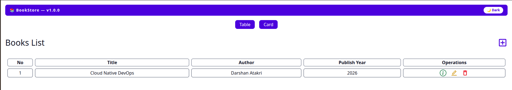
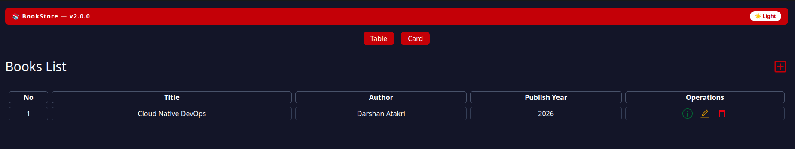
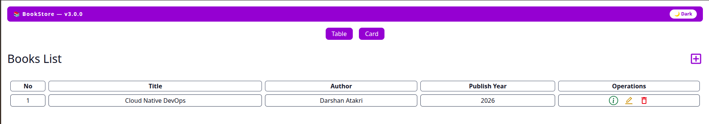
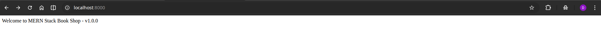
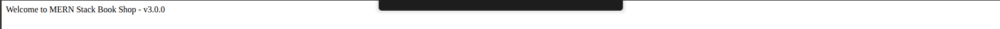

# BookStore App — Version Guide

Three versions of the application, each with visible frontend and backend differences.

---

## Version Overview

| Version | Frontend Theme | Backend Response | Changes |
|---------|---------------|-----------------|---------|
| `1.0.0` | 🔵 Blue | `...v1.0.0` | Baseline |
| `2.0.0` | 🔴 Red | `...v2.0.0` | Red theme update |
| `3.0.0` | 🟣 Purple | `...v3.0.0` | Purple theme  |

> To build a specific version, update `src/frontend/src/pages/Home.jsx` (banner color + version label) and `src/backend/index.js` (response string) to match the tag.

---

## Frontend Screenshots

<table>
<tr>
<td align="center"><strong>v1.0.0 — Blue</strong></td>
<td align="center"><strong>v2.0.0 — Red</strong></td>
<td align="center"><strong>v3.0.0 — Purple</strong></td>
</tr>
<tr>
<td></td>
<td></td>
<td></td>
</tr>
</table>

## Backend Screenshots

<table>
<tr>
<td align="center"><strong>v1.0.0</strong></td>
<td align="center"><strong>v2.0.0</strong></td>
<td align="center"><strong>v3.0.0</strong></td>
</tr>
<tr>
<td></td>
<td></td>
<td></td>
</tr>
</table>

---